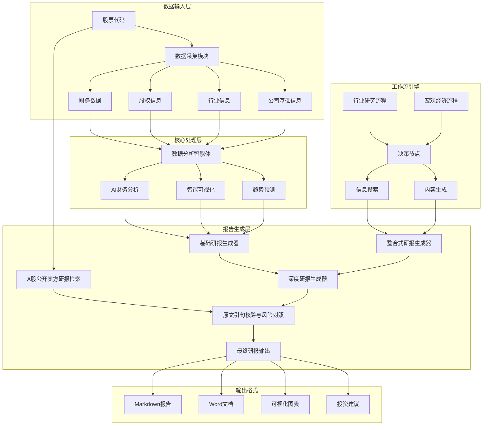

# 金融研报自动生成系统

🤖 **基于AI大模型的智能金融研报生成平台**

## 📋 项目简介

本项目是一个基于AI大模型的金融研报自动生成系统，专为金融分析师、投资者和研究机构设计。通过整合多源数据采集、智能数据分析和专业报告生成功能，实现了从数据获取到研报输出的全流程自动化。

### 🎯 核心功能

- **📊 多维度数据采集**：自动获取公司财务报表、股权结构、行业信息等多源数据
- **🤖 智能财务分析**：基于AI的财务分析、同业对比和趋势预测
- **📈 可视化图表生成**：自动生成专业的财务图表和数据可视化
- **📝 深度研报生成**：生成包含投资建议的完整金融研究报告
- **🔄 工作流引擎**：支持行业分析和宏观经济研究的自动化流程

## 🏗️ 系统架构

### 系统架构图



### 项目目录结构

```
financial_research_report/
├── 📄 核心生成器
│   ├── research_report_generator.py          # 研报生成器
│   ├── integrated_research_report_generator.py  # 整合式研报生成器
│   └── in_depth_research_report_generator.py    # 数据收集部分
├── 📄 工作流引擎
│   ├── industry_workflow.py                 # 行业研究工作流
│   └── macro_workflow.py                   # 宏观经济研究工作流
├── 📁 数据分析智能体
│   └── data_analysis_agent/                # AI数据分析模块
│       ├── __init__.py
│       ├── data_analysis_agent.py          # 主分析引擎
│       ├── prompts.py                      # 提示词模板
│       ├── README.md                       # 模块文档
│       ├── config/                         # 配置文件
│       │   ├── __init__.py
│       │   └── llm_config.py              # LLM配置
│       └── utils/                          # 工具函数
│           ├── __init__.py
│           ├── code_executor.py           # 代码执行器
│           ├── create_session_dir.py      # 会话目录创建
│           ├── extract_code.py            # 代码提取
│           ├── fallback_openai_client.py  # 备用OpenAI客户端
│           ├── format_execution_result.py # 结果格式化
│           └── llm_helper.py              # LLM助手
├── 📁 数据采集工具
│   └── utils/                              # 数据获取工具集
│       ├── get_base_info.py               # 基础信息获取
│       ├── get_company_info.py            # 公司信息获取
│       ├── get_financial_statements.py    # 财务报表获取
│       ├── get_shareholder_info.py        # 股东信息获取
│       ├── get_stock_intro.py             # 股票介绍获取
│       ├── identify_competitors.py        # 竞争对手识别
│       ├── search_info.py                 # 信息搜索
│       └── sell_side_review.py            # 公开卖方研报检索与风险对照
├── 📁 工作流框架
│   └── pocketflow/                         # 轻量级工作流引擎
│       └── __init__.py
├── 📁 数据存储
│   ├── company_info/                       # 公司基础信息
│   │   ├── 百度_HK_09888_info.txt
│   │   ├── 寒武纪_A_SH688256_info.txt
│   │   ├── 科大讯飞_A_SZ002230_info.txt
│   │   ├── 商汤科技_HK_00020_info.txt
│   │   └── 云从科技_A_SH688327_info.txt
│   ├── download_financial_statement_files/ # 财务报表数据
│   │   ├── [公司名]_balance_sheet_年度.csv  # 资产负债表
│   │   ├── [公司名]_cash_flow_statement_年度.csv # 现金流量表
│   │   └── [公司名]_income_statement_年度.csv    # 利润表
│   └── industry_info/                      # 行业信息
│       └── all_search_results.json        # 搜索结果汇总
├── 📁 输出结果
│   └── outputs/                            # 生成的报告和图表
│       ├── inputs/[市场]_[代码]_[运行时间]/   # 本次运行的数据输入
│       ├── sell_side_demo_300750.md       # 无模型密钥的公开来源示例
│       ├── sell_side_no_coverage_demo_600478.md # 无公开覆盖示例
│       └── session_[ID]/                   # 按会话分组的输出
│           ├── 经营活动现金流趋势.png
│           ├── 净利润趋势.png
│           ├── 营业收入趋势.png
│           └── 资产与权益趋势.png
├── 📄 配置文件
│   ├── requirements.txt                    # Python依赖包
│   └── LICENSE                            # 开源许可证
└── 📄 文档
    └── README.md                          # 项目说明文档
```

## 🚀 核心特性

### 1. 多源数据整合

- **财务数据**：通过akshare接口获取财务三大报表（资产负债表、利润表、现金流量表）
- **股权结构**：自动爬取同花顺等平台的股东信息
- **行业信息**：通过DuckDuckGo搜索引擎获取行业动态和市场信息
- **公司资料**：获取公司基本面信息、主营业务介绍等

### 2. 智能分析引擎

- **财务分析**：营收增长、盈利能力、偿债能力、运营效率分析
- **同业对比**：自动识别竞争对手并进行横向对比分析
- **趋势预测**：基于历史数据的未来业绩预测和估值模型
- **风险评估**：财务风险、行业风险、市场风险综合评估

### 3. 专业报告生成

- **结构化输出**：标准化的研报格式和章节结构
- **图表可视化**：专业的财务图表和数据可视化
- **投资建议**：基于分析结果的明确投资评级和建议
- **多格式支持**：支持Markdown、Word等多种输出格式

## 🛠️ 安装与配置

### 环境要求

- Python 3.10+
- OpenAI API密钥（或兼容的LLM服务）

### 安装步骤

1. **安装依赖**

```bash
python -X utf8 -m pip install -r requirements.txt
```

`-X utf8` 可避免 Windows 默认 GBK 环境读取含中文注释的依赖文件时解码失败。
如需 Word 输出，还需在系统中安装 Pandoc；未安装时仍会保留 Markdown 报告。

2. **环境配置**
创建 `.env` 文件并配置以下变量：

```env
OPENAI_API_KEY=your_openai_api_key
OPENAI_BASE_URL=https://api.openai.com/v1
OPENAI_MODEL=gpt-4
```

## 🎮 使用指南

### 基础研报生成（不追加卖方章节）

```bash
python integrated_research_report_generator.py --code 300750 --no-sell-side-review
```

### 整合式研报生成

```python
from integrated_research_report_generator import IntegratedResearchReportGenerator

# 创建生成器实例
generator = IntegratedResearchReportGenerator()

# 运行完整流程
generator.run_full_pipeline()
```

### A 股卖方研报自动对照与风险补充

在原有整合式生成器的最后一步追加一节：按股票代码检索最近的公开个股研报，尽量读取可公开访问的 PDF 或网页正文，再对照刚生成的研报，列出有原文依据的观点与风险线索。无需手动上传卖方 PDF。支持沪深 A 股与北交所 `92` 号段代码的自动识别；未取得公开卖方正文时仍会明确标注覆盖不足。

```bash
# 完整流程：只输入 A 股代码，自动识别公司名称并生成研报与补充章节
python integrated_research_report_generator.py --code 300750

# 只运行新模块，检查公开研报来源；已有自生成研报时可传 --report 做对照
python -m utils.sell_side_review 300750 --as-of 2026-10-01 --days 90 --max-reports 3 --sources-only
python -m utils.sell_side_review 300750 --report 自己生成的研报.md
```

完整流程需要 `.env` 中配置可用的 `OPENAI_API_KEY`、`OPENAI_BASE_URL` 和 `OPENAI_MODEL`。独立模块未配置模型或指定 `--sources-only` 时只列来源，不编造观点或风险判断；`--sources-only` 仍会检查公开正文是否可读，但即使已配置密钥也不会调用模型。默认对照最近 90 天内最多三家不同券商；`--as-of` 可固定检索截止日，完整流程还支持 `--sell-side-days`、`--sell-side-max-reports` 和 `--no-sell-side-review`。`--as-of` 只是日期过滤，不是历史时点的数据快照，不能直接用于无前瞻信息的回测。

[宁德时代公开研报来源示例](outputs/sell_side_demo_300750.md)和[无近期公开覆盖示例](outputs/sell_side_no_coverage_demo_600478.md)展示了两种真实结果。港股代码也可自动识别公司名称，但卖方正文自动检索目前仅接入 A 股；港股报告会明确显示未覆盖提示。

默认数据源是东方财富公开研报聚合索引，并非各券商的登录研究平台。输出明确标注“仅标题与元数据”“公开网页节选”或“PDF 文字节选”；表内日期是索引日期，可能与 PDF 封面日期不同。网页/PDF 节选不等于完整报告，PDF 提取还可能错读表格和数字，公开索引也不保证覆盖所有券商及付费研报。公开 PDF 若返回验证页面或无法提取文字，会回退到网页节选；两者都不可读时仅列来源，不进行内容比较。程序不绕过登录、付费墙或反爬验证。公开可读不等于可批量采集、再分发或传给外部模型，正式部署前需要核对来源条款与团队的数据处理权限；取得授权数据后，可实现 `utils/sell_side_review.py` 的 `SellSideProvider` 接口并通过生成器的 `sell_side_provider` 参数接入。

风险补充按“风险点—可能的影响路径—后续监测项”组织；卖方乐观假设核查点和券商之间的差异线索都要求保留实际来源与可在取得的正文中找到的原文引句。与原研报的一致或分歧还要求能找到原研报原句。公开资料不足时不会把“预测偏乐观”直接判成“卖方夸大”，也不会编造风险概率或等级。最终结论仍需研究员结合公司公告、财报和预测时点复核。

新功能的离线回归检查可运行 `python -m pytest -q`（需另装 `pytest`）。

### 行业研究工作流

```python
from industry_workflow import IndustryResearchFlow
from pocketflow import Flow

# 创建行业研究流程
flow = Flow()
flow.add_node("industry_research", IndustryResearchFlow())

# 设置研究参数
shared_data = {
    "industry": "人工智能",
    "context": []
}

# 执行研究流程
flow.run(shared_data)
```

## 📊 数据源说明

### 主要数据来源

- **财务数据**：东方财富网财务报表接口
- **股权信息**：同花顺股东信息页面
- **公司信息**：同花顺主营业务介绍
- **行业资讯**：DuckDuckGo搜索引擎聚合信息
- **市场数据**：akshare金融数据接口

### 数据更新频率

- 财务报表：季度更新
- 股权结构：实时更新
- 行业信息：每日更新
- 市场数据：实时更新

## 🧩 模块详解

### 数据分析智能体 (Data Analysis Agent)

- **自然语言分析**：支持中文自然语言查询
- **代码自动生成**：基于需求自动生成Python分析代码
- **图表可视化**：自动生成专业图表，支持中文显示
- **报告输出**：生成Markdown和Word格式的分析报告

### 工作流引擎 (PocketFlow)

- **决策节点**：智能判断下一步分析方向
- **信息搜索**：自动搜索和整合相关信息
- **内容生成**：基于模板生成标准化报告章节

### 数据采集工具

- **财务报表获取**：支持A股、港股财务数据
- **股东信息爬取**：自动解析股权结构信息
- **竞争对手识别**：AI驱动的同业公司识别
- **行业信息搜索**：多源信息聚合和整理

## 📈 支持的分析类型

### 财务分析

- 营业收入增长趋势
- 净利润变化分析
- 现金流健康状况
- 资产负债结构

### 估值分析

- P/E、P/B等相对估值
- DCF现金流折现模型
- 行业估值对比
- 合理价值区间

### 风险分析

- 财务风险指标
- 行业周期性风险
- 市场流动性风险
- 公司治理风险

## 🎯 输出示例

生成的研报包含以下标准章节：

1. **公司概况**：基本信息、主营业务、股权结构
2. **财务分析**：三大报表分析、财务比率、趋势分析
3. **行业分析**：行业地位、竞争格局、发展趋势
4. **估值分析**：估值模型、合理价值、投资建议
5. **风险提示**：主要风险因素及应对措施

## 🔧 自定义配置

### LLM配置

支持多种大语言模型：

- OpenAI GPT系列
- 其他OpenAI兼容接口
- 本地部署模型

### 分析参数

- 历史数据回溯期间
- 同业对比范围
- 风险评估标准
- 报告详细程度
