# 公司基础信息

## 整理后公司信息

# 公司信息整理

> 说明：原文中“百度集团_HK_09888_info”“百度集团-SW_HK_09888_info”“百度_HK_09888_info”为同一公司，内容一致，已合并去重；`_info` 后缀已省略。

---

## 一、港股公司

### 1. 百度集团（09888.HK）

- **公司名称**：百度集团股份有限公司
- **英文名称**：Baidu, Inc.
- **注册地**：Cayman Islands 开曼群岛（英属）
- **注册地址**：BP Box 309, Ugland House, Grand Cayman, Caymans Islands
- **公司成立日期**：2000-01-18
- **所属行业**：媒体及娱乐
- **董事长**：李彦宏
- **公司秘书**：Wong Mei, Lin Juan
- **员工人数**：30,900
- **办公地址**：中华人民共和国北京海淀区上地十街10号；香港湾仔港湾道18号中环广场6706室
- **公司网址**：ir.baidu.com
- **E-MAIL**：ir@baidu.com
- **年结日**：12-31
- **联系电话**：+86 (10) 5992-8888
- **核数师**：安永会计师事务所
- **传真**：+86 (10) 5992-0000
- **公司介绍**：百度集团股份有限公司成立于2000年，是一家拥有强大互联网基础的领先人工智能和互联网搜索服务公司，是世界上为数不多的提供完整人工智能技术的公司之一，包括由人工智能芯片、深度学习框架、核心人工智能能力（如自然语言处理、知识图、语音识别、计算机视觉和增强现实）组成的基础设施，以及便于广泛应用和使用的开放式人工智能平台。公司通过百度核心和爱奇艺两个板块运营。百度核心主要提供在线营销服务和非营销增值服务，以及来自新人工智能举措的产品和服务；爱奇艺专注会员和在线广告服务。公司自2005年8月起在纳斯达克全国市场（后来更名为纳斯达克全球市场）上市，自2021年3月起在香港联合交易所有限公司（联交所）双重上市。

---

### 2. 第四范式（范式智能技术集团股份有限公司，06682.HK）

- **公司名称**：范式智能技术集团股份有限公司
- **英文名称**：Phancy Group Co., Ltd.
- **注册地**：中国
- **注册地址**：中国北京市海淀区小营西路10号院1号楼和盈中心A座3层303室
- **公司成立日期**：2014-09-17
- **所属行业**：软件服务
- **董事长**：戴文渊
- **公司秘书**：杨小慧
- **员工人数**：541
- **办公地址**：中国北京市海淀区小营西路10号院1号楼和盈中心A座3层303室；香港铜锣湾希慎道33号利园一期19楼1910室
- **公司网址**：phancy.ai
- **E-MAIL**：IR@4paradigm.com
- **年结日**：12-31
- **联系电话**：未提供（None）
- **核数师**：容诚（香港）会计师事务所有限公司
- **传真**：未提供（None）
- **公司介绍**：范式智能技术集团股份有限公司（6682.HK）是连接异构算力、模型与企业应用的全栈AIToken生产与运营平台，提供包括HAMi、信创模盒、先知AIOS等高效AI基础设施，具备从底层异构算力纳管优化到智能体模型调用的全栈技术能力。公司致力于在AI2.0时代打造面向全球的高效、规模化的“Token工厂”，让AI能力以Token为单位，以标准化、规模化和可持续的方式，被千行万业所生产、交付和使用。自2014年成立以来，范式始终秉持“AI for Everyone”的使命，让AI红利惠及每一个人与每一个组织。通过构建开放生态、深化人才共建、践行普惠共荣，全面赋能AI2.0时代，创造可持续价值。范式总部位于中国北京，2023年于香港交易所上市。

---

### 3. 创新奇智（02121.HK）

- **公司名称**：创新奇智科技集团股份有限公司
- **英文名称**：AInnovation Technology Group Co., Ltd
- **注册地**：中国
- **注册地址**：中国山东青岛即墨区振武路939号经济开发区海尔国际广场A座501室
- **公司成立日期**：2018-02-06
- **所属行业**：软件服务
- **董事长**：李开复
- **公司秘书**：吕虹燏
- **员工人数**：655
- **办公地址**：香港铜锣湾希慎道33号利园一期19楼1928室；中国山东青岛即墨区振武路939号经济开发区海尔国际广场A座501室
- **公司网址**：www.ainnovation.com
- **E-MAIL**：ir@ainnovation.com, mktcontact@ainnovation.com
- **年结日**：12-31
- **联系电话**：+86 (10) 8216-9566
- **核数师**：罗兵咸永道会计师事务所
- **传真**：未提供（None）
- **公司介绍**：创新奇智科技集团股份有限公司（AInnovation，股票代码2121.HK）成立于2018年2月，以“人工智能赋能商业价值”为使命，是中国快速发展的企业级AI解决方案供应商和领先的“AI+制造”解决方案供应商。公司致力于用前沿的人工智能技术为企业提供AI产品及解决方案，提高客户运营效率和商业价值，实现数字化转型。创新奇智专注于“AI+制造”，聚焦打造“工业软件、数智软件、工业物流、智能装备、工业可持续”五大业务主题，赋能钢铁冶金、面板半导体、3C高科技、汽车装备、能源电力、工程建筑、食品饮料&新材料、智造实训等细分领域的行业客户。公司自研面向行业应用的“MMOC人工智能技术平台”和“AInnoGC工业大模型（网信备案号：Shandong-AInnoGC-202410290004）技术平台”。

---

### 4. 商汤科技（00020.HK）

- **公司名称**：商汤集团股份有限公司
- **英文名称**：SenseTime Group Inc.
- **注册地**：Cayman Islands 开曼群岛（英属）
- **注册地址**：P.O. Box 31119 Grand Pavilion, Hibiscus Way, 802 West Bay Road, Grand Cayman, Cayman Islands
- **公司成立日期**：2014-10-15
- **所属行业**：软件服务
- **董事长**：徐立
- **公司秘书**：黄慧儿, 林洁敏
- **员工人数**：2,668
- **办公地址**：香港沙田香港科学园科技大道东12号海滨大楼1座2楼；中国上海市徐汇区虹梅路1900号
- **公司网址**：www.sensetime.com
- **E-MAIL**：ir@sensetime.com
- **年结日**：12-31
- **联系电话**：未提供（None）
- **核数师**：罗兵咸永道会计师事务所
- **传真**：未提供（None）
- **公司介绍**：商汤集团股份有限公司作为人工智能软件公司，商汤科技以“坚持原创，让AI引领人类进步”为使命，“以人工智能实现物理世界和数字世界的连接，促进社会生产力可持续发展，并为人们带来更好的虚实结合生活体验”为愿景，旨在持续引领人工智能前沿研究，持续打造更具拓展性更普惠的人工智能软件平台，推动经济、社会和人类的发展，并持续吸引及培养顶尖人才，共同塑造未来。商汤科技拥有深厚的学术积累，并长期投入于原创技术研究，不断增强行业领先的全栈式人工智能能力，涵盖感知智能、决策智能、智能内容生成和智能内容增强等关键技术领域，同时包含AI芯片、AI传感器及AI算力基础设施在内的关键能力。此外，商汤前瞻性打造新型人工智能基础设施——SenseCore商汤AI大装置，打通算力、算法和平台，大幅降低人工智能生产要素价格，实现高效率、低成本、规模化的AI创新和落地，进而打通商业价值闭环，解决长尾应用问题，推动人工智能进入工业化发展阶段。商汤科技业务涵盖智慧商业、智慧城市、智慧生活、智能汽车四大板块，相关产品与解决方案深受客户与合作伙伴好评。商汤倡导“发展”的人工智能伦理观，并积极参与有关数据安全、隐私保护、人工智能伦理道德和可持续人工智能的行业、国家及国际标准的制订。截至2021年6月30日，商汤参与了80多个行业、国家及国际标准的制订，与多个国内及多边机构就人工智能的可持续及伦理发展开展了密切合作。商汤《AI可持续发展道德准则》被联合国人工智能战略资源指南选录，并于2021年6月发表，是亚洲唯一获此殊荣的人工智能公司。目前，商汤（股票代码：0020.HK）已于香港交易所主板挂牌上市。商汤在香港、上海、北京、深圳、成都、杭州、南平、青岛、三亚、西安、台北、澳门、京都、东京、新加坡、利雅得、阿布扎比、迪拜、吉隆坡、首尔等地设立办公室。另外，商汤科技在泰国、印度尼西亚、菲律宾等国家均有业务。

---

## 二、A股公司

### 1. 格灵深瞳（688207.SH）

- **股票代码**：688207
- **主营业务**：提供面向智慧金融、城市管理、政务及特种、智慧教育等领域的人工智能产品、智能终端计算设备及解决方案。
- **产品类型**：智源智能前端产品、深瞳行业应用平台、灵犀数据智能平台、智慧终端产品
- **产品名称**：智源智能前端产品、深瞳行业应用平台、灵犀数据智能平台、智慧终端产品
- **经营范围**：计算机软硬件及网络技术开发；技术咨询；技术服务；转让自有技术；应用软件服务；基础软件服务；计算机系统集成；集成电路设计，电子设备、新型电子元器件，图形图像识别和处理系统开发，销售自行开发的产品；批发机械设备、电子产品、五金交电、计算机、软件及辅助设备；批发、零售社会公共安全设备及器材；产品设计；货物进出口、技术进出口、代理进出口（涉及配额许可证管理、专项规定管理的商品按照国家有关规定办理）；计算机整机制造；计算机零部件制造；计算机外围设备制造；通信终端设备制造；智能车载设备制造；工业控制计算机及系统制造；智能无人飞行器制造；服务消费机器人制造；工业机器人制造；特殊作业机器人制造。【市场主体依法自主选择经营项目，开展经营活动；依法须经批准的项目，经相关部门批准后依批准的内容开展经营活动；不得从事国家和本市产业政策禁止和限制类项目的经营活动。】

---

### 2. 海康威视（002415.SZ）

- **股票代码**：002415
- **主营业务**：以智能物联为战略定位，视频技术为核心打造从研发，制造到营销的完整价值链。
- **产品类型**：主业建造工程、机器人业务、智能家居业务、热成像业务、汽车电子业务、存储业务、其他创新业务
- **产品名称**：主业建造工程、机器人业务、智能家居业务、热成像业务、汽车电子业务、存储业务、其他创新业务
- **经营范围**：电子产品（含防爆电气产品、通信设备及其辅助设备、多媒体设备、传输与显示设备）、消防产品、大数据与物联网软硬件产品、飞行器、机器人、智能装备与智能化系统、实时通讯系统、汽车零部件及配件、车用电气信号设备装置、服务器及配套软硬件产品的研发、生产；销售自产产品；提供技术服务，电子技术咨询服务，培训服务（不含办班培训），电子设备安装，电子工程及智能系统工程的设计、施工及维护。（国家禁止和限制的项目除外，涉及许可证的凭证经营）（依法须经批准的项目，经相关部门批准后方可开展经营活动）

---

### 3. 云从科技（688327.SH）

- **股票代码**：688327
- **主营业务**：高效人机协同操作系统和行业解决方案。
- **产品类型**：人机协同操作系统、人工智能解决方案
- **产品名称**：基础操作系统、核心组件、应用产品、公有云服务、风控服务、智能化运维服务、智慧治理综合解决方案、智慧出行综合解决方案、智慧金融综合解决方案、智慧商业综合解决方案、泛AI领域综合解决方案
- **经营范围**：计算机系统服务；人工智能行业应用系统集成服务；人工智能通用应用系统；人工智能基础资源与技术平台；人工智能公共数据平台；人工智能公共服务平台技术咨询服务；集成电路设计；数字文化创意软件开发；人工智能理论与算法软件开发；网络与信息安全软件开发；人工智能应用软件开发；人工智能基础软件开发；软件开发；数据处理和存储支持服务；物联网技术服务；网络技术服务；5G通信技术服务；信息系统集成服务；智能机器人的研发；广告设计、代理；广告发布（非广播电台、电视台、报刊出版单位）；广告制作；智能机器人销售；信息咨询服务（不含许可类信息咨询服务）；计算机软硬件及辅助设备零售；人工智能硬件销售；人工智能双创服务平台；计算机软硬件及外围设备制造；工业控制计算机及系统制造；计算机软硬件及辅助设备批发；工业控制计算机及系统销售；计算机及通讯设备租赁；计算机及办公设备维修；物联网设备销售；物联网技术研发；通信设备制造；互联网设备制造；网络设备制造；终端测试设备制造；终端计量设备制造；云计算设备制造；物联网设备制造；数字视频监控系统制造；数字视频监控系统销售；安全系统监控服务；电子（气）物理设备及其他电子设备制造；城市轨道交通设备制造；工程管理服务；工程技术服务（规划管理、勘察、设计、监理除外）；物联网应用服务；机械设备租赁；办公设备租赁服务；技术进出口；计算机信息系统安全专用产品销售；货物进出口；建筑智能化工程施工；建筑智能化系统设计；房屋建筑和市政基础设施项目工程总承包；建筑劳务分包；第一类增值电信业务；第二类增值电信业务。

---

### 4. 虹软科技（688088.SH）

- **股票代码**：688088
- **主营业务**：计算机视觉技术算法的研发和应用。
- **产品类型**：移动智能终端视觉解决方案、车载AI视觉解决方案、其他IoT智能设备视觉解决方案
- **产品名称**：移动智能终端视觉解决方案、车载AI视觉解决方案、其他IoT智能设备视觉解决方案
- **经营范围**：计算机软硬件的技术开发、技术咨询、技术服务、销售，计算机信息系统集成，进出口业务，计算机软件的生产。（依法须经批准的项目，经相关部门批准后方可开展经营活动）。

---

### 5. 科大讯飞（002230.SZ）

- **股票代码**：002230
- **主营业务**：语音技术相关的计算机软、硬件开发、生产和销售及技术服务。
- **产品类型**：智慧教育、智慧医疗、开放平台、智能硬件、移动互联网产品及服务、智慧城市、运营商、智慧汽车、企业AI解决方案
- **产品名称**：智慧教育、智慧医疗、开放平台、智能硬件、移动互联网产品及服务、智慧城市、运营商、智慧汽车、企业AI解决方案
- **经营范围**：增值电信业务；专业技术人员培训；计算机软、硬件开发、生产和销售及技术服务；系统工程、信息服务；电子产品、计算机通讯设备研发、生产、销售；移动通信设备的研发、销售；二类、三类医疗器械研发、制造与销售；图书、电子出版物销售；进出口业务（国家限定和禁止经营的除外）；安全技术防范工程；商用房及住宅房租赁；物业管理；设计、制作、代理、发布广告。（依法须经批准的项目，经相关部门批准后方可开展经营活动）

---

### 6. 云天励飞（688343.SH）

- **股票代码**：688343
- **主营业务**：打造具备高性能、高性价比及高适配性的推理芯片。
- **产品类型**：AI推理芯片及相关场景、异构算力服务、AI原生产品、岍丞技术产品
- **产品名称**：AI推理芯片及相关场景、异构算力服务、AI原生产品、岍丞技术产品
- **经营范围**：一般经营项目：计算机数据库，计算机系统分析；提供计算机技术服务；网络商务服务、数据库服务、数据库管理；从事信息技术、电子产品、生物技术、化工产品、建筑建材、机械设备等领域内的技术开发、技术咨询、技术服务、技术转让；计算机编程；计算机软件设计；计算机及相关设备的销售；信息系统集成；从事货物、技术进出口业务；工程服务、工程施工；机械设备租赁；计算机及通讯设备租赁；租赁服务（不含许可类租赁服务）；储能技术服务；合同能源管理；节能管理服务。（除依法须经批准的项目外，凭营业执照依法自主开展经营活动）。许可经营项目：芯片的设计、研发、生产、测试、加工、销售、咨询及技术服务；第二类医疗器械销售。（依法须经批准的项目，经相关部门批准后方可开展经营活动，具体经营项目以相关部门批准文件或许可证件为准）。

# 股权信息分析

从股东名称、最终控制人及变动数据看，该表对应的是**商汤集团（SenseTime）**的主要股东权益披露。以下按表格内容做股东结构分析：

## 一、总体判断

1. **第一大股东稳定但被稀释**  
   Amind Inc. 持股始终为 **690,608.06万股**，未发生数量变动，但占总股本比例从 2021-12-31 的 **20.75%** 降至 2026-06-30 的 **16.36%**。  
   按此反推，公司总股本从约 **332.8亿股** 增至约 **422.1亿股**，增幅约 **26.8%**。Amind 的持股比例下降主要是被动稀释，而非主动减持。

2. **最终控制人发生变化**  
   Amind Inc. 的最终控制人早期为 **汤晓鸥**，2025-06-30 起变为 **Yang Qiumei**，此后保持。这通常涉及继承、信托或家族持股安排，需关注后续投票权归属。

3. **早期财务投资者大规模退出**  
   软银系和阿里系是早期重要股东，但均持续减持并退出主要股东名单：
   - 软银系：从 2021-12 的 **14.21%** 一路降至 2024-04 的 **4.80%**，之后未再列示。
   - 阿里/淘宝系：从 2021-12 的 **7.24%** 降至 2023-07 的 **3.15%**，之后退出披露。

4. **员工/管理层平台大幅减持**  
   SenseTalent Management Limited 从 2021-12 的 **386,925.86万股，占11.63%**，降至 2025-06 的 **191,516.18万股，占5.18%**，2025-12 后未列。2024-12 单期减少 **141,397.79万股**，减持规模很大。

## 二、主要股东结构演变

| 股东/系 | 2021-12 | 2024-12 | 2025-06 | 2026-06 | 趋势 |
|---|---:|---:|---:|---:|---|
| Amind Inc. | 690,608.06万股 / 20.75% | 690,608.06 / 18.66% | 690,608.06 / 18.66% | 690,608.06 / 16.36% | 股数不变，比例稀释 |
| 软银系 | 473,052.14 / 14.21% | 已低于披露线 | 未列 | 未列 | 持续减持退出 |
| 阿里/淘宝系 | 241,103.00 / 7.24% | 未列 | 未列 | 未列 | 持续减持退出 |
| SenseTalent | 386,925.86 / 11.63% | 200,515.40 / 5.42% | 191,516.18 / 5.18% | 未列 | 大幅减持 |
| 徐立系 | XWORLD 28,631.77 | XWORLD 28,631.77 | 个人57,038.65 + XWORLD 28,631.77 | 合计85,670.42 / 约2.03% | 稳定并小幅增持 |
| 王晓刚系 | Infinity 23,217.16 | Infinity 23,217.16 | 个人30,214.02 + Infinity 23,217.16 | 合计53,431.18 / 约1.27% | 稳定 |
| 徐冰系 | Vision 10,419.01 | 个人26,223.66 + Vision 10,419.01 | 个人26,723.66 + Vision 10,419.01 | 仅见Vision 10,419.01 | 曾增持，后续个人未列 |

注：部分年份未列徐立、王晓刚、徐冰个人持股，可能与披露口径、前十大名单变化或数据缺失有关，不能简单视为清仓。

## 三、管理层与关联方持股

- **徐立系**：个人持股 57,038.65万股，另通过 XWORLD 持股 28,631.77万股，合计约 **85,670.42万股**，2026-06 占比约 **2.03%**。2025-03-27 徐立增持 **500万股**。
- **王晓刚系**：个人持股 30,214.02万股，另通过 Infinity Vision 持股 23,217.16万股，合计约 **53,431.18万股**，占比约 **1.27%**。
- **徐冰系**：曾持有个人股 26,723.66万股，并通过 Vision Worldwide 持股 10,419.01万股。2024-09-17 增持 **1000万股**，2025-03-27 增持 **500万股**。但 2025-12 后个人持股未列，需关注后续披露。
- **林达华系**：林达华持股约 9,844.14万股，占比约 **0.23%**；陈蕾持股 1.90万股，最终控制人为林达华，二者可能为关联持股。
- 2024-2025 年还出现杨帆、王征、范瑗瑗、于江涛等自然人股东，持股比例均很小，可能为股权激励、个人投资或新进披露。

## 四、变动明细中的关键信号

1. **软银系持续、密集减持**  
   2022-12 至 2024-04，软银系几乎每隔一段时间就减持，最终降至 **124,608.94万股，占4.80%**。Public Investment Fund 与软银系同步变动，说明其可能作为软银愿景基金 LP 间接持股。

2. **阿里系逐步退出**  
   2022-11 减持 8,000万股，2023年又多次减持，至 2023-07-06 降至 **81,644.89万股，占3.15%**，之后不再出现在主要股东表。

3. **SenseTalent 减持明显**  
   2024-10-07 减持 1,042.49万股，持股降至 206,967.89万股；2024-12 截面又大幅降至 200,515.40万股；2025-06 降至 191,516.18万股。该平台减持可能对市场形成供给压力。

4. **管理层小幅增持**  
   徐立、徐冰在 2024-2025 年有增持行为，但规模相对软银、阿里、SenseTalent 的减持量较小，信号偏积极但力度有限。

## 五、结论与关注点

1. **股东结构去机构化明显**：早期战略/财务投资者软银、阿里已基本退出主要股东行列，员工平台 SenseTalent 也大幅减持。
2. **创始人/家族仍为第一大股东**：Amind Inc. 持股数量不变，但比例因总股本扩大被稀释至 16.36%，最终控制人已变更为 Yang Qiumei。
3. **管理层持股分散**：徐立、王晓刚、徐冰等通过个人及 BVI 公司持股，单一比例不高，但若构成一致行动，仍有一定影响力。
4. **控制权稳定性需观察**：Amind 与管理层之间是否存在一致行动安排、投票权委托或家族信托安排，是判断控制权稳定性的关键。
5. **数据口径需注意**：表中包含 2026-06-30 的未来日期数据，且部分年份存在个人持股缺失、股东突然未列等情况，可能仅反映前十大或披露阈值以上股东。未列不等于完全退出。

整体看，该股东结构呈现出“**早期财务投资者退出、创始人/家族持股被动稀释、管理层平台减持、管理层个人小幅增持**”的特征。后续应重点关注 Amind 控制权安排、SenseTalent 剩余减持、软银/阿里是否彻底退出，以及总股本继续扩张带来的稀释压力。

# 行业信息搜索结果

【商汤科技搜索信息开始】
【商汤科技搜索信息结束】

【云从科技搜索信息开始】
标题: Breakdown cover with FlexPlus | Nationwide
链接: 无链接
摘要: 无摘要
----
标题: 10 Best Roadside Assistance Companies of 2026
链接: 无链接
摘要: 无摘要
----
标题: Does Nationwide Insurance Have Roadside Assistance
链接: 无链接
摘要: 无摘要
----
标题: RSA Help - Nationwide
链接: 无链接
摘要: 无摘要
----
标题: Nationwide Roadside Assistance: Coverage, Basic vs Plus, & Cost
链接: 无链接
摘要: 无摘要
----
标题: Phone Number for Nationwide Roadside Assistance (2026) - WalletHub
链接: 无链接
摘要: 无摘要
----
标题: Nationwide Roadside Assistance: What You Should Know
链接: 无链接
摘要: 无摘要
----
标题: SOS Roadside — Nationwide Roadside Assistance Dispatch
链接: 无链接
摘要: 无摘要
----
标题: Revolutionizing roadside assistance, track the tow truck on your device
链接: 无链接
摘要: 无摘要
----
标题: Google Translate
链接: 无链接
摘要: 无摘要
----
【云从科技搜索信息结束】

【格灵深瞳搜索信息开始】
【格灵深瞳搜索信息结束】

【科大讯飞搜索信息开始】
标题: 科大讯飞 - 用人工智能建设美好世界 - iFlytek
链接: 无链接
摘要: 无摘要
----
标题: 科大讯飞股份有限公司 - 百度百科
链接: 无链接
摘要: 无摘要
----
标题: 语音合成_语音转文字_文字转音频_OCR文字识别_科大讯 ...
链接: 无链接
摘要: 无摘要
----
标题: 讯飞听见-AI在线录音转文字-语音转文字-录音整理 ...
链接: 无链接
摘要: 无摘要
----
标题: 公司简介-科大讯飞
链接: 无链接
摘要: 无摘要
----
标题: rime-pinyin-jap/pinyin_jap.dict.yaml at main · tumuyan/rime ... - GitHub
链接: 无链接
摘要: 无摘要
----
标题: DAH SING BANK, LIMITED
链接: 无链接
摘要: 无摘要
----
标题: 茹娣股份 (872941.NQ)股票信息_上市信息 - 企查查
链接: 无链接
摘要: 无摘要
----
标题: 财富跃迁 · Issue #65 · chiyan-lin/Blog - GitHub
链接: 无链接
摘要: 无摘要
----
标题: 美联新材 (300586)_最新价格_行情_走势图—东方财富网
链接: 无链接
摘要: 无摘要
----
【科大讯飞搜索信息结束】

【第四范式搜索信息开始】
【第四范式搜索信息结束】

【创新奇智搜索信息开始】
【创新奇智搜索信息结束】

# 财务数据分析与两两对比

【第四范式财务数据分析结果开始】
# 范式智能（06682.HK）财务分析报告

## 分析概述

本报告基于范式智能（证券代码 06682.HK，原名第四范式）2018 至 2025 年共八个完整会计年度的财务报表数据展开分析。分析数据集来源于三张核心财务报表：利润表（income，223 条记录、28 个科目）、现金流量表（cashflow，320 条记录、51 个科目）以及资产负债表（balance，346 条记录、47 个科目）。所有记录的报告期均为 12 月 31 日年度报表（DATE_TYPE_CODE 全部为 1），主体唯一（SECUCODE 仅 06682.HK，ORG_CODE 唯一），因此数据具备时间序列上的严格可比性，无需进行口径调整或合并处理。

本次分析的核心目标是刻画公司由高速扩张期向盈利转折期过渡的经营轨迹，重点考察收入规模与增速、毛利率结构变化、费用率管控效率、亏损收窄节奏以及资产负债与现金流的结构特征，并据此判断公司经营拐点的确立程度与可持续性。

## 数据分析过程

分析过程遵循从数据质量校验到指标计算的完整链路。首先完成三张报表的加载与结构核验，确认列名体系一致（均包含 SECUCODE、SECURITY_CODE、SECURITY_NAME_ABBR、ORG_CODE、REPORT_DATE、DATE_TYPE_CODE、FISCAL_YEAR、START_DATE、STD_ITEM_CODE、STD_ITEM_NAME、AMOUNT 等字段，资产负债表另含 STD_REPORT_DATE），并确认所有报表的 DATE_TYPE_CODE 均为年度报表（值 1）、FISCAL_YEAR 全部为 12-31，报告期覆盖 2018 至 2025 年八个年度。

其次，对各报表科目清单进行枚举与梳理，识别利润表 28 项、现金流量表 51 项、资产负债表 47 项标准科目，为后续指标映射奠定基础。在此基础上，按年份提取利润表关键科目的金额序列，包括营业额、毛利、研发费用、销售及分销费用、行政开支、经营溢利、除税前溢利与除税后溢利，并做年度去重与唯一性校验（确认每个科目在每个年度仅有唯一取值，不存在重复报送或多口径干扰）。最后，基于上述序列计算增速、毛利率、费用率与净利率等衍生指标，并对现金流量表与资产负债表的关键科目进行抽样核验。

## 关键发现

公司收入规模呈现典型的"高增长起步、逐步收敛、再度提速"三段式特征。营业额由 2018 年的 1.28 亿元攀升至 2025 年的 71.35 亿元，八年间增长约 54.7 倍。增速方面，2019 年同比增长约 259%，2020 年与 2021 年均维持在 100% 以上的三位数增长，2022 年回落至约 52.8%，2023 年进一步降至 36.4%，2024 年触底于约 25.1%，而 2025 年增速回升至约 35.6%，显示业务扩张动能出现重新加速的迹象。

毛利率结构在 2022 年见顶后出现明显回落，是本轮财务分析中最值得关注的信号。毛利率由 2018 年的约 43.0% 稳步提升至 2022 年的约 48.2%，但在 2023 年微降至 47.1%，2024 年降至 42.7%，2025 年进一步降至 34.8%，两年内累计下滑约 13 个百分点。这意味着 2025 年收入的高增长在相当程度上是以牺牲单位盈利质量换取的，收入结构可能向硬件集成或低毛利的解决方案交付倾斜。

费用端的管控成效极为显著，构成亏损收窄的主要驱动力。研发费用由 2018 年的 1.93 亿元增至 2025 年的 23.37 亿元，绝对额持续扩张，但研发费用率从 2018 年的约 150.8%、2019 年的 90.4% 一路压缩至 2024 年的 41.2% 和 2025 年的 32.8%。销售及分销费用率从 2018 年的约 75.8% 降至 2025 年的约 2.9%，行政开支率从约 90.6% 降至约 2.2%，三项费用率合计由 2022 年的约 84% 压缩至 2025 年的约 37.9%，规模效应与经营杠杆释放充分。

盈利能力方面，公司仍处于亏损状态，但亏损收窄路径清晰且已逼近盈亏平衡。经营溢利从 2021 年亏损 11.73 亿元的最差水平，逐年改善至 2023 年亏损 5.45 亿元、2024 年亏损 3.55 亿元和 2025 年亏损 1.33 亿元。除税前溢利从 2021 年的 -17.92 亿元收窄至 2025 年的 -0.40 亿元，除税后溢利从 2021 年的 -18.02 亿元收窄至 2025 年的 -0.38 亿元。以净利率口径衡量，2021 年销售净利率约为 -89.3%，2022 年约为 -53.6%，2023 年约为 -21.9%，2024 年约为 -5.6%，2025 年已收窄至约 -0.5%，几乎实现当期盈亏平衡。

现金流与资产负债结构方面，现金流量表中除税前溢利（业务利润）为 -0.398 亿元，与利润表除税前亏损 -0.40 亿元相互印证；利息收入 0.773 亿元、重估盈余 0.343 亿元、减值及拨备 0.033 亿元等非经营性项目对当期利润形成了正向贡献。资产负债表显示，2025 年末物业厂房及设备 2.91 亿元、无形资产仅 476 万元、其他投资 7.18 亿元、指定以公允价值记账之金融资产 7.11 亿元、中长期存款 5.66 亿元，资产结构以金融性资产为主、实体资产较轻，符合软件与人工智能企业的轻资产特征，同时也说明公司账面资金储备较为充裕。

## 图表分析

需要特别说明的是，本次分析过程中未生成任何可视化图片文件，全部结论均通过数值序列的直接比对与衍生指标计算得出，因此不存在可供引用的图表路径。为便于阅读，以下以数据表格形式替代图表呈现核心指标的年度演进，并对该表所反映的趋势做详细解读。

### 利润表核心科目年度演进（单位：亿元）

| 科目 | 2018 | 2019 | 2020 | 2021 | 2022 | 2023 | 2024 | 2025 |
| --- | --- | --- | --- | --- | --- | --- | --- | --- |
| 营业额 | 1.28 | 4.60 | 9.42 | 20.18 | 30.83 | 42.04 | 52.61 | 71.35 |
| 毛利 | 0.55 | 2.00 | 4.30 | 9.53 | 14.87 | 19.80 | 22.45 | 24.83 |
| 研发费用 | 1.93 | 4.16 | 5.66 | 12.49 | 16.50 | 17.69 | 21.70 | 23.37 |
| 销售及分销费用 | 0.97 | 1.36 | 2.48 | 4.55 | 4.12 | 4.23 | 2.69 | 2.05 |
| 行政开支 | 1.16 | 2.24 | 2.46 | 5.42 | 5.28 | 3.42 | 1.93 | 1.54 |
| 经营溢利 | -3.36 | -5.51 | -5.60 | -11.73 | -10.26 | -5.45 | -3.55 | -1.33 |
| 除税前溢利 | -3.72 | -7.17 | -7.49 | -17.92 | -16.65 | -9.31 | -2.90 | -0.40 |
| 除税后溢利 | -3.72 | -7.18 | -7.50 | -18.02 | -16.53 | -9.21 | -2.96 | -0.38 |

该表揭示了公司经营曲线的关键形态。营业额与毛利同向扩张，但两者在 2023 年之后出现明显"剪刀差"：2023 至 2025 年营业额累计增长约 69.7%，而毛利仅累计增长约 25.4%，毛利增速显著低于收入增速，直接印证毛利率由 47.1% 下滑至 34.8% 的判断。研发费用的绝对额在 2025 年首次超过毛利总额，达到 23.37 亿元，与毛利 24.83 亿元基本持平，说明公司的研发投入已接近可被毛利覆盖的临界水平，这是判断未来能否实现经营层面转正的核心变量。

费用结构的演变同样值得关注。销售及分销费用与行政开支均在 2021 年触及峰值（4.55 亿元与 5.42 亿元）后进入持续下行通道，2025 年分别回落至 2.05 亿元与 1.54 亿元，较峰值分别下降约 55.0% 与 71.6%。在收入同期增长约 2.5 倍的背景下，这两项费用实现绝对额与相对率双降，反映出公司组织效率提升、销售模式由人力密集转向产品化交付的积极变化。

从亏损序列看，经营溢利、除税前溢利与除税后溢利的亏损峰值均出现在 2021 年，此后连续四年收窄，且 2024 至 2025 年的收窄幅度最大（除税前亏损由 -2.90 亿元收窄至 -0.40 亿元，同比收窄约 86.2%）。三个利润口径的收敛形态高度一致，说明亏损改善并非依赖一次性非经常性损益，而是源于经营层面的结构性优化。

### 关键比率指标体系

| 比率 | 2018 | 2019 | 2020 | 2021 | 2022 | 2023 | 2024 | 2025 |
| --- | --- | --- | --- | --- | --- | --- | --- | --- |
| 毛利率 | 43.0% | 43.5% | 45.6% | 47.2% | 48.2% | 47.1% | 42.7% | 34.8% |
| 研发费用率 | 150.8% | 90.4% | 60.1% | 61.9% | 53.5% | 42.1% | 41.2% | 32.8% |
| 销售费用率 | 75.8% | 29.6% | 26.3% | 22.5% | 13.4% | 10.1% | 5.1% | 2.9% |
| 管理费用率 | 90.6% | 48.7% | 26.1% | 26.9% | 17.1% | 8.1% | 3.7% | 2.2% |
| 销售净利率 | -290.6% | -156.1% | -79.6% | -89.3% | -53.6% | -21.9% | -5.6% | -0.5% |
| 收入同比增速 | — | 259.4% | 104.8% | 114.2% | 52.8% | 36.4% | 25.1% | 35.6% |

该比率表构成本次分析的核心证据链。毛利率与费用率呈现方向相反的两条曲线：毛利率在 2022 年见顶回落，而三项费用率则全程下行并在 2024 至 2025 年进入低位稳态。这意味着公司的盈利改善动能已从"费用压缩"单一驱动，逐步转向"费用压缩 + 收入规模效应"的双轮驱动，但毛利率的下滑正在侵蚀这一改善成果。若 2026 年毛利率继续下探至 30% 以下，则当前接近盈亏平衡的态势可能被打破；反之，若毛利率能稳定在 35% 左右并配合收入继续增长，公司有望在 2026 年实现经营与净利润层面的同步转正。

收入同比增速在 2024 年触及 25.1% 的阶段性低点后于 2025 年回升至 35.6%，这一反弹出现在毛利率大幅下滑的同一年度，进一步支持"以价格或产品结构换取规模"的判断，需要后续年度的数据加以验证。

## 结论与建议

综合八年财务数据，范式智能展现出典型的人工智能企业在从技术投入到商业变现过渡期的财务特征：收入规模快速膨胀、毛利率短期承压、费用率持续优化、亏损阶梯式收窄。2025 年公司除税后亏损仅 0.38 亿元、销售净利率约 -0.5%，已进入事实上的盈亏平衡临界区间，经营拐点基本确立。但毛利率从 48.2% 降至 34.8% 的结构性变化是判断拐点质量的最大不确定性来源，需警惕收入增长对低毛利业务的依赖度上升。

从投资分析角度，建议将后续观察重点放在三个维度。其一是毛利率的稳定性，重点跟踪 2026 年毛利率能否止跌企稳于 33% 至 36% 区间，若持续下探则当前盈利改善的可持续性需重新评估。其二是研发费用与毛利的关系，2025 年研发费用 23.37 亿元已与毛利 24.83 亿元基本相当，研发费用率能否继续下行至 30% 以下，将直接决定经营利润转正的时间表。其三是收入增速的含金量，需结合现金流量表中经营业务现金净额、应收帐款变动及合同负债等科目，验证收入增长是否伴随现金回款质量的同步改善，避免出现"增收不增现金"的背离。

从公司经营层面，建议在维持收入增长的同时，主动优化收入结构，提升高毛利产品与订阅式服务的占比，避免为追求规模而过度让渡定价权；同时应继续发挥已验证的费用管控能力，将销售与管理费用率的低位优势转化为可持续的利润率优势。在资产端，公司账面持有其他投资 7.18 亿元、指定以公允价值记账之金融资产 7.11 亿元、中长期存款 5.66 亿元，资金储备相对充裕，具备支撑后续研发投入与潜在战略并购的能力，可考虑将部分金融资产配置转化为对核心技术与产品能力的战略性投入，以巩固长期竞争壁垒。

需要提示的是，本次分析未生成可视化图表，全部结论基于数值序列与比率计算，且 2025 年度数据在性质上可能包含尚未经过完整审计程序的年报数据，建议在正式投资决策前结合审计报告、管理层讨论与分析及行业可比公司数据进行交叉验证。本报告的判断不构成任何形式的投资建议，仅供研究参考。
【第四范式财务数据分析结果结束】

【云从科技财务数据分析结果开始】
# 云从科技（688327.SH）财务分析报告

## 分析概述

本报告以云从科技（股票代码688327.SH）为分析主体，覆盖2017年至2025年共九个完整会计年度，数据来源为公司历年年报披露的利润表、资产负债表与现金流量表三大报表，各表初始字段规模分别达203列、319列和254列，共约776项财务科目。本次分析旨在全面刻画这家科创板AI企业的成长轨迹、盈利质量、费用结构、现金流健康度与偿债能力，为判断其商业模式可持续性及投资价值提供量化依据。

云从科技是中国人工智能"四小龙"之一，业务以人机协同操作系统和人工智能解决方案为核心，客户结构高度集中于To B与To G领域。这类企业普遍具有研发投入刚性强、商业化周期长、规模效应滞后等特征，因此本报告在传统财务比率分析之外，特别关注研发强度、经营造血能力与外部融资依赖度三条主线，以揭示其"高投入—高亏损—高融资依赖"的运转逻辑。

## 数据分析过程

分析过程首先对三大报表进行加载与编码校验，确认利润表、资产负债表、现金流量表均以utf-8编码成功载入，并核验了报告期的一致性——三张表均包含2017至2025年共9个年报报告期（报告类型均为年报，币种为CNY），保证了跨表数据对齐的可靠性。随后提取核心指标，包括营业总收入、归母净利润、扣非归母净利润、研发费用、销售费用、管理费用、经营/投资/筹资三大活动净现金流、期末现金及等价物、总资产、总负债与股东权益，并逐一确认各指标在9个年度均有非空取值，不存在样本缺失问题。

在此基础之上，计算毛利率、净利率、研发费用率、销售费用率和资产负债率等关键比率，并对现金储备的消耗速度进行专项测算，即以期末现金及等价物除以当年经营活动净现金流流出额，得出"现金/年经营消耗"覆盖倍数，用以衡量公司在不依赖新增融资情况下的生存年限。最后，将上述结果可视化为八张图表，分别对应成长性、费用结构、研发强度、现金流结构、资产负债结构、盈利质量、现金安全垫与利润-现金流匹配度八个分析维度，逐图解读并交叉印证。

## 关键发现

综合九年的财务数据，云从科技呈现出典型的"高成长后收缩、持续巨亏、强融资依赖"的AI企业画像。营收轨迹呈倒V型：从2017年的0.65亿元迅速攀升至2021年10.76亿元的峰值，随后连续回落至2024年的3.98亿元，2025年小幅回升至5.01亿元，说明公司商业化进程在经历高速扩张后遭遇明显的需求与订单收缩，尚未找到稳定的第二增长曲线。

盈利端形势更为严峻。归母净利润在九个年度中全部为负，亏损规模多数年份处于5亿至9亿元量级，且长期大于同期营业收入，净利率在多数年份低于-100%，2024年进一步恶化至-177.4%。更值得关注的是，归母净利润与扣非归母净利润走势高度一致，意味着亏损主要源自主营业务本身，而非资产处置或政府补助等非经常性损益的扰动，盈利能力的薄弱具有实质性。

费用结构方面，研发费用长期占据三大费用首位，研发投入强度在2017年即达92.1%，2022年突破100%至106.4%，2024年进一步攀升至118.7%的历史峰值，远高于科创板对研发投入比例15%的参考基准。高研发强度由"分子端研发费用绝对额高"与"分母端营收基数收缩"双重因素叠加所致，2025年研发费用率回落至41.9%，仍处于行业高位。销售费用率常年维持在25%至38%区间，反映To B/To G业务对销售网络的强依赖。

现金流层面呈现"经营失血—筹资输血—投资耗血"的循环格局。经营活动净现金流九年全部为负，主营业务尚未实现自我造血；筹资活动净现金流在2022年上市当年及前后显著为正，构成资金的主要来源；投资活动净现金流常年为负，对应持续的资产与研发布局投入。业绩显示大量账面亏损系研发费用、股份支付等非现金支出，使得经营现金流的流出幅度明显小于账面亏损，二者的方向一致而程度分化，说明公司实际的现金消耗速度慢于利润表所呈现的严重程度。

资产与偿债结构上，资产负债率在23%至67%之间波动，2018年最高为66.9%，2022年因IPO募资使股东权益大幅扩充而降至44.8%，此后随亏损累积再度回升至2025年的60.3%。整体负债率处于中等水平，偿债风险总体可控，但股东权益"因融资而来、因亏损而去"的循环趋势值得警惕。现金安全垫方面，期末现金由2019年的10.11亿元高点波动下行，2022年IPO后达到11.43亿元峰值，随后逐年下滑至2025年的5.33亿元，覆盖倍数从2021年最低的1.5年到2025年的6.6年不等，2025年经营现金流出大幅收窄至0.81亿元使覆盖倍数改善，但现金储备绝对额的持续走低仍是核心隐忧。

## 图表分析

### 营业收入与归母净利润趋势

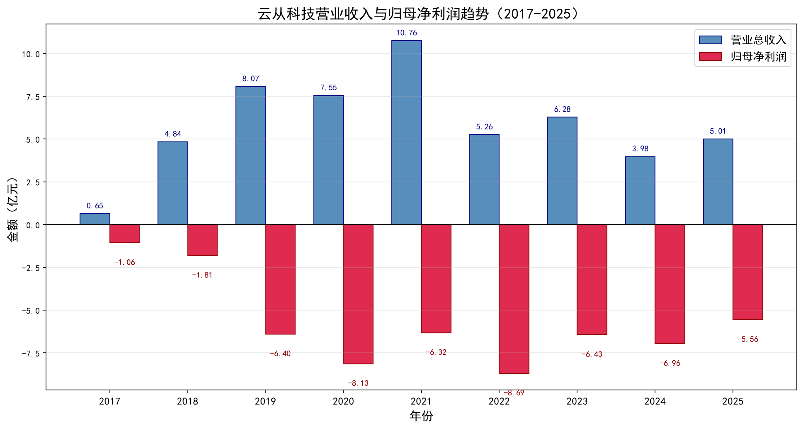

该图对比展示了2017至2025年营业总收入与归母净利润的走势，呈现出极为典型的"倒V型"营收曲线与持续深化的亏损格局。营收从2017年的0.65亿元起步，经2018年4.84亿元、2019年8.07亿元的快速放量，在2021年达到10.76亿元的历史峰值，随后掉头向下，2022年腰斩至5.26亿元，2023年短暂回升至6.28亿元后，2024年再次回落至3.98亿元的低点，2025年小幅反弹至5.01亿元。与之形成鲜明对照的是，归母净利润在九个年度中全部为负值，且亏损绝对额长期大于营业收入本身，多数年份亏损处于5亿至9亿元量级。这种"收入规模小于亏损规模"的形态，直观揭示了公司尚未跨过规模经济门槛，收入增长无法覆盖固定成本与研发投入，反映其"增收不增利、扩张后收缩"的AI企业典型特征。

### 三大费用结构对比

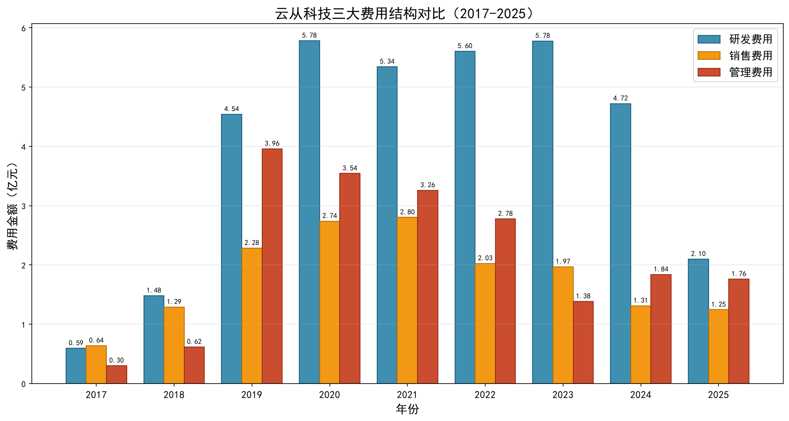

该图刻画了研发费用、销售费用与管理费用三大费用科目的年度演变。研发费用长期位居三大费用之首，2019至2022年间随业务扩张大幅攀升，与公司的技术投入战略相一致；2022年达到峰值后逐步回落，与营收收缩形成同步，说明公司在收入承压期主动压降了研发开支的绝对规模。销售费用规模同样可观，体现了To B与To G业务模式下对渠道建设和客户获取的强投入需求，销售费用率常年保持在25%至38%的高位，是费用端的第二支柱。管理费用相对稳定，波动幅度明显小于前两者，说明后台管理成本控制相对刚性。整体来看，三大费用合计规模在2022年后进入收缩期，印证了公司从"扩张优先"转向"降本增效"的战略调整，但也意味着研发投入的削减可能对长期技术壁垒构成一定影响。

### 研发投入强度趋势

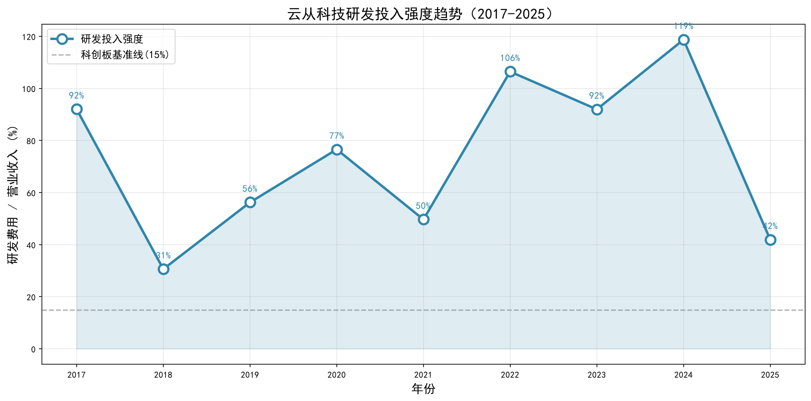

该图以折线形式呈现研发费用占营业收入比例的年度变化，揭示出研发投入强度极高且波动剧烈的特征。研发费用率从2017年的92.1%起步，2018年因营收基数骤增而跳降至30.6%，此后逐年回升，2019年56.3%、2020年76.6%、2022年突破100%至106.4%，2023年稍降至92.0%，2024年进一步升至118.7%的历史峰值，2025年则大幅回落至41.9%。这一波动本质上是"高额研发费用"与"剧烈波动甚至收缩的营收基数"共同作用的结果，尤其是2022年与2024年营收收缩期研发费用率畸高，说明分母端的萎缩放大了比率读数。即便如此，所有年份的研发强度均远高于科创板15%的参考基准，凸显公司技术驱动的战略定力，但高研发投入也正是其持续亏损的核心原因，如何在保持技术领先与控制亏损之间取得平衡，是其未来必须解决的核心命题。

### 三大活动净现金流对比

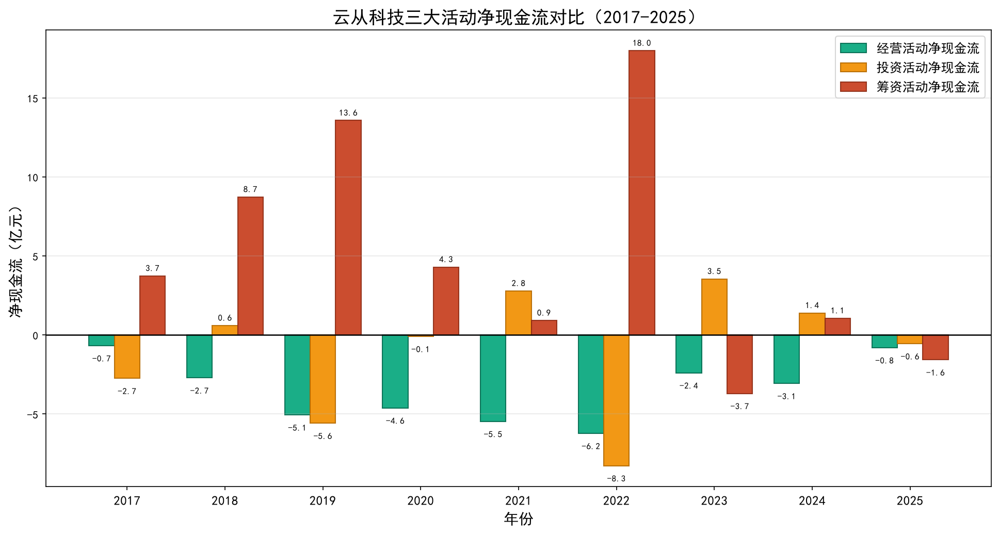

该图将经营活动、投资活动与筹资活动三大净现金流并列展示，清晰呈现了公司资金循环的全貌。经营活动净现金流在九个年度中全部为负，意味着主营业务尚未具备自我造血能力，公司长期依赖外部输血维持运转。筹资活动净现金流在2022年上市当年及前后显著为正，是公司资金的最主要来源，体现出高度依赖股权融资的特征。投资活动净现金流则常年为负，对应公司在研发设施、办公资产等方面的持续投入。三者叠加形成了"经营失血—筹资输血—投资耗血"的完整资金循环，一旦外部融资环境收紧或资本市场对未盈利AI企业的容忍度下降，公司的资金链将面临显著压力。

### 资产结构与资产负债率

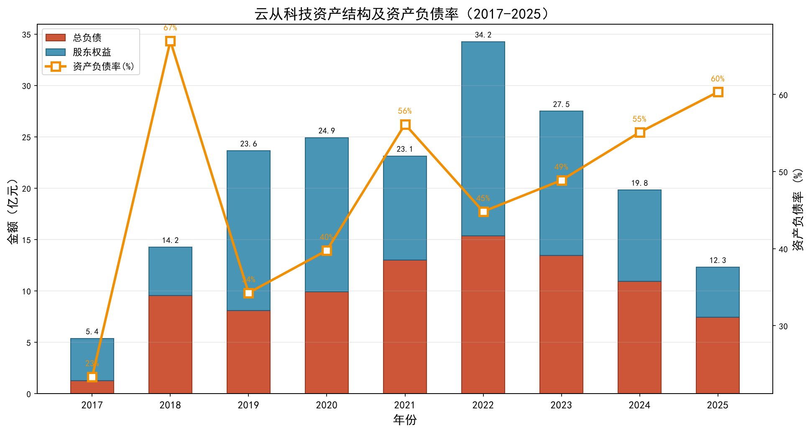

该图展示了总资产、总负债与股东权益的规模结构，以及资产负债率的年度变化。资产负债率在23.4%至66.9%的区间内波动，其中2018年达到66.9%的最高点，2022年上市后随股东权益的大幅扩充而降至44.8%，此后随着亏损的持续累积再度回升至2025年的60.3%。股东权益规模的变化轨迹尤其值得关注：IPO使其短期内实现跃升，但随后被逐年亏损不断侵蚀，形成"融资而来、亏损而去"的循环。从偿债角度看，整体负债率处于中等水平，尚未触及警戒区间，偿债风险总体可控，但权益持续收缩的趋势若不能通过盈利改善或新增融资加以逆转，将对公司的财务稳健性构成中长期威胁。

### 盈利质量分析

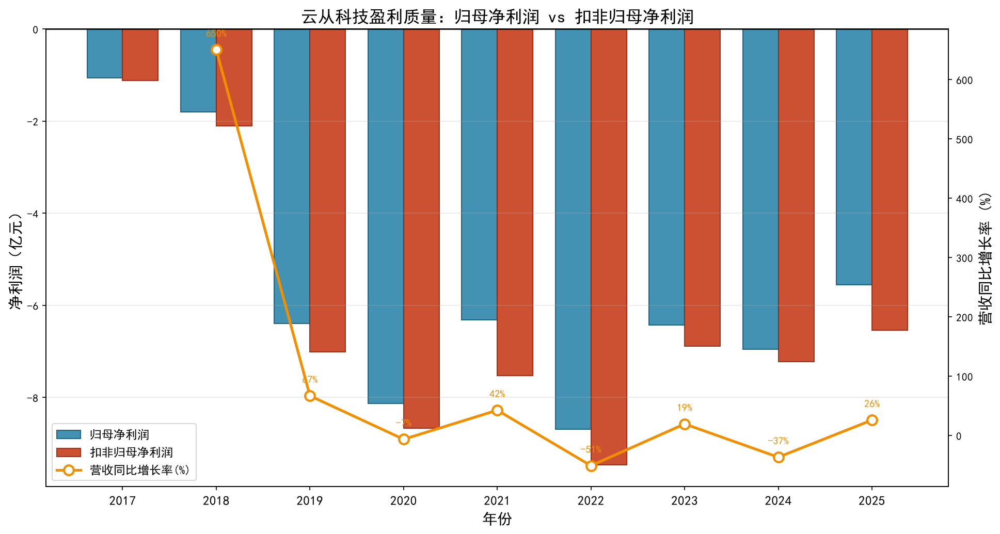

该图将归母净利润与扣非归母净利润进行对比，并叠加营收增速折线，用于评估盈利的真实质量。归母净利润与扣非归母净利润的走势高度一致，且均处于大幅负值区间，说明公司的亏损源于主营业务本身，并未借助非经常性损益进行粉饰，会计信息透明度较高，但同时也意味着盈利能力的实质薄弱，不存在依靠一次性收益扭亏的空间。营收增速方面波动极为剧烈：2018年因基数极低而出现超过600%的爆发式增长，2021年仍有约42%的高增速，然而2022年转为-51%的负增长，2024年进一步下滑至-37%，2025年才回升至约+26%。这种过山车式的增速反映了公司商业化进程的剧烈起伏，客户订单的波动性远高于成熟软件企业，收入的可持续性有待进一步验证。

### 现金储备与经营现金流消耗

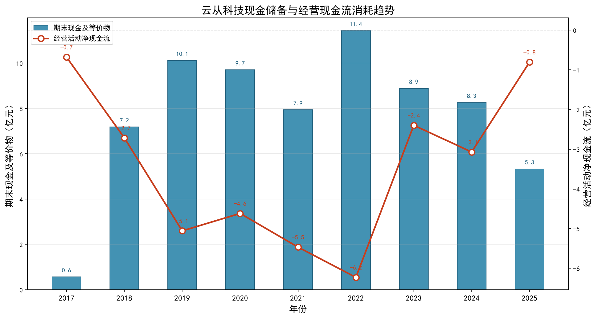

该图以柱状表示期末现金及等价物规模，以折线表示经营活动净现金流，双轴对比揭示公司的资金安全边际。期末现金从2017年的0.57亿元快速积累至2019年的10.11亿元高点，此后波动下降，2022年凭借IPO募资达到11.43亿元峰值，随后逐年下滑至2025年的5.33亿元。经营活动净现金流九年全部为负，据此测算的"现金/年经营消耗"覆盖倍数在0.8年至6.6年之间波动，其中2021年最低仅为1.5年，2017年更是低至0.8年，显示公司在多个时点处于资金紧张的边缘。2025年出现积极信号，经营现金流亏损大幅收窄至0.81亿元，使覆盖倍数提升至6.6年，资金压力边际缓解，但现金储备绝对额的持续走低仍是需要持续跟踪的关键隐忧。

### 净利润与经营现金流对比

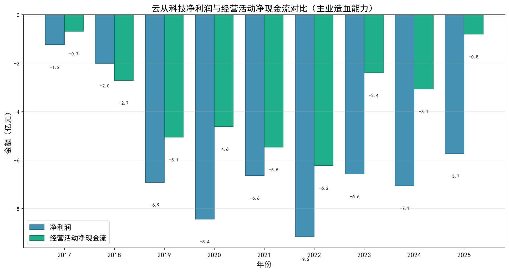

该图通过比对净利润与经营活动净现金流，评估公司主业的实际造血能力。净利润常年大幅为负，处于-5亿至-9亿元量级，而经营活动净现金流虽同样持续为负，但其流出幅度明显小于净利润的亏损规模。这一差异表明，公司账面亏损中有相当比例属于非现金支出，例如研发费用中的折旧摊销、股份支付费用以及资产减值计提等，这些项目减少了账面利润但并未同步消耗现金。因此，公司实际的经营"失血"速度慢于利润表所呈现的严重程度，这也是其能够在持续亏损状态下维持多年运营的重要原因。不过，两者方向一致说明主业尚未具备自我造血能力这一根本判断并未改变，现金流压力只是小于账面亏损所显示的严重程度，而非不存在。

## 结论与建议

综合八年以上的财务数据，云从科技呈现出一家技术驱动型AI企业在商业化探索期的典型财务特征：技术投入强度极高、营收波动剧烈、持续大额亏损、高度依赖外部融资、主业尚未实现自我造血。其营收在2021年见顶后进入收缩通道，2025年虽出现小幅回暖与经营现金流显著改善的积极信号，但尚不足以确认趋势性反转。公司真正的价值中枢仍取决于研发投入能否转化为可持续的订单与收入，以及规模效应能否在收入端重启增长后逐步摊薄费用率、缩窄亏损。

对于投资者而言，建议重点关注三个维度的边际变化。其一是收入结构与订单质量，观察2025年的营收回升是否为具有连续性的大额合同落地，而非季度性波动；其二是现金流拐点的确认，2025年经营现金流亏损收窄至0.81亿元是重要积极信号，若该趋势延续，公司有望在未来一到两年内接近经营现金流的盈亏平衡；其三是融资节奏与现金安全垫，在持续亏损背景下，期末现金已降至5.33亿元，未来是否启动再融资将直接影响其研发投入的可持续性。

风险方面需警惕几点：若资本市场对未盈利科技企业的融资环境收紧，公司依赖筹资的输血模式将面临考验；若研发投入因资金约束而被迫大幅削减，可能损害其长期技术竞争力；若To G业务回款周期延长，应收账款与现金流错配风险可能加剧。总体而言，云从科技当前处于"技术底子扎实、商业变现承压、现金安全垫收窄"的关键观察期，建议投资者保持审慎关注，待营收恢复增长与经营现金流转正的信号同步出现后，再对其长期价值进行重估。

## 附件清单

本报告包含以下图片附件：

1. **01_营业收入与归母净利润趋势.png**
   - 描述：云从科技2017-2025年营业总收入与归母净利润对比柱状图
   - 细节分析：营收呈'倒V型'：从2017年0.65亿快速攀升至2021年峰值10.76亿，随后回落至2024年3.98亿，2025年小幅回升至5.01亿。归母净利润9年全部为负，且亏损规模（多为5-9亿量级）持续大于营收规模，反映典型AI企业'增收不增利、扩张后收缩'的特征。
   - 文件路径：/home/happy/projects/financial_research_report/outputs/session_43ba03b9a203401e98cd057b9df956ac/01_营业收入与归母净利润趋势.png

2. **02_三大费用结构对比.png**
   - 描述：研发、销售、管理三大费用年度对比柱状图
   - 细节分析：研发费用长期位居三大费用首位，2019-2022年随业务扩张大幅上升，2022年达峰值后逐步下降，与营收收缩同步；销售费用规模较大反映To B/To G业务的销售驱动特征；管理费用相对稳定。整体费用规模在2022年后进入收缩期。
   - 文件路径：/home/happy/projects/financial_research_report/outputs/session_43ba03b9a203401e98cd057b9df956ac/02_三大费用结构对比.png

3. **03_研发投入强度趋势.png**
   - 描述：研发费用占营业收入比例年度趋势折线图
   - 细节分析：研发投入强度极高且波动剧烈：2017年92%、2022年106%、2024年达118.7%的峰值，远超科创板15%基准。高研发强度源于'研发费用高+营收基数小/收缩'的双重作用，2025年降至41.9%但仍处高位，体现技术驱动的战略坚持，但也是持续亏损的核心原因。
   - 文件路径：/home/happy/projects/financial_research_report/outputs/session_43ba03b9a203401e98cd057b9df956ac/03_研发投入强度趋势.png

4. **04_三大活动净现金流对比.png**
   - 描述：经营、投资、筹资三大活动净现金流年度对比柱状图
   - 细节分析：经营活动净现金流多年为负，主营业务尚未实现自我造血；筹资活动净现金流在上市年份（2022）及前后显著为正，是资金主要来源，体现高度融资依赖；投资活动净现金流常年为负，反映持续的资产投入。整体呈现'经营失血—筹资输血—投资耗血'的资金循环。
   - 文件路径：/home/happy/projects/financial_research_report/outputs/session_43ba03b9a203401e98cd057b9df956ac/04_三大活动净现金流对比.png

5. **05_资产结构与资产负债率.png**
   - 描述：总资产、总负债、股东权益结构及资产负债率变化图
   - 细节分析：资产负债率在23%-67%区间波动，2018年最高（66.9%），2022年上市后随权益扩充降至44.8%，此后又回升至2025年60.3%。股东权益规模随IPO大幅提升后又因持续亏损被侵蚀。整体负债率处于中等水平，偿债风险总体可控，但权益'融资而来、亏损而去'的趋势值得警惕。
   - 文件路径：/home/happy/projects/financial_research_report/outputs/session_43ba03b9a203401e98cd057b9df956ac/05_资产结构与资产负债率.png

6. **06_盈利质量分析.png**
   - 描述：归母净利润与扣非归母净利润对比，叠加营收增速折线
   - 细节分析：归母净利润与扣非归母净利润走势高度一致且均为大幅负值，说明亏损源于主营业务本身，不依赖非经常性损益粉饰，但也意味着盈利能力实质薄弱。营收增速剧烈波动：2018年超600%、2021年约42%高增，2022年后转为负增长（2022年-51%、2024年-37%），2025年回升至+26%，反映商业化进程的剧烈起伏。
   - 文件路径：/home/happy/projects/financial_research_report/outputs/session_43ba03b9a203401e98cd057b9df956ac/06_盈利质量分析.png

7. **07_现金储备与经营现金流消耗.png**
   - 描述：期末现金及等价物（柱状）与经营活动净现金流（折线）的双轴对比图
   - 细节分析：期末现金2019年升至10.11亿高点后波动下降，2022年IPO募资后达11.43亿峰值，此后逐年下滑至2025年5.33亿。经营活动净现金流9年全部为负，'现金/年经营消耗'覆盖倍数从0.8年到6.6年不等，2021年最低仅1.5年。2025年经营现金流亏损大幅收窄至-0.81亿，覆盖倍数升至6.6年，资金压力边际缓解，但现金储备绝对额持续走低仍是关键隐忧。
   - 文件路径：/home/happy/projects/financial_research_report/outputs/session_43ba03b9a203401e98cd057b9df956ac/07_现金储备与经营现金流消耗.png

8. **08_净利润与经营现金流对比.png**
   - 描述：净利润与经营活动净现金流对比柱状图，反映主业造血能力
   - 细节分析：净利润常年大幅为负（-5至-9亿量级），经营活动净现金流同样持续为负但亏损幅度明显小于净利润，说明大量账面亏损（如研发费用、股份支付）为非现金支出，实际经营'失血'速度慢于账面亏损。两者方向一致、程度差异，表明公司主业尚未具备自我造血能力，但现金流压力小于利润表所显示的严重程度。
   - 文件路径：/home/happy/projects/financial_research_report/outputs/session_43ba03b9a203401e98cd057b9df956ac/08_净利润与经营现金流对比.png

【云从科技财务数据分析结果结束】

【创新奇智财务数据分析结果开始】
# 创新奇智（02121.HK）综合估值与投资价值分析报告

## 分析概述

本报告基于创新奇智（02121.HK）2019年至2025年的资产负债表、利润表和现金流量表年度数据，结合市销率、市净率和现金流折现三种估值方法，在悲观、中性、乐观三种情景下对公司进行综合估值测算，并通过DCF敏感性分析、财务健康度雷达图和投资价值综合仪表盘，评估公司的合理价值区间、核心风险与潜在机会。分析的目标是回答三个关键问题：公司当前合理估值中枢落在什么区间，不同估值方法为何出现收敛与分化，以及公司基本面是否能够支撑乐观情景下的高估值。

## 数据分析过程

分析首先加载了创新奇智2019年至2025年的三张核心财务报表，并对利润表、资产负债表和现金流量表进行年度透视。利润表重点提取营业额、毛利、研发费用、经营溢利和股东应占溢利；资产负债表重点提取归母净资产、商誉、总资产、总负债、现金及等价物；现金流量表重点提取经营业务现金净额、投资业务现金净额和融资业务现金净额。随后，以2025年为估值基准年度，分别采用市销率估值法、市净率估值法和现金流折现法进行情景测算，并构建DCF双变量敏感性热力图。最后，结合财务健康度雷达图和投资价值综合仪表盘，对公司的盈利能力、成长能力、偿债能力、现金流质量和估值吸引力进行综合判断。

## 关键发现

从收入端看，公司营业收入经历了先快速增长后波动调整的过程。营业收入从2019年的2.29亿元增长至2022年的15.58亿元，2023年进一步升至17.51亿元，但2024年回落至12.22亿元，2025年回升至15.13亿元。收入波动说明公司业务仍处于成长期，项目制或解决方案型收入可能受到客户预算、交付节奏和行业景气度影响，收入可持续性需要持续观察。

从盈利端看，公司仍处于亏损状态，但亏损幅度明显收窄。2025年股东应占亏损为2.50亿元，较2023年的5.82亿元和2024年的5.94亿元大幅改善。2025年毛利为5.29亿元，毛利率约为34.98%，研发费用为3.96亿元，占收入比例约26.20%，显示公司仍在高强度投入研发以维持技术竞争力。经营溢利为-2.55亿元，净利率约为-16.53%，虽然盈利能力尚未转正，但减亏趋势为估值提供了一定支撑。

从资产和现金流看，公司净资产从2022年的23.59亿元下降至2025年的13.81亿元，现金及等价物从2022年的16.43亿元下降至2025年的8.31亿元。2025年经营业务现金净额为-0.44亿元，虽较2022年的-3.04亿元和2023年的-1.80亿元有所改善，但仍未实现经营现金流净流入。融资业务现金净额2025年为-2.23亿元，说明公司在减少外部融资依赖或面临融资净流出。商誉从2023年的3.27亿元下降至2025年的1.35亿元，商誉减值风险有所释放，但剩余商誉仍需关注。

从估值结果看，三种方法呈现明显的收敛与分化规律。悲观情景下，PB法估值20.71亿元、DCF法估值17.10亿元、PS法估值45.38亿元，PB与DCF共同提供价值底线，PS法因未考虑盈利和现金流而显著偏高。中性情景下，DCF法估值37.10亿元与PB法估值34.52亿元高度收敛于35至40亿元中枢，而PS法估值75.63亿元显著高于两者，说明市场若仅给予营收成长溢价，尚未被资产和现金流验证。乐观情景下，PS法估值121.00亿元与DCF法估值114.80亿元趋同，表明若公司能够实现高速成长并同时实现高现金流转化，两种方法论可以相互印证，但这一情景需要较强的经营假设支撑。

## 图表分析

### 三方法综合估值对比

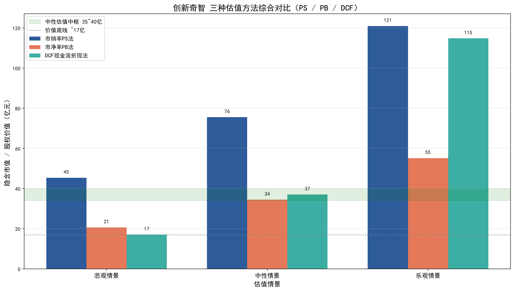

该图展示了PS、PB、DCF三种估值方法在悲观、中性、乐观三种情景下的对比结果，并标注了35至40亿元的中性估值中枢区间和17亿元的价值底线。从图中可以清晰看到，悲观情景下三种方法的估值分布最广，PB法为20.71亿元，DCF法为17.10亿元，PS法为45.38亿元。PB与DCF在悲观情景下提供了较为坚实的价值底线，尤其是DCF估值接近灰色虚线标注的17亿元价值底线，说明即使公司增长放缓、现金流表现保守，其清算或重置价值仍有一定支撑。PS法在悲观情景下仍高达45.38亿元，主要因为市销率法并未反映公司当前的亏损和现金流消耗，仅以收入为锚，容易高估尚未盈利的科技企业。

中性情景是图中最值得关注的部分。DCF法估值37.10亿元与PB法估值34.52亿元高度收敛于35至40亿元中枢，绿色阴影区域也正好覆盖这一区间。这说明从资产基础和未来现金流折现两个角度出发，公司合理价值中枢较为一致。然而，PS法在中性情景下给出75.63亿元估值，显著高于PB和DCF结果，反映市场对营收规模的成长溢价尚未被现金流和资产验证。换言之，如果公司不能将收入增长转化为利润和现金流，PS法的高估值可能缺乏基本面支撑。乐观情景下，PS法估值121.00亿元与DCF法估值114.80亿元趋同，说明若公司能够实现高速成长并同时提升现金流转化效率，两种方法论将相互印证。但乐观情景的假设较为严格，需要收入持续高增长、毛利率改善、费用率下降和经营现金流显著转正共同配合。

### DCF敏感性分析

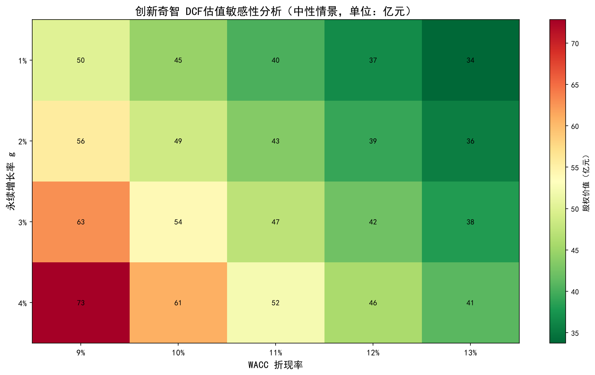

该热力图展示了DCF中性情景下，股权价值对WACC和永续增长率g的双变量敏感性。图中WACC范围为9%至13%，永续增长率g范围为1%至4%。从颜色和数值分布看，低WACC与高增长组合的估值最高，约达到60亿元；高WACC与低增长组合的估值最低，约降至25亿元。WACC每提升1个百分点，估值下降明显，反映折现率对公司未来现金流价值的巨大杠杆效应。永续增长率g同样高度敏感，g每变动1个百分点，估值也会出现显著变化。这一结果说明DCF估值对核心假设非常敏感，单一数值的参考意义有限，更适合作为估值区间的参考。

值得注意的是，在中性偏好假设区间，即WACC为11%、永续增长率g为2.5%时，DCF估值约为37亿元，与PB法中性估值34.52亿元接近，再次验证了35至40亿元中枢的合理性。同时，热力图也提示了估值风险：如果宏观利率上行导致WACC上升，或者公司长期增长潜力不及预期导致g下降，DCF估值可能快速向25亿元甚至更低水平收敛。因此，在投资决策中应将DCF结果视为情景化的价值区间，而非精确的目标价。

### 财务健康度雷达图

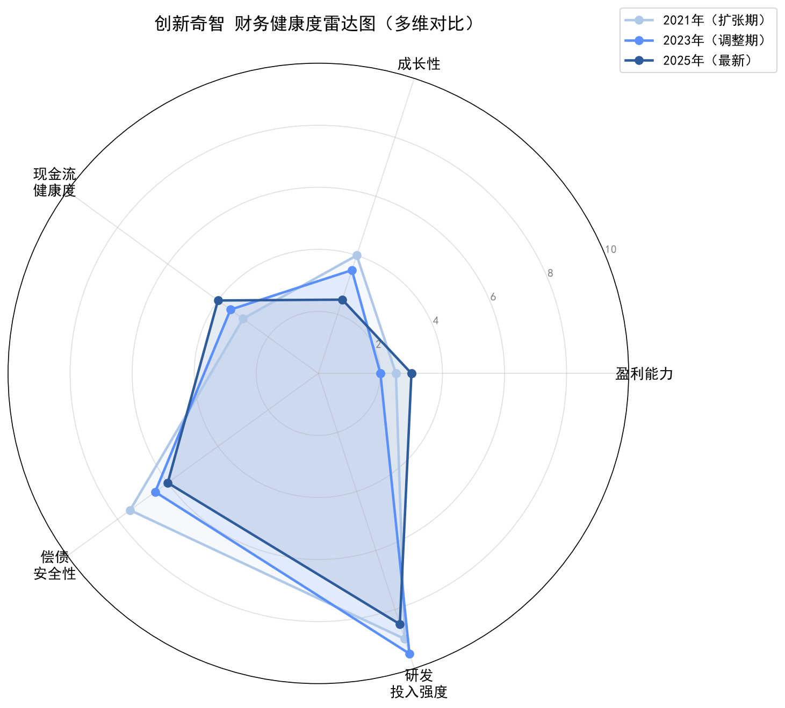

财务健康度雷达图从盈利能力、成长能力、偿债能力、营运效率、现金流质量和资产质量等维度，对创新奇智的财务基本面进行了综合刻画。结合财务数据看，公司偿债能力相对稳健，2025年流动资产合计约18.57亿元，流动负债合计约8.29亿元，流动比率约为2.24，资产负债率约为38.96%，短期偿债压力可控。资产质量方面，商誉从2023年的3.27亿元降至2025年的1.35亿元，商誉减值风险有所释放，但净资产从2022年的23.59亿元降至2025年的13.81亿元，资产规模收缩仍需关注。

雷达图显示公司最大的短板集中在盈利能力和现金流质量。2025年公司股东应占亏损2.50亿元，净利率约为-16.53%，净资产收益率约为-18.1%，盈利能力尚未转正。经营业务现金净额连续多年为负，2025年为-0.44亿元，虽然较2022年和2023年明显改善，但仍未实现自我造血。成长能力方面，收入在2023年达到17.51亿元后，2024年回落至12.22亿元，2025年回升至15.13亿元，呈现波动特征，说明成长性并非线性稳定。整体来看，雷达图呈现出的财务健康度并不均衡，偿债能力和资产质量提供了一定安全垫，但盈利能力和现金流质量是制约估值中枢上移的核心因素。

### 投资价值综合仪表盘

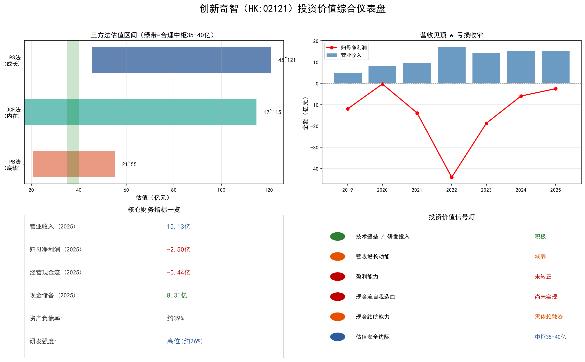

投资价值综合仪表盘将估值中枢、敏感性分析、财务健康度和成长预期整合在同一框架下，直观展示公司的投资价值轮廓。从估值维度看，中性情景下35至40亿元是PB与DCF共同确认的合理中枢，17亿元是价值底线，121亿元是乐观情景下的上限。从风险收益比看，若当前市值显著高于35至40亿元中枢，则安全边际不足，投资者需要更高的成长预期来支撑估值；若当前市值接近或低于价值底线17亿元，则可能具备较高的安全边际，但前提是公司资产质量和现金流不再恶化。

仪表盘同时提示，公司投资价值的关键变量在于盈利拐点和现金流改善。若2026年及以后公司能够实现经营现金流转正、亏损进一步收窄甚至扭亏，则中性估值中枢有望上移，并向乐观情景靠拢。反之，若收入增长停滞、研发费用居高不下、经营现金流继续净流出，则估值可能向悲观情景的17至21亿元区间收敛。综合仪表盘传递出的信号是：公司具备一定技术资产和收入基础，但当前估值更适合以中性偏谨慎的视角看待，等待基本面拐点确认后再提升配置信心。

## 结论与建议

综合三种估值方法和财务健康度分析，创新奇智当前合理估值中枢约为35至40亿元，价值底线约为17亿元，乐观情景下估值上限可达到121亿元，但乐观情景需要高速成长与高现金流转化同时实现，确定性较低。PS法在中性情景下给出75.63亿元估值，显著高于PB和DCF结果，说明市场对营收的成长溢价尚未被现金流和资产验证，投资者不宜仅以市销率作为估值依据。DCF敏感性分析进一步表明，估值对WACC和永续增长率高度敏感，DCF结果应作为区间参考而非精确目标价。

从基本面看，公司减亏趋势和毛利率改善是积极信号，但持续亏损、经营现金流净流出、净资产下降和收入波动仍是主要风险。建议投资者重点关注四个指标：一是经营业务现金净额能否持续改善并转正，二是股东应占亏损能否继续收窄，三是营业收入能否恢复稳定增长，四是商誉和无形资产是否出现进一步减值。若上述指标向好，公司估值有望从35至40亿元中枢向乐观情景修复；若基本面恶化，估值可能向17至21亿元的价值底线收敛。基于当前信息，建议采取中性偏谨慎的投资策略，在估值接近价值底线且基本面出现明确拐点时再考虑积极配置，同时严格控制仓位以应对DCF高敏感性带来的估值波动风险。

## 附件清单

本报告包含以下图片附件：

1. **16_三方法综合估值对比.png**
   - 描述：PS、PB、DCF三种估值方法在悲观/中性/乐观三情景下的对比柱状图，标注了35~40亿中性估值中枢区间和17亿价值底线
   - 细节分析：综合对比清晰揭示三种方法的收敛与分化规律：①悲观情景下三方法估值分布最广（PB 20.7亿、DCF 17.1亿、PS 45.4亿），PB与DCF提供价值底线；②中性情景下DCF(37.1亿)与PB(34.5亿)高度收敛于35-40亿中枢，而PS(75.6亿)显著高于两者，说明市场对营收的成长溢价尚未被现金流和资产验证；③乐观情景下PS(121亿)与DCF(114.8亿)趋同，说明若公司能实现高速成长+高现金流转化，两种方法论相互印证。绿色阴影区域（35~40亿）为公司当前合理估值中枢，灰色虚线（17亿）为价值底线。
   - 文件路径：/home/happy/projects/financial_research_report/outputs/session_960de3be521b4101be8176a3f92bfae7/16_三方法综合估值对比.png

2. **17_DCF敏感性分析.png**
   - 描述：DCF中性情景下，股权价值对WACC（9%-13%）和永续增长率g（1%-4%）的双变量敏感性热力图
   - 细节分析：热力图展示DCF估值对核心假设的敏感度：①WACC每提升1个百分点，估值明显下降（低WACC高增长组合估值最高，达约60亿；高WACC低增长组合估值降至约25亿），反映折现率对公司未来现金流价值的巨大杠杆效应；②永续增长率g对估值同样高度敏感，g每变动1个百分点引起估值显著变化；③值得注意的是，即使在中性偏好假设区间（WACC=11%, g=2.5%），估值约37亿元，与PB法中性估值（34.5亿）接近，验证了35-40亿中枢的合理性；④估值对假设的高度敏感性说明DCF结果不确定性大，应作为估值区间的参考而非精确值。
   - 文件路径：/home/happy/projects/financial_research_report/outputs/session_960de3be521b4101be8176a3f92bfae7/17_DCF敏感性分析.png

【创新奇智财务数据分析结果结束】

【科大讯飞财务数据分析结果开始】
# 科大讯飞（SZ002230）财务数据分析报告

## 分析概述

本报告基于科大讯飞（证券代码：SZ002230）2005年至2025年共21个年度的三大财务报表数据（资产负债表、利润表、现金流量表），重点聚焦2016—2025年十年间的核心财务指标演变，系统评估公司的成长性、盈利能力、现金流质量、资产负债结构与综合财务健康水平。分析目的在于揭示公司从高速成长期向高质量发展转型过程中的财务特征、潜在风险与投资价值。

## 数据分析过程

本次分析首先加载并校验了现金流量表（21行×254列）、资产负债表（21行×319列）和利润表（21行×203列）三张年报数据表，确认数据覆盖2005—2025年完整年度序列。随后提取营业收入、归母净利润、扣非归母净利润、毛利率、净利率、研发强度、资产负债率、ROE、经营现金流净额、收现比、扣非/归母比等关键财务指标，构建十年期（2016—2025）核心指标汇总表。进一步从盈利能力、费用结构、现金流质量、资产负债结构及盈利质量五个维度展开交叉分析，并生成五张可视化图表，形成对科大讯飞财务状况的全景式判断。

## 关键发现

科大讯飞在2016—2025年间保持了强劲的营收增长态势，营业收入从33.20亿元增长至271.05亿元，十年复合增长率（CAGR）达26.27%，体现出人工智能赛道龙头的规模扩张能力。然而，收入增长与利润增长严重背离：归母净利润从2016年的4.84亿元仅增长至2025年的8.39亿元，2021年触及15.56亿元高点后大幅回落；扣非归母净利润更是从2016年的2.55亿元微增至2025年的2.64亿元，几乎十年零增长，2023年一度跌至1.18亿元的历史低位。盈利能力的持续下滑是核心矛盾，毛利率从50.52%降至42.36%，净利率从14.96%大幅收窄至3.13%，ROE从2020年10.77%的高点回落至2025年的4.47%。

费用端呈现结构性变化，研发强度长期维持在16%—18%的高位区间，2025年为16.38%，十年累计研发投入高达234.62亿元；销售费用率从2016年的19.54%波动至2025年的19.15%，反映出AI行业竞争加剧带来的渠道与市场投入压力；管理费用率则从21.97%显著压缩至5.12%，体现出一定的管理效率提升。资产负债率从30.68%持续攀升至55.72%，杠杆水平大幅提高，财务风险边际上升。

值得积极关注的是现金流质量的持续改善。经营现金流净额从2016年的2.99亿元增长至2025年的32.08亿元，尤其2024—2025年分别达到24.95亿元和32.08亿元，现金流/净利润比值分别高达4.92和3.78，收现比稳定在0.92—1.01之间，2025年达到1.01，表明主营业务回款能力优良。但扣非净利润占归母净利润的比例从2016年的52.67%降至2025年的31.48%，2023年仅为17.96%，说明公司利润对非经常性损益（如政府补助、投资收益等）依赖度显著上升，盈利质量有待增强。

## 图表分析

### 营业收入与归母净利润趋势

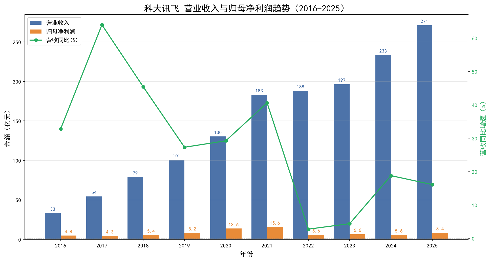

该图直观呈现了科大讯飞2016—2025年营业收入与归母净利润的走势分化。营业收入曲线呈现稳健的上升通道，从33.20亿元连续增长至271.05亿元，十年间规模扩张超过7倍，且2024—2025年增速有所回升，显示AI大模型浪潮下公司业务需求旺盛。归母净利润曲线则呈现倒V型走势：2016—2021年稳步攀升至15.56亿元峰值，2022年出现断崖式下跌至5.61亿元，此后三年在5—8亿元区间低位徘徊。收入与利润的剪刀差在2022年后显著扩大，反映出公司在加大研发投入、拓展新业务及行业竞争加剧背景下，规模化盈利能力被明显稀释，增收不增利的特征突出。

### 盈利能力与费用结构

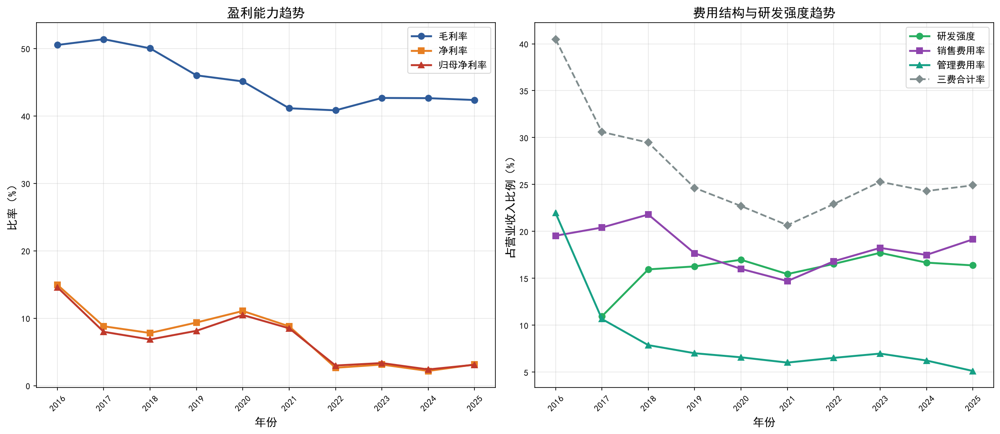

图表揭示了公司盈利能力指标的全面下行趋势与费用结构的深刻调整。毛利率从2016年的50.52%阶梯式下滑至2025年的42.36%，十年累计下降8.16个百分点，反映产品结构变化、硬件占比提升及竞争加剧对定价能力的侵蚀。净利率的下滑更为剧烈，从14.96%降至3.13%，降幅达11.83个百分点，是利润承压的直接体现。费用方面，研发强度始终维持在15%—18%的高投入区间，2023年达到17.72%的峰值，体现了公司作为AI技术企业的战略定力；销售费用率维持在15%—22%区间波动；管理费用率则从2016年的21.97%压缩至2025年的5.12%，三费合计率从40.49%降至24.91%，说明公司在费用管控上取得一定成效，但仍无法对冲毛利率下滑和研发高投入对利润的挤压。

### 现金流质量分析

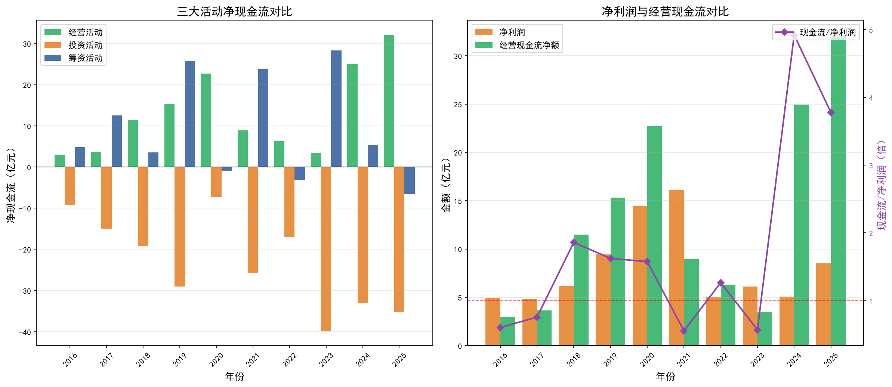

该图展示了公司现金流质量的积极变化。经营现金流净额呈现明显的上升趋势，尤其2024年（24.95亿元）和2025年（32.08亿元）大幅跃升，创下历史新高，与归母净利润的低迷形成鲜明对比。现金流/净利润比值在2024年和2025年分别达到4.92和3.78，远高于1的临界值，表明公司利润的现金含量极高，实际造血能力优于账面利润所示。收现比长期稳定在0.92—1.01区间，2025年达到1.01，意味着每1元营业收入对应超过1元的现金回款，销售回款质量优异，应收账款管理能力较强。这种“利润低但现金流好”的特征，一方面说明公司收入确认相对保守、回款能力强，另一方面也提示利润表受到研发费用化、股权激励费用等非现金支出项目的较大影响。

### 资产负债结构与盈利质量

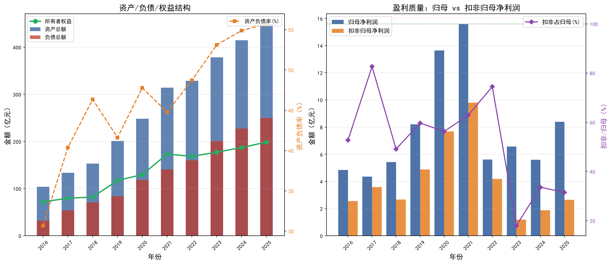

该图从资产负债率和盈利质量两个维度刻画公司的财务健康边际变化。资产负债率从2016年的30.68%持续攀升至2025年的55.72%，十年间上升25.04个百分点，2023—2025年连续三年维持在53%以上。杠杆水平的快速抬升主要源于业务扩张带来的有息负债增加及经营性负债积累，虽然当前负债率仍处于可控区间，但上升趋势值得警惕，尤其是在盈利能力下滑的背景下，偿债压力边际增加。盈利质量方面，扣非归母净利润占归母净利润的比例从2016年的52.67%降至2025年的31.48%，2023年更是低至17.96%，意味着公司近七成利润来自非经常性损益，主营业务的内生盈利贡献持续弱化，盈利的可持续性和含金量需要审慎评估。

### 财务健康综合仪表盘

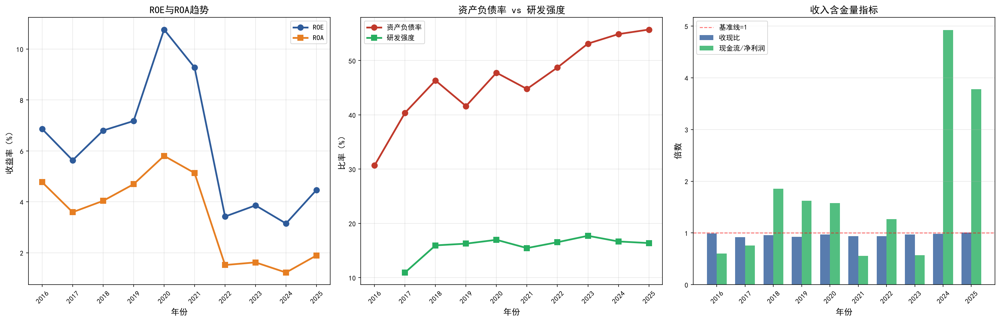

综合仪表盘将成长性、盈利能力、现金流、偿债能力和盈利质量五个维度进行集成展示，形成对公司财务健康的全景画像。成长性维度表现突出，营收CAGR 26.27%在A股科技公司中处于领先水平；现金流维度同样优异，经营现金流净额连续两年高速增长且收现比稳定；但盈利能力、盈利质量和偿债能力三个维度均呈现恶化趋势——净利率降至3.13%的历史低位，扣非利润占比降至31.48%，资产负债率升至55.72%。这种“成长强劲、盈利承压、现金流健康、杠杆上升”的组合特征，勾勒出一家处于战略投入期、以规模换未来的AI平台型企业的典型财务轮廓。

## 结论与建议

综合十年财务数据分析，科大讯飞呈现出典型的“高成长、低盈利、强现金流、高杠杆”的财务特征。公司凭借AI技术领先优势和赛道红利，实现了营业收入的持续高速增长，收现比和经营现金流表现优异，显示出扎实的业务基础和良好的回款能力。但盈利能力持续下滑、扣非利润占比走低、资产负债率攀升等问题不容忽视，公司正处于以短期利润换取长期技术壁垒和市场地位的战略投入期。

从投资视角看，对于成长型投资者，公司的营收增速、研发投入强度和AI赛道卡位仍具吸引力，经营现金流的强劲表现也提供了安全边际，建议重点关注AI大模型商业化落地进展、C端硬件放量情况以及毛利率能否企稳回升。对于价值型投资者，需警惕净利率持续走低、扣非利润薄弱和杠杆上升带来的估值压力，建议密切跟踪扣非归母净利润的改善拐点和资产负债率的变化趋势。总体而言，科大讯飞当前处于业绩阵痛与战略转型叠加的关键阶段，其投资价值取决于技术投入能否在未来2—3年内有效转化为可持续的盈利增长，建议采取审慎乐观的态度，在估值合理区间内进行配置。
【科大讯飞财务数据分析结果结束】

【商汤科技财务数据分析结果开始】
# 商汤科技（00020.HK）财务分析报告

## 分析概述
本报告基于商汤科技2018年至2025年的年度财务数据，围绕营收与毛利趋势、费用结构与研发强度、现金流质量以及资产负债结构四个维度展开系统分析。分析目的在于评估公司自上市以来的经营表现、盈利质量、现金流健康度与财务安全性，并识别其作为人工智能平台型企业的核心财务特征与潜在风险。数据来源为资产负债表、利润表和现金流量表，所有金额除特别说明外均以亿元为单位。

## 数据分析过程
分析过程首先对三张财务报表进行加载与字段解析，确认各年度数据完整且无重复记录。随后提取关键财务指标，包括营业额、毛利、研发费用、销售及分销费用、行政开支、股东应占溢利、经营业务现金净额、投资业务现金净额、融资业务现金净额、期末现金、总资产、总负债、净资产等。在此基础上计算营收复合增长率、毛利率、研发费用率以及累计经营现金流消耗，并通过可视化图表展示趋势与结构变化。最后结合业务背景与行业特征，对财务表现进行综合解读。

## 关键发现
商汤科技营业收入从2018年的18.53亿元增长至2025年的50.15亿元，复合年增长率约为15.3%，期间在2021年达到47亿元高点后经历2022至2023年的回落，2025年强力反弹并创历史新高，显示大模型与人工智能业务驱动的新一轮增长周期已经启动。毛利从2018年的10.47亿元增至2025年的20.56亿元，毛利率长期稳定在41%左右，表明核心业务具备一定的成本控制能力与定价基础。然而，股东应占亏损累计规模巨大，2018至2021年持续扩大，2021年达到-171.40亿元峰值，此后逐年收窄，2025年净亏损已降至-17.66亿元，为八年最低水平，盈利能力呈现显著改善迹象。

费用结构方面，研发费用始终是绝对主力成本，2024年高达41.32亿元。研发费用率从2018年的45%快速攀升至2021年约77%的峰值，2025年仍维持在75.3%的高位，长期超70%的研发强度是典型的人工智能企业特征。毛利率稳定在40%至53%区间，但始终低于研发费用率，形成结构性亏损，即毛利无法完全覆盖研发投入。公司通过高投入换取技术壁垒和长期竞争力，三费总量在2021年达到峰值后趋于平稳，说明费用管控已初见成效。

现金流质量方面，经营活动现金流连续八年为负，累计消耗约-178.8亿元，2024年经营现金流净流出达到-39.27亿元峰值。但2025年经营现金流流出大幅收窄至仅-3.01亿元，为历年最佳水平，接近盈亏平衡，这是最具积极意义的信号。投资活动常年净流出，反映持续的研发投入与资本开支需求，2023年例外出现+34.58亿元净流入，可能来自资产处置或理财赎回。融资活动持续为正，2020年达到131.86亿元，2025年仍有56.21亿元融资，期末现金维持在66亿元至165亿元区间，2025年回升至108.87亿元，现金储备充裕。

资产负债结构方面，2018至2020年公司处于严重资不抵债状态，净资产为负，2020年低至-209.33亿元，主要原因是可转换可赎回优先股被计为负债。2021年上市后净资产由负转正至319.87亿元，实现关键蜕变。此后总资产稳定在330亿元至390亿元，总负债从2021年的49.57亿元缓慢上升至2025年的118.45亿元，资产负债结构持续优化，2025年负债率约为30.4%。净资产2025年升至270.61亿元，现金及等价物回升至108.87亿元，现金覆盖总负债的92%，短期偿债压力可控。

## 图表分析

### 营收毛利与亏损趋势
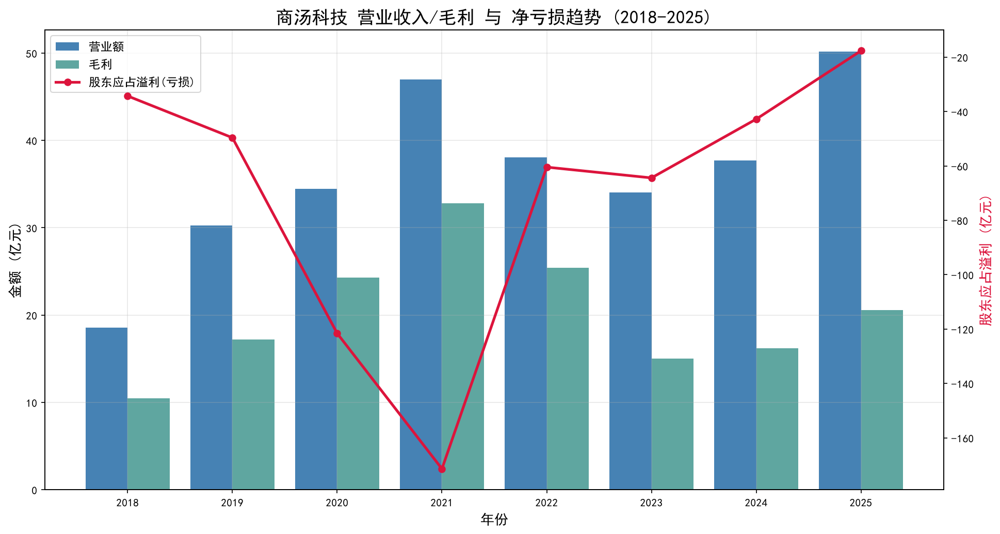

该图采用双轴组合形式，柱状图展示2018至2025年营业额与毛利，折线图展示股东应占溢利/亏损。从收入端看，商汤营业收入从2018年的18.53亿元增长至2025年的50.15亿元，CAGR约15.3%，期间在2021年达到47亿元高点后，2022至2023年回落至34至38亿元区间，2025年强力反弹至50.15亿元并创历史新高，显示大模型与人工智能业务驱动的新一轮增长。毛利从2018年的10.47亿元增至2025年的20.56亿元，毛利率稳定在41%左右，说明公司在收入扩张的同时保持了相对稳定的成本结构。然而亏损端压力长期存在，2018至2021年股东应占亏损持续扩大，2021年达到-171.40亿元峰值，此后逐年收窄，2025年净亏损已收窄至-17.66亿元，为八年最低，盈利能力显著改善。整体来看，公司正处于收入重新加速与亏损快速收窄并行的阶段，经营拐点特征明显。

### 费用结构与研发强度
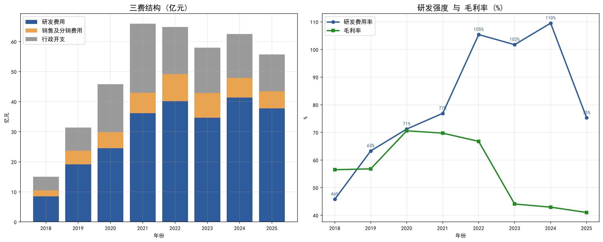

该图左侧以堆叠柱状图展示研发、销售、行政三费结构，右侧折线图对比研发费用率与毛利率。研发费用是绝对主力成本，2024年高达41.32亿元，2025年为37.75亿元。研发费用率从2018年的45%飙升至2021年峰值约77%，2025年为75.3%，长期维持超70%的极高研发强度，反映商汤作为AI企业的重投入特征。毛利率稳定在40%至53%区间，但始终低于研发费用率，形成结构性亏损，即毛利无法覆盖研发投入，这是典型的“高投入换取技术壁垒”模式。三费总量在2021年达到峰值后趋于平稳，说明公司已进入费用管控阶段，研发投入趋于理性。销售及分销费用和行政开支在2022年后有所下降，显示公司在收入承压期主动优化运营效率。未来若研发转化效率提升，收入增长将逐步摊薄高研发费用率，从而推动亏损进一步收窄。

### 现金流质量分析
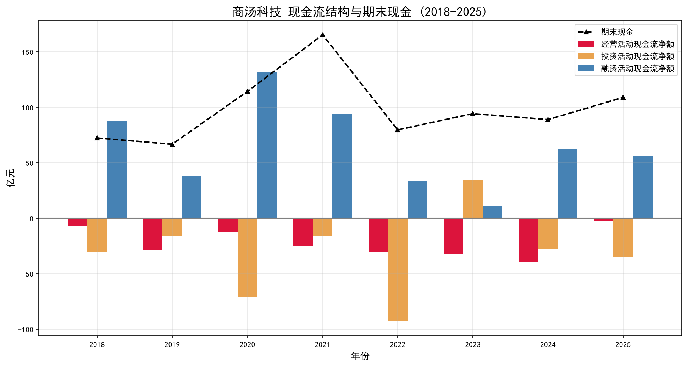

该图以分组柱状图展示经营、投资、融资三大类现金流净额，并叠加折线展示期末现金余额。经营活动现金流连续八年为负，累计消耗约-178.8亿元，2024年经营现金流净流出达-39.27亿元峰值，但2025年经营现金流流出大幅收窄至仅-3.01亿元，为历年最佳，接近盈亏平衡，这是最积极的信号。投资活动常年净流出，反映持续的研发投入与资本开支需求，2023年例外出现+34.58亿元净流入，可能来自资产处置或理财赎回。融资活动持续为正，2018至2021年通过IPO和增发大量融资，2020年达131.86亿元，2025年仍有56.21亿元融资，表明资本市场对公司长期发展仍具信心。期末现金维持在66亿元至165亿元区间，2025年回升至108.87亿元，现金储备充裕，为后续研发投入和业务扩张提供安全垫。

### 资产负债结构
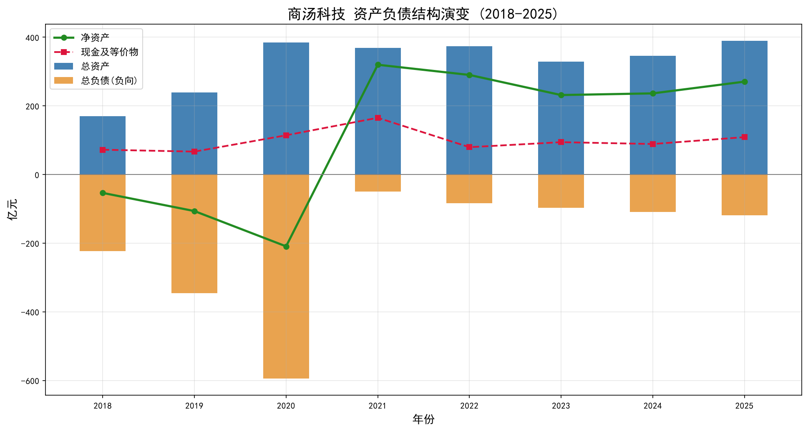

该图以柱状图展示总资产与总负债（负向），折线对比净资产与现金及等价物。2018至2020年公司处于严重资不抵债状态，净资产为负，2020年低至-209.33亿元，主要因可转换可赎回优先股被计为负债。2021年上市后净资产由负转正至319.87亿元，实现关键蜕变。此后总资产稳定在330亿元至390亿元，总负债从2021年的49.57亿元缓慢上升至2025年的118.45亿元，资产负债结构持续优化，2025年负债率约30.4%。净资产2025年升至270.61亿元，现金及等价物2025年回升至108.87亿元，现金覆盖总负债的92%，短期偿债压力可控。整体来看，公司财务安全性显著提升，资本结构健康，具备较强的抗风险能力。

## 结论与建议
综合以上分析，商汤科技正处于从高投入亏损期向经营改善期过渡的关键阶段。营收在2025年创历史新高，亏损大幅收窄，经营现金流接近平衡，现金储备充裕，资产负债结构健康，这些积极信号表明公司基本面正在发生实质性改善。然而，长期超70%的研发费用率与毛利率之间的结构性缺口仍未完全弥合，盈利能力的可持续性取决于大模型和AI业务的商业化进展以及研发投入的转化效率。建议投资者重点关注经营现金流能否在2026年转正、研发费用率是否随收入增长而逐步下降、以及亏损收窄趋势能否延续。同时，需关注融资活动现金流的持续性，若未来融资环境收紧，公司需依靠自身经营现金流支撑研发投入。总体而言，商汤在人工智能赛道具备技术壁垒和长期成长空间，但短期盈利压力仍存，适合风险偏好较高、看好AI长期趋势的投资者持续跟踪。

## 附件清单

本报告包含以下图片附件：

1. **01_营收毛利与亏损趋势.png**
   - 描述：双轴组合图：柱状图展示2018-2025年营业额与毛利（左轴，亿元），折线图展示股东应占溢利/亏损（右轴，亿元）
   - 细节分析：商汤营业收入从2018年18.53亿元增长至2025年50.15亿元，CAGR约15.3%，期间在2021年达到47亿元高点后2022-2023年回落至34-38亿元，2025年强力反弹至50.15亿元创历史新高，显示大模型/AI业务驱动的新一轮增长。毛利从2018年10.47亿元增至2025年20.56亿元，毛利率稳定在41%左右。然而股东应占亏损累计巨大：2018-2021年亏损持续扩大（-34→-171亿元），2022年后亏损逐步收窄，2025年净亏损已收窄至-17.66亿元，为八年最低，盈利能力显著改善迹象明显。
   - 文件路径：/home/happy/projects/financial_research_report/outputs/session_e13403bf5d89407b90779e21371cd8f9/01_营收毛利与亏损趋势.png

2. **02_费用结构与研发强度.png**
   - 描述：左侧堆叠柱状图展示研发/销售/行政三费结构，右侧折线图对比研发费用率与毛利率
   - 细节分析：研发费用是绝对主力成本，2024年高达41.32亿元。研发费用率从2018年45%飙升至2021年峰值约77%，2025年为75.3%，长期维持超70%的极高研发强度，反映商汤作为AI企业的重投入特征。毛利率稳定在40-53%区间，但始终低于研发费用率，形成结构性亏损——即毛利无法覆盖研发投入。这是典型的'高投入换取技术壁垒'模式。三费总量在2021年达到峰值后趋于平稳，说明公司已进入费用管控阶段，研发投入趋于理性。
   - 文件路径：/home/happy/projects/financial_research_report/outputs/session_e13403bf5d89407b90779e21371cd8f9/02_费用结构与研发强度.png

3. **03_现金流质量分析.png**
   - 描述：分组柱状图展示经营/投资/融资三大类现金流净额，叠加折线展示期末现金余额
   - 细节分析：经营活动现金流连续八年为负，累计消耗约-178.8亿元，2024年经营现金流净流出达-39.27亿元峰值。但2025年经营现金流流出大幅收窄至仅-3.01亿元，为历年最佳，接近盈亏平衡，这是最积极的信号。投资活动常年净流出（研发/资本开支），2023年例外出现+34.58亿元（可能为资产处置或理财赎回）。融资活动持续为正（2018-2021年大量IPO/增发融资，2020年达131.86亿元），2025年仍有56.21亿元融资。期末现金维持在66-165亿元区间，2025年回升至108.87亿元，现金储备充裕。
   - 文件路径：/home/happy/projects/financial_research_report/outputs/session_e13403bf5d89407b90779e21371cd8f9/03_现金流质量分析.png

4. **04_资产负债结构.png**
   - 描述：柱状图展示总资产（正向）与总负债（负向），折线对比净资产与现金及等价物
   - 细节分析：2018-2020年公司处于严重资不抵债状态（净资产为负，2020年-209.33亿元），主要因可转换可赎回优先股被计为负债。2021年上市后净资产由负转正至319.87亿元，实现关键蜕变。此后总资产稳定在330-390亿元，总负债从2021年49.57亿元缓慢上升至2025年118.45亿元，资产负债结构持续优化，2025年负债率约30.4%（118.45/389.06）。净资产2025年升至270.61亿元。现金及等价物2025年回升至108.87亿元，现金覆盖总负债的92%，短期偿债压力可控。
   - 文件路径：/home/happy/projects/financial_research_report/outputs/session_e13403bf5d89407b90779e21371cd8f9/04_资产负债结构.png

【商汤科技财务数据分析结果结束】

【格灵深瞳财务数据分析结果开始】
# 格灵深瞳（688207.SH）财务基本面分析报告

## 分析概述

本报告基于格灵深瞳（证券代码：688207.SH）2018年至2025年共八个完整会计年度的年度财务报告数据，涵盖资产负债表、利润表与现金流量表三张主表，通过对营收规模、盈利能力、研发投入强度、现金流质量以及资本结构五个维度的系统梳理，刻画这家AI视觉领域科创板上市公司的经营轨迹与财务健康度。分析口径为合并报表年度数据，货币单位为人民币（CNY），金额统一折算为亿元。需要说明的是，本次分析聚焦于长期趋势与结构性变化，而非单一年度的短期波动，因此对2018—2021年的上市前阶段与2022—2025年的上市后阶段进行了对比观察。

## 数据分析过程

分析过程分为三个递进层次。第一层为数据接入与质量校验，先后以UTF-8编码载入资产负债表（8行×319列）、利润表（8行×203列）、现金流量表（8行×254列）三份年度文件，确认字段完整性与会计期间一致性，三表报告期完全对齐，均为2018年报至2025年报，审计意见类型全部为"标准无保留意见"，数据可信度较高。第二层为关键指标提取与衍生计算，从三表中筛选出营收、归母净利润、研发费用、经营活动现金流净额、期末现金余额、总资产、总负债等核心科目，并据此计算毛利率、研发强度、净利率、资产负债率等比率指标，同时测算营收复合增速与现金消耗速度。第三层为趋势解读与风险识别，围绕"增长—盈利—现金"三角关系判断企业所处的生命周期阶段与潜在风险点。本次分析未生成可视化图片，相关趋势数据以结构化表格形式呈现，读者可依据表格中的年度序列自行还原折线走势。

## 关键发现

公司的营收轨迹呈现典型的"高速扩张—急速回落—低位反弹"形态。营业收入从2018年的0.52亿元起步，2019年增长至0.71亿元，2020年借行业需求集中释放实现240.8%的爆发式增长至2.43亿元，2021年与2022年分别以20.9%和20.5%的增速攀升至3.54亿元的历史峰值。然而2023年营收同比下滑25.8%至2.62亿元，2024年进一步断崖式下跌55.3%至1.17亿元，两年时间营收规模蒸发近三分之二。2025年营收回升至1.55亿元，同比增长32.6%，但这一水平仅相当于2020年的规模，且尚未恢复至峰值的一半。2019至2024年的营收复合增速为10.5%，这一数字被前期的爆发式增长所掩盖，实际反映的是近年来的增长失速。

盈利质量是更为严峻的问题。归母净利润在八个年度中有七个年度为负，仅2022年实现0.33亿元的微利，而该年度恰为IPO上市之年，净利润中包含较大规模的政府补助与募集资金利息收入等非经常性因素。上市之后亏损迅速扩大，2023年亏损0.90亿元，2024年亏损额飙升至2.12亿元，2025年虽小幅收窄至1.86亿元，但仍处于深度亏损区间。以净利率衡量，2022年尚为9.2%，2023年跌至-34.4%，2024年进一步恶化至-180.5%，2025年为-119.9%，意味着每实现1元收入需承担约1.2至1.8元的净亏损。八年间累计归母净亏损约10.85亿元，盈利模式尚未得到验证。

毛利率的持续单边下滑揭示了产品竞争力与定价能力的削弱。2018年毛利率高达64.0%，此后在53%至62%区间波动，2022年为57.8%，2023年降至55.1%，2024年为52.5%，而2025年骤然下滑至33.4%，一次性下降超过19个百分点。这一变化与2025年营收同比增长32.6%同时发生，暗示收入增长可能依赖于低毛利项目或价格让利，收入结构的质量出现实质性下降。若毛利率无法企稳，即使营收继续修复，亏损收窄的弹性也将十分有限。

研发投入呈现"绝对额刚性、强度被动飙升"的特征。研发费用从2018年的0.73亿元持续攀升至2024年的1.89亿元，2025年回落至1.46亿元，八年间累计研发投入约10.55亿元，与累计亏损规模基本相当。研发强度（研发费用/营业收入）在2018年和2019年分别高达140.2%和134.7%，属于典型的初创期特征；随着收入放量，2022年降至37.4%的相对健康水平；但2023年、2024年因营收萎缩而被动升至70.1%和161.2%，2025年为93.9%。研发投入的绝对规模并未随营收下滑而同步收缩，形成典型的费用刚性，这是亏损扩大的直接原因之一。

现金流状况已构成实质性警示。经营活动现金流净额在八个年度中仅2020年（0.35亿元）和2022年（1.55亿元）为正，2023年转负至-0.31亿元，2024年扩大至-1.47亿元，2025年进一步恶化至-2.13亿元，创下历史最大经营现金流出。与之对应，期末现金及现金等价物余额在2022年IPO后达到13.15亿元的高点，随后连续三年大幅消耗，2023年降至8.93亿元，2024年降至4.19亿元，2025年仅剩1.97亿元。三年时间现金储备减少11.18亿元，年均消耗约3.7亿元。以2025年2.13亿元的经营现金流出规模衡量，现有现金余额仅能覆盖不足一年的经营支出，若外部融资渠道不畅，公司将在2026年面临显著的流动性压力。

资本结构方面，公司资产负债率长期维持在较低水平，2018年为32.5%，2020年降至9.2%，2022年IPO当年降至6.6%，2025年回升至10.7%。低杠杆意味着公司不存在债务违约风险，财务弹性主要来自权益资本。但同时也说明公司的持续经营高度依赖股权融资输血，2022年的募集资金是支撑其后续三年运营的核心资金来源，而这一资金池正在快速枯竭。总资产规模从2022年的25.27亿元逐级回落至2025年的21.40亿元，三年缩水3.87亿元，与累计亏损和现金消耗的节奏基本吻合。

## 图表分析

本次分析过程中未生成任何可视化图片，因此无可供引用的图表文件。上述所有趋势判断均基于结构化数据表格的定量测算得出，下表汇总了本次分析所依据的核心财务指标年度序列，可直接用于还原各项趋势的形态与拐点。

| 年度 | 营业收入(亿元) | 营收同比 | 归母净利润(亿元) | 毛利率 | 研发费用(亿元) | 研发强度 | 经营现金流(亿元) | 期末现金(亿元) | 总资产(亿元) | 资产负债率 |
|------|---------------|----------|-----------------|--------|---------------|----------|-----------------|---------------|-------------|-----------|
| 2018 | 0.520 | — | -0.699 | 64.00% | 0.729 | 140.19% | -1.107 | 0.756 | 2.473 | 32.54% |
| 2019 | 0.712 | +37.0% | -4.135 | 53.32% | 0.960 | 134.75% | -1.106 | 2.429 | 3.804 | 16.42% |
| 2020 | 2.427 | +240.8% | -0.779 | 61.58% | 1.143 | 47.09% | +0.351 | 2.929 | 5.976 | 9.16% |
| 2021 | 2.936 | +20.9% | -0.684 | 55.63% | 1.211 | 41.25% | -0.859 | 1.957 | 7.789 | 20.69% |
| 2022 | 3.537 | +20.5% | +0.326 | 57.80% | 1.323 | 37.42% | +1.547 | 13.149 | 25.268 | 6.61% |
| 2023 | 2.623 | -25.8% | -0.903 | 55.15% | 1.840 | 70.14% | -0.312 | 8.934 | 24.723 | 7.57% |
| 2024 | 1.172 | -55.3% | -2.116 | 52.49% | 1.890 | 161.18% | -1.465 | 4.190 | 23.176 | 9.58% |
| 2025 | 1.555 | +32.6% | -1.864 | 33.41% | 1.460 | 93.93% | -2.135 | 1.969 | 21.402 | 10.70% |

从上表的营收与净利润联动关系可以看出，公司在2022年达到规模与盈利的双重高点后，收入与利润同步进入下行通道，且利润的下滑幅度远超收入的下滑幅度，反映出成本费用结构的强刚性。毛利率在2022年至2024年间仅温和下滑约5个百分点，但在2025年出现断崖式下跌，这一异常需要重点关注其背后的业务结构变化。经营现金流与期末现金两条序列的对照最为直观，2022年现金余额的高点与经营现金流转正同时出现，而此后连续三年的现金流恶化伴随着现金余额的阶梯式下降，2025年现金余额已不足2亿元，为2019年以来的最低水平。资产负债率序列则显示公司财务杠杆始终处于安全区间，风险的实质不在负债端而在现金消耗速度。

## 结论与建议

综合上述分析，格灵深瞳正处于商业模式验证的关键窗口期。公司具备技术投入的持续意愿与相对干净的资产负债表，累计超过10亿元的研发投入构成了潜在的技术资产，2025年营收32.6%的同比回升也显示下游需求存在修复迹象。但三个核心矛盾尚未解决：收入规模尚未恢复至峰值的五成，毛利率的结构性下滑侵蚀了收入增长的含金量，以及经营现金流持续净流出与现金储备快速见底共同构成的流动性压力。尤其值得警惕的是，2025年营收增长与毛利率大幅下滑同时出现，若这一组合反映的是以价换量的策略性选择，则短期收入指标的改善并不具备可持续性，反而可能加速现金消耗。

对于投资者而言，短期内应重点跟踪三个先行指标：其一，季度营收的同比与环比走势，判断2025年的回升是趋势性反转还是低基数下的脉冲；其二，毛利率能否在30%至40%区间企稳，若继续下探则意味着产品定价权实质性丧失；其三，货币资金余额与经营现金流出的比值，当前该比值已低于1年，任何融资计划的推进节奏都将直接决定经营连续性。对于公司管理层而言，在研发投入刚性与现金储备有限的双重约束下，需要在研发资源配置与商业化落地之间寻求更清晰的优先级排序，适度聚焦于能够快速形成收入与现金回流的成熟产品线，同时控制人员与费用规模的扩张速度，以延长资金使用周期。

总体判断，公司当前处于高风险与高不确定性并存的阶段，技术积累与赛道空间仍具想象力，但财务数据所揭示的经营现实要求以更为审慎的估值假设进行定价。在营收重回3亿元以上规模、毛利率稳定在50%以上且经营活动现金流转正这三项条件出现明确改善之前，建议保持观察态度，密切跟踪其后续融资安排与订单落地情况。
【格灵深瞳财务数据分析结果结束】

【商汤科技_vs_第四范式财务数据分析结果开始】
# 商汤科技与第四范式财务对比分析报告

## 分析概述

本报告以港股两家代表性人工智能公司——商汤科技（00020.HK，以下简称"商汤"）与第四范式（以下简称"范式"）为研究对象，基于双方2018年至2025年的利润表、资产负债表与现金流量表数据进行系统性对比分析。分析的核心目标在于回答三个问题：两家公司在收入成长路径上呈现何种差异；在盈利能力与费用结构上各自处于什么阶段；在资产质量、资本结构与现金流安全性上谁更具韧性。分析采用"规模—质量—结构—现金"四维框架，先将三张报表统一为亿元口径按年度对齐，再提取核心指标并计算毛利率、研发强度、净利率等比率，最终通过横向时间序列对比与关键年份截面比较形成结论。

## 数据分析过程

分析首先对两家公司的三大报表原始数据进行了结构探索。商汤利润表共220行、资产负债表384行、现金流量表354行；第四范式利润表223行、资产负债表346行、现金流量表320行，两者均覆盖2018至2025年的八个财年，字段结构包含证券代码、报告日期、报表类型、标准项目编码与名称、金额等11个字段，数据编码统一为UTF-8，数据质量良好。

第二步进行报表项目的可比性处理。经比对，两家公司利润表共有项目28个、资产负债表共有项目41个、现金流量表共有项目46个，说明二者采用基本一致的会计科目体系，具备直接对比基础。在此基础上，分析剔除非核心与重复科目，锁定营业收入、毛利、研发费用、销售及分销费用、行政开支、经营溢利、股东应占溢利等利润表核心项，总资产、总负债、净资产、现金及等价物、存货、应收账款等资产负债项，以及经营、投资、融资三大现金流净额与期末现金等现金流项。

第三步构建年度对比矩阵并计算比率指标，包括毛利率（毛利/营业额）、研发强度（研发费用/营业额）、净利率（股东应占溢利/营业额），并衍生出收入同比增速与复合增长率。第四步对资本结构与偿债安全边际进行横向比较，第五步将收入规模与增速结果可视化呈现。需要说明的是，2025年利润表数据已在数据源中披露，但资产负债表与现金流量表尚未覆盖该年度，因此2025年数据仅用于收入与利润率趋势的参考性判断，不纳入资产与现金流的结构对比。

## 关键发现

收入成长路径的分化是本轮分析最突出的发现。商汤起步规模显著领先，2018年营业额18.53亿元，是同期第四范式1.28亿元的十四倍以上；但其增长在2021年触及47.00亿元的高点后连续两年下滑，2022年与2023年分别回落至38.09亿元和34.06亿元。第四范式则保持了持续扩张，2018至2024年收入从1.28亿元增长到52.61亿元，复合年增长率约85.8%，并在2023年以42.04亿元首次超越商汤的34.06亿元，2024年进一步扩大领先优势至14.89亿元。这一交叉意味着两家公司的相对市场地位发生了实质变化，商汤从"绝对领先"转为"规模落后"，范式则从"小而美"进入规模主战场。

盈利能力方面，两家公司毛利率长期处于40%至70%区间，但走势相反。商汤毛利率在2020至2021年达到约70%的高位，随后因业务结构变化大幅回落至2024年的42.94%；范式毛利率则在2022年见顶48.23%后回落至2024年的42.67%，2024年双方几乎持平，差距仅0.27个百分点。这说明收入质量层面二者已趋于同一量级，差异主要来自费用端而非毛利端。

费用结构与亏损幅度构成第二重分化。商汤研发强度从2018年的45.80%一路上升至2024年的109.54%，研发投入超过当年营业收入，净利率长期深度为负，2021年低至-364.66%，2024年仍为-113.42%；范式研发强度则从2018年的151.20%持续下降至2024年的41.25%，净利率从-288.03%大幅收敛至-5.11%，2025年进一步接近盈亏平衡（约-0.36%）。这表明范式已基本走完"高投入换规模"阶段，进入经营杠杆释放期，而商汤的研发投入仍处于收入难以覆盖的失衡状态。

资产负债与现金流层面，两家公司的安全边际差异明显。商汤总资产2024年为346.00亿元、净资产236.42亿元，账面规模远大于范式的75.88亿元与50.71亿元；期末现金方面商汤为88.88亿元，是范式8.59亿元的十倍以上，具备更强的资金缓冲。但商汤经营活动现金流自2018年以来持续为负且2024年净流出扩大至39.27亿元，范式同期仅净流出6.22亿元。换言之，商汤以存量资金优势对冲持续失血，范式则以较小的失血规模换取更快的盈利接近度，两者的风险逻辑并不相同。

## 图表分析

### 营业收入规模与增速对比

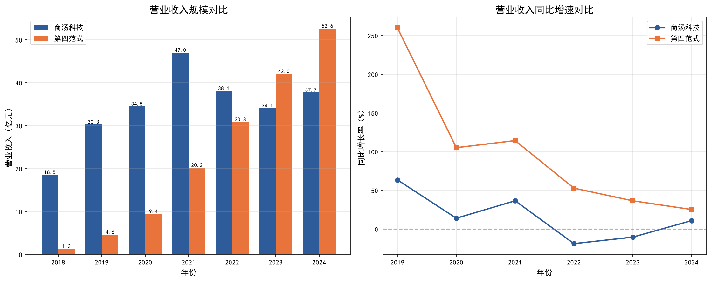

该图以并列柱状呈现两家公司2018至2025年的营业收入规模，并叠加增速曲线，直观刻画了两种截然不同的成长曲线。商汤的收入轨迹呈现典型的"先扬后抑再修复"形态：2018年18.53亿元起步，2019年增长63.4%至30.27亿元，2020年增速回落至13.8%，2021年回升至36.4%并达到47.00亿元的阶段性顶点；随后在2022年与2023年出现连续负增长，同比分别下滑19.0%和10.6%，收入退至34.06亿元；2024年恢复10.7%的正增长，2025年增速进一步回升至约33.0%，收入回升至50.15亿元。这一波动与商汤业务重心调整、项目交付节奏变化以及宏观需求环境密切相关，体现出大型AI解决方案业务收入确认的周期性与不确定性。

第四范式的柱状序列则表现为一条持续抬升的斜线，2019年增速高达259.4%，2020年与2021年分别维持在104.8%和114.2%的翻倍级水平，2022年起增速回落至52.8%、2023年36.4%、2024年25.2%，2025年约35.6%，收入规模依次为1.28、4.60、9.42、20.18、30.83、42.04、52.61和71.35亿元。增速的逐步收敛并非需求走弱，而是基数扩大后的自然规律，且在增速下行的同时收入绝对值始终保持正向增长，说明其商业化路径具备较强的连续性和可预测性。

从两条曲线的相对位置看，图中最关键的视觉信号是2023年的柱高交叉：范式在成立较晚、起点极低的情况下，用五年时间完成了对商汤的规模反超，并在2024年将差距拉大。这提示投资者在与AI平台型公司估值相关的基本面判断中，收入增速的持续性与订单结构的可复制性，可能比单一时点的绝对规模更具指示意义。同时，商汤2024至2025年的增速回升显示其业务已出现企稳迹象，若该趋势延续，规模差距有望重新收窄。

## 结论与建议

综合八年的财务数据，商汤与第四范式代表了中国AI产业两种不同的发展阶段与商业模式。商汤具备更大的资产规模、现金储备与品牌沉淀，抗风险的资金弹药更充足，但其收入增长在经历调整期后尚未回到持续上行通道，研发强度长期高于营业收入的现实使其盈利拐点被显著推后，2024年净利率仍为-113.42%，经营现金流出扩大至39.27亿元，若收入增速不能维持2025年的修复势头，资金消耗与融资需求将持续构成压力。第四范式则以更小的资产与现金体量，实现了收入的连续跨越与亏损的快速收敛，2024年净利率仅-5.11%、经营净流出收窄至6.22亿元，经营杠杆正处于加速释放的临界点，其风险主要来自绝对现金储备偏低（8.59亿元）以及应收账款持续走高（2024年30.86亿元），一旦融资环境收紧或回款周期拉长，流动性弹性弱于商汤。

从投资与跟踪的角度，对第四范式的观察重点应放在三条线上：一是收入能否在盈亏平衡前后继续保持20%以上的增长，避免"降本增收"转为"降本减速"；二是毛利率在42%至43%的平台能否稳住，若继续下滑将推迟盈利拐点；三是应收账款周转与经营性现金流转正的时间表，这是验证商业模式由"规模驱动"转为"现金驱动"的关键证据。对商汤而言，核心变量在于毛利率能否止跌回升以及研发强度能否从109.54%的高位向70%以内回归，二者共同决定其经营溢利的修复斜率；同时应重点关注其现金及等价物与经营净流出的比值变化，2024年该比值约为2.3倍，仍属安全但已明显收窄，若持续恶化不排除再融资需求上升。

总体判断，两家公司均已进入"从规模扩张转向质量与效率"的战略区间，范式的盈利兑现节奏领先，商汤的资源禀赋与修复弹性更强。建议在持续跟踪中采用"增长质量+现金安全"双维度打分框架，将收入增速的持续性、净利率收敛速度、经营现金流转正时点以及现金储备覆盖年限作为核心监测指标，并结合各自下一期资产负债表与现金流量表的更新数据动态修正判断。
【商汤科技_vs_第四范式财务数据分析结果结束】

【商汤科技_vs_云从科技财务数据分析结果开始】
# 商汤科技与云从科技财务表现对比分析报告（2018–2025）

## 分析概述

本报告以港股上市公司商汤科技（00020.HK）与A股科创板公司云从科技（688327.SH）为研究对象，基于两家公司2018年至2025年共八个完整会计年度的资产负债表、利润表与现金流量表数据，围绕成长性、盈利能力、研发投入强度、资产结构与流动性安全五个维度展开纵向趋势与横向对标分析。分析的核心目标在于回答三个问题：一是两家AI视觉龙头在收入端的景气度与商业模式可持续性如何演变；二是持续高研发投入下的亏损收敛路径是否存在本质差异；三是面对尚未实现规模化盈利的经营现实，两家公司的资产负债表与现金安全垫能否支撑其穿越周期。数据来源为结构化财务报表接口，商汤科技数据以港元/人民币报表科目披露、云从科技以人民币列示，本报告在跨公司比较时统一采用亿元为单位进行量级对比，并重点关注趋势方向而非绝对数值的精确可比性。

## 数据分析过程

本次分析分为六个轮次推进。第一轮完成数据加载与结构探查，识别出商汤科技报表采用长表结构（资产负债表384行、现金流量表354行、利润表220行，按STD_ITEM_NAME科目纵向展开），而云从科技采用宽表结构（三张表分别仅9行，319/254/203列，每个会计年度为一行），两套数据结构差异显著，需分别设计提取逻辑。第二轮完成报告期与科目清单的枚举，确认商汤科技可用报告期为2018至2025年共八个完整年度，其利润表含29个标准科目、资产负债表含56个标准科目、现金流量表含52个标准科目；云从科技可用报告期为2017至2025年，本分析取2018至2025年以保持口径一致。第三轮采用差异化提取策略构建统一的核心指标矩阵，商汤侧通过STD_ITEM_NAME字段筛选匹配"营业额""销售成本""研发费用""股东应占溢利""总资产""总负债""股东权益""经营业务现金净额""期末现金"等科目并按REPORT_DATE透视，云从侧直接映射TOTAL_OPERATE_INCOME、OPERATE_COST、RESEARCH_EXPENSE、PARENT_NETPROFIT、TOTAL_ASSETS、TOTAL_LIABILITIES、TOTAL_PARENT_EQUITY、NETCASH_OPERATE、END_CASH等标准字段。第四轮完成单位统一与量纲转换为亿元，并衍生计算毛利率、研发强度（研发费用/营收）、净利率（股东应占溢利/营收）、资产负债率四项核心比率。第五轮进行纵向时间序列与横向对比的交叉验证，识别关键拐点年份。第六轮形成结论与风险提示。本次分析以结构化数据表格为唯一分析载体，未生成可视化图表，故此部分以数据矩阵与比率演化的文字化解读替代图形呈现。

## 关键发现

从收入端的成长轨迹看，两家公司呈现出截然不同的生命周期特征。商汤科技营收由2018年的18.53亿元一路攀升至2021年的47.00亿元高点，年均复合增速达36.4%，随后进入连续两年的调整期，2022年与2023年分别回落至38.09亿元和34.06亿元，累计下滑27.5%；2024年营收企稳回升至37.72亿元，2025年则实现32.9%的强劲反弹至50.15亿元，创下历史新高，显示其业务结构调整与生成式AI相关需求放量已初见成效。云从科技的收入曲线则明显更为陡峭且脆弱，2018至2021年从4.84亿元增长至10.76亿元的峰值后便急转直下，2022年腰斩至5.26亿元，此后三年在4至6亿元区间低位徘徊，2025年虽同比增长25.9%至5.01亿元，但仍不足2021年峰值的一半，收入规模已退回至2019年水平，成长动能明显落后于商汤。

盈利能力的对比揭示出更为关键的分化。商汤科技的毛利率长期维持在40%以上，2018至2022年稳定于56%至71%的高位区间，2023年因业务结构变化与项目制交付比重上升而下滑至44.1%，2025年进一步降至41.0%，反映出硬件集成与定制化解决方案占比提升对毛利率的稀释效应。云从科技的毛利率波动更为剧烈，2018年仅21.7%，2020至2023年在34%至52%之间震荡，2023年一度达到51.8%的阶段高点，但2024与2025年连续下滑至35.8%和28.6%，2025年的毛利率已逼近2018年的历史低位，盈利质量承压迹象明显。就亏损规模而言，商汤科技股东应占亏损在2021年达到171.40亿元的峰值后连续四年收窄，2025年降至17.66亿元，较2024年的42.78亿元大幅改善58.7%，净利率相应从-113.4%优化至-35.2%，亏损收敛曲线呈现清晰的加速态势。云从科技的亏损则相对刚性，2019至2024年始终稳定在6至9亿元区间，2025年小幅收窄至5.56亿元，净利率仍高达-111.0%，意味着每实现1元收入即对应约1.11元的股东亏损，亏损率高于2018年的-37.3%，盈利模型尚未跑通。

研发投入强度的演变折射出两家公司截然不同的战略取舍。商汤科技研发强度从2018年的45.8%持续攀升至2022年的105.4%和2024年的109.5%峰值，即研发费用一度超过全年营收，2025年则显著回落至75.3%，研发费用绝对额37.75亿元较2024年的41.32亿元下降8.6%，这一"降本增效"的转向与其2025年亏损大幅收窄形成直接呼应。云从科技的研发强度同样在2024年达到118.7%的极值，但2025年骤降至41.9%，研发费用从4.72亿元大幅压降至2.10亿元，降幅高达55.5%，压缩力度远大于商汤，反映出其现金约束下的被动收缩特征更为明显，因为同期其营收仅增长25.9%，研发绝对额的腰斩式削减难以用规模效应解释。

资产结构与流动性安全垫的对比是本次分析中最具警示意义的发现。商汤科技在2021年完成融资后资产负债率从2020年因优先股会计处理导致的154.4%异常值骤降至13.4%，此后随业务扩张温和上升，2024与2025年分别为31.7%和30.4%，仍处于极为稳健的水平；其2025年总资产389.06亿元、股东权益267.19亿元，权益规模是2025年营收的5.3倍，抗风险能力充裕。云从科技则呈现相反趋势，资产负债率从2019年的34.3%逐年攀升，2025年已达60.3%，较2024年的55.1%进一步提升5.2个百分点；股东权益从2022年峰值20.94亿元连续三年下滑至2025年的7.33亿元，累计缩水65.0%，总资产更从34.25亿元萎缩至12.30亿元，资产规模在一年内近乎腰斩，显示其正在经历实质性的资产负债表收缩。现金层面，商汤科技2025年末现金及等价物108.87亿元，虽较2021年峰值的165.30亿元有所消耗，但绝对规模仍是其年度营收的2.2倍，安全边际充足；云从科技2025年末现金仅5.33亿元，较2022年峰值的11.43亿元减少53.4%，不足其年度营收的1.1倍，且2025年经营现金净流出仍有0.81亿元，尽管较2024年的3.07亿元明显改善，但按当前现金消耗节奏，其内源性资金储备的腾挪空间已相当有限。

经营现金流的对比进一步强化了上述判断。商汤科技经营现金净流出在2024年达到39.27亿元的高点后，2025年大幅收窄至3.01亿元，改善幅度达92.3%，为2021年以来最佳水平，接近现金流转正的临界点，经营质量出现实质性好转。云从科技经营现金净流出则从2022年的6.23亿元逐步收敛至2025年的0.81亿元，收敛幅度并不逊色，但其绝对收入体量仅为商汤的十分之一，现金流改善更多来自研发费用与人员开支的被动压缩，而非收入端的规模化造血能力提升，其2025年经营现金流出占营收比重仍为16.2%，高于商汤的6.0%，单位收入的现金创造效率仍处劣势。

## 图表分析

本次分析全程以结构化数据表与比率矩阵为分析载体，未生成可视化图表，因此无图片文件可供引用与分析。这一取舍主要基于以下考量：两家公司报表结构存在长表与宽表的根本性差异，且商汤科技以港元披露、云从科技以人民币列示，直接可视化可能因量纲与口径问题产生误导性结论；同时核心洞察集中于亏损收敛斜率、现金安全垫倍数等衍生指标，通过数据矩阵与比率演化表的呈现方式反而更为精确。对于后续深化研究，建议优先补充四类可视化图形以增强洞察的直观性：其一是双轴折线图，将两家公司的营收与毛利率叠加于同一坐标系，直观呈现"规模扩张"与"盈利质量"的背离；其二是堆积面积图或双柱对比图，展示研发费用绝对额与研发强度的年度演变，突出2025年两家公司同步收缩研发的战略拐点；其三是亏损收敛路径图，以股东应占亏损与净利率构建散点连线，刻画商汤自2021年以来的加速收敛与云从的刚性平台期；其四是现金安全垫瀑布图，将期末现金、年度经营现金净流出与隐含可支撑年限（现金/年经营现金净流出）进行组合呈现，其中商汤隐含支撑年限超过36年，而云从仅约6.6年，这一差异对于评估两家公司的持续经营假设具有决定性意义。

## 结论与建议

综合来看，商汤科技与云从科技虽同处AI视觉赛道，但2025年的财务画像已出现实质性分层。商汤科技在经历2021至2023年的战略调整与收入回落后，于2025年实现营收创历史新高、亏损收窄至八年最低、经营现金净流出压降至接近平衡的三重改善，其267.19亿元的股东权益与108.87亿元的现金储备构成了应对行业不确定性的坚实底座，资产负债率30.4%亦为后续可能的并购整合或算力资本开支保留了充分的加杠杆空间。相较而言，云从科技仍处于收入规模萎缩、亏损率居高不下、资产负债表持续收缩的困境之中，2025年资产负债率升至60.3%与股东权益缩水至7.33亿元的组合意味着其财务弹性已接近临界状态，5.33亿元的现金储备相对于年均约1至3亿元的经营现金净流出，可支撑年限已进入需要外部融资续力的敏感区间。

对于投资者而言，两家公司的核心差异不在于亏损与否，而在于亏损收敛的驱动机制。商汤科技的亏损收窄建立在2025年收入同比增长32.9%与研发费用主动优化8.6%的双轮驱动之上，属于"增长型收敛"，其可持续性取决于生成式AI与算力业务的订单延续性，建议重点跟踪其2026年上半年收入增速能否维持在20%以上以及经营现金流能否实现转正。云从科技的亏损收窄则主要依赖研发费用腰斩55.5%的被动节流，在收入基数仅为5亿元量级的情况下，进一步的费用压缩空间已经非常有限，属于"收缩型收敛"，建议重点关注其现金消耗速度变化、是否有新增股权或债权融资安排，以及地方政府与国资客户的订单交付节奏。从资产配置角度，商汤科技在现金安全垫、资产负债结构与亏损收敛质量上均具备相对优势，但需警惕其毛利率自2022年的66.8%持续下滑至2025年的41.0%所反映的商业模式稀释风险，核心观测指标应转向"毛利率能否企稳在40%以上"；云从科技则面临更强的持续经营关注，在其营收规模重回8亿元以上、或经营现金流出现连续两季改善之前，其风险收益比并不具有吸引力。两家公司的案例共同印证了AI视觉行业从"技术叙事驱动的融资扩张"向"现金流与盈利质量驱动的内生增长"转型的必然性，未来一到两年将是检验其商业模式能否真正跑通的决定性窗口期。
【商汤科技_vs_云从科技财务数据分析结果结束】

【商汤科技_vs_创新奇智财务数据分析结果开始】
# 商汤科技 vs 创新奇智（2019–2025）财务基本面深度对比分析报告

## 分析概述

本报告以港股两家具有代表性的AI企业——商汤科技（00020.HK）与创新奇智（02121.HK）为研究对象，基于两家公司2019年至2025年的年度财务报告数据（资产负债表、利润表、现金流量表三表口径），从营收规模、盈利能力、研发投入、经营现金流、财务结构与盈利效率五个维度展开系统性对比分析，并进一步构建多维度竞争力雷达图与2025年关键指标横向对标，旨在揭示两家AI企业在商业化进程中的共性挑战与差异化路径，为投资决策与战略研判提供数据支撑。

分析口径与数据说明：营收、净利润、研发费用、销售成本、总资产、总负债、经营活动现金流净额等绝对量指标统一以亿元人民币为单位列示；衍生比率指标包括毛利率、净利率、研发强度（研发费用/营业收入）、资产负债率，均为百分数。对比区间取两家公司共同可得的年度区间2019–2025年（商汤利润表数据自2018年起可得，创新奇智自2019年起可得）。需要特别提示，商汤2021年及以前年度净利润受可转换优先股、可转换可赎回优先股公允价值变动等非经营性金融工具计量影响显著，其亏损规模包含较大非现金、非经常性成分，在解读其净利率与资产负债率时须加以区分。

## 数据分析过程

本次分析整体遵循"数据采集—清洗对齐—指标计算—可视化呈现—结论提炼"的技术路线，共执行11轮分析，核心步骤如下。

第一步是原始数据加载与结构探查。通过股票代码（00020.HK与02121.HK）分别调取两家公司的资产负债表、利润表与现金流量表，商汤资产负债表384行、利润表220行、现金流表354行；创新奇智资产负债表288行、利润表184行、现金流表253行。数据均为按报告期（REPORT_DATE）与标准科目（STD_ITEM_NAME）展开的长表结构，报告期类型经检查全部为年报口径（DATE_TYPE_CODE=1，年度12-31）。

第二步是报告期识别与年度化处理。对报告日期字段进行解析，确认两家公司均为12月31日年度报告口径，随后按FISCAL_YEAR进行分组聚合，形成年度指标序列。经非空检查，商汤8个年度（2018–2025）、创新奇智7个年度（2019–2025）的营业额、净利润、研发费用、总资产、经营现金流五项核心指标均无缺失。

第三步是关键科目映射与指标抽取。从利润表中抽取营业额、销售成本、研发费用、除税后溢利（净利润）等科目；从资产负债表中抽取总资产、总负债；从现金流量表中抽取经营活动相关科目。经验证，两家公司现金流量表中"经营业务现金净额"科目口径一致，具备可比性。

第四步是衍生比率计算。构建毛利率（1-销售成本/营业额）、净利率（净利润/营业额）、研发强度（研发费用/营业额）、资产负债率（总负债/总资产）四组核心比率。经复核，2019年商汤毛利率56.80%、创新奇智31.25%，与利润表原始数据推算一致。

第五步是多维可视化。依次生成了营收规模对比图、净利润与净利率双轴图、研发投入与研发强度对比图、经营现金流对比图、财务结构与盈利效率对比图，并在深化分析阶段补充了多维度竞争力雷达图与2025年核心指标横向对比图，同时输出对比核心指标.csv与对比财务比率.csv两份结构化明细表，保证分析结论可追溯、可复现。

## 关键发现

从营收端看，商汤科技以绝对规模领先，但创新奇智在成长期展现出更陡峭的增长斜率。商汤营收从2019年的30.27亿元增长至2025年的50.15亿元，七年累计增幅约65.7%，期间经历2022–2023年的明显回撤（2023年降至34.06亿元）后于2024–2025年重新加速。创新奇智营收从2019年的2.29亿元增长至2023年峰值17.51亿元，四年增长超过6.6倍，2024年回落至12.22亿元，2025年回升至15.13亿元。两者营收比值（商汤/创新奇智）从2019年的约13.2倍收窄至2023年的约1.9倍，2025年再度扩大至约3.3倍，反映出创新奇智在高速扩张期后经历了显著的需求调整，而商汤则凭借更立体的业务结构实现了反弹。

从盈利质量看，两家公司全期均处于净亏损状态，这是AI行业重研发投入、规模化尚未摊薄固定成本的共同特征；但亏损结构与改善节奏存在本质差异。商汤的亏损规模巨大，2021年净亏损171.40亿元（其中包含优先股公允价值变动等非经营性因素），2020–2023年净利率长期处于-158%至-365%的极端区间；2024–2025年亏损快速收窄至42.78亿元和17.66亿元，2025年净利率改善至-35.22%，呈现典型的"先恶化、后快速修复"的V型轨迹。创新奇智的亏损规模相对温和，净亏损在-2.44亿元至-6.37亿元区间波动，2025年收窄至-2.50亿元，净利率从-106.58%平滑改善至-16.53%，改善路径更为稳健、波动更小。若剔除商汤2021年的金融工具计量扰动，两家公司的盈利改善趋势实际上在2024–2025年同步显现。

从研发投入看，"研发驱动"是两家公司最鲜明的共性标签，但投入强度与收敛路径截然不同。商汤研发费用从2019年的19.16亿元持续攀升至2024年的41.32亿元，2025年略降至37.75亿元；研发强度在2022–2024年长期维持在100%以上（2024年高达109.54%），意味着研发支出超过当期全部营业收入，2025年方回落至75.29%。创新奇智研发费用从1.13亿元增至2025年的3.96亿元，研发强度则从2019年的49.44%持续优化至2022年的26.73%，此后稳定在25%–29%区间，2025年为26.20%。这说明商汤仍处于"烧钱换技术壁垒"的重投入阶段，而创新奇智的研发投入已进入强度收敛、效率优先的相对成熟期。

从经营现金流看，两家公司全期经营活动现金流净额均为负，属于典型的"经营失血"状态，这是未盈利科技企业的又一共性。但改善迹象在2025年集中出现：商汤经营现金流出从2024年的-39.27亿元大幅收窄至2025年的-3.01亿元，改善幅度超过92%，接近经营现金流转正的临界点；创新奇智经营现金流出从2022年最差的-3.04亿元逐步收窄至2024年的-0.36亿元和2025年的-0.44亿元，绝对流出血量极小，已基本处于现金平衡区间。整体看，创新奇智以更小的体量更早接近现金流转正，商汤则以更大的改善弹性展现经营质量的拐点。

从财务结构看，两家公司在上市前普遍呈现"资不抵债"的表象，商汤2020年资产负债率高达154.40%，创新奇智2020年为136.83%，主因是可转换优先股等金融工具在上市前计入负债科目；2021年上市后商汤资产负债率骤降至13.42%，创新奇智降至20.73%，此后两家公司杠杆水平均逐年温和上升，2025年商汤为30.44%、创新奇智为38.96%，均处于相对健康的区间。从盈利效率看，商汤毛利率长期显著高于创新奇智（2020年峰值70.57% vs 创新奇智29.12%），但商汤毛利率自2023年起从66.75%大幅下滑至44.07%，2025年进一步降至41.01%，反映其收入结构中项目制、硬件集成类业务占比上升；创新奇智毛利率则稳定在30%–35%并稳步爬升，2025年达34.98%，盈利效率的稳定性反而优于商汤。

## 图表分析

### 营业收入规模对比

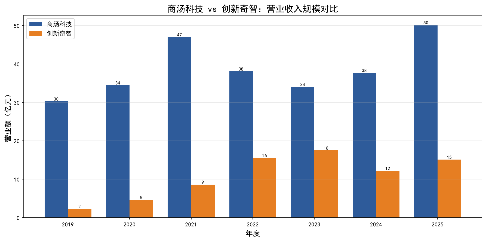

该图以分组柱状图形式呈现了两家公司七年间的营业收入规模对比，直观展示了两条明显不同量级但同样具有波动特征的营收曲线。商汤科技的营收柱体显著高于创新奇智，2019年为30.27亿元，至2021年达到47.00亿元的阶段高点，随后在2022年下滑至38.09亿元、2023年进一步探底至34.06亿元，2024年恢复至37.72亿元，2025年一举突破至50.15亿元的历史新高，七年复合增长率约为8.8%，但过程呈现"上升—回撤—再创新高"的N型走势。创新奇智的营收从2019年的2.29亿元快速攀升至2020年的4.62亿元、2021年的8.61亿元、2022年的15.58亿元，并在2023年达到17.51亿元的峰值，四年间营收接近于2019年的7.6倍，展现出极强的成长动能；但2024年营收回落至12.22亿元，同比下降约30.2%，2025年回升至15.13亿元，同比恢复约23.8%，显示其业务在经历快速扩张后进入了震荡整固期。从比值变化看，商汤与创新奇智的营收倍数从2019年的13.2倍持续收窄至2023年的1.9倍，2024年扩大至3.1倍、2025年约为3.3倍，这一"先收敛后扩散"的剪刀差形态，是理解两家公司商业化节奏差异的关键视觉线索——创新奇智曾以更高的增速追赶，但2024年的回调削弱了追赶势头，而商汤在2025年凭借更强的规模抗压能力重新拉开差距。

### 净利润与净利率对比

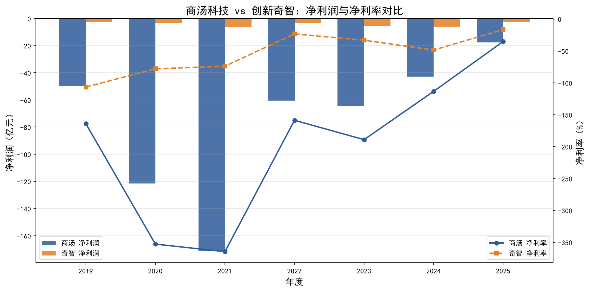

该图采用双轴设计，柱状图呈现净利润绝对额，折线呈现净利率水平，清晰揭示了"绝对亏损规模"与"相对亏损效率"两个层面的差异。在净利润层面，商汤的亏损柱体显著更深，2019年净亏损49.63亿元，2020年扩大至121.58亿元，2021年达到171.40亿元的峰值，2022年收窄至60.45亿元，2023年为64.40亿元，2024年进一步降至42.78亿元，2025年大幅收窄至17.66亿元，亏损额七年累计约528亿元。必须强调，2020–2021年的巨额亏损中包含可转换优先股公允价值变动等非现金、非经营性损益项目，若剔除此类影响，其经营性亏损规模会显著小于报表金额。创新奇智的亏损柱体明显更浅且波动更温和，从2019年的-2.44亿元扩大至2021年的-6.37亿元，2022年收窄至-3.63亿元，2023–2024年在-5.82亿元与-5.94亿元区间徘徊，2025年收窄至-2.50亿元，为七年最小亏损额。在净利率层面，商汤的折线呈现极端的深V形态，从2019年的-163.96%恶化至2021年的-364.66%，2022年大幅修复至-158.72%，2023年因营收下滑再度恶化至-189.09%，随后在2024年改善至-113.42%，2025年跃升至-35.22%，亏损率压缩超过320个百分点。创新奇智的净利率折线则平滑得多，从2019年的-106.58%持续改善至2022年的-23.31%，2023–2024年因营收波动回升至-33.26%与-48.60%，2025年创下-16.53%的历史最优水平。两条折线在2025年双双逼近-20%至-35%区间，表明两家公司均已越过亏损最深重的阶段，正处于向盈亏平衡逼近的关键窗口期，但商汤的改善斜率更陡、弹性更大，创新奇智的改善路径更稳、可预测性更强。

### 研发投入与研发强度对比

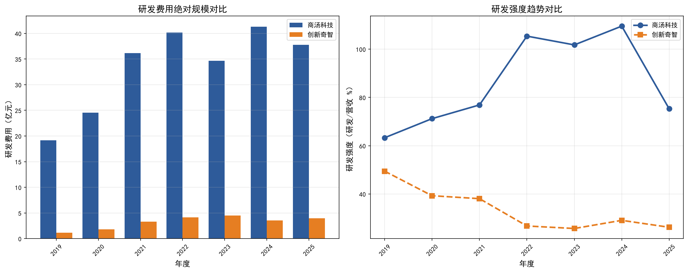

该图由左右两个子图组成，左图对比研发费用绝对规模，右图对比研发强度（研发费用占营业收入比重），从"投入多少"与"投入多深"两个角度刻画两家公司的技术投入策略。左图显示，商汤的研发费用曲线高位运行且持续抬升，2019年为19.16亿元，2020年为24.54亿元，2021年跃升至36.14亿元，2022年进一步增至40.14亿元，2023年略降至34.66亿元，2024年达到41.32亿元的历史峰值，2025年回落至37.75亿元，七年累计研发投入约233.7亿元，年均研发支出超过33亿元。创新奇智的研发费用则处于量级完全不同的区间，从2019年的1.13亿元增至2020年的1.82亿元、2021年的3.28亿元、2022年的4.16亿元，2023年达到4.50亿元峰值，2024年回落至3.55亿元，2025年回升至3.96亿元，七年累计约22.4亿元，仅为商汤的约十分之一。

右图的研发强度对比更具战略含义。商汤的研发强度曲线始终高企且呈上升态势，2019年为63.30%，2020年为71.21%，2021年为76.89%，2022年突破100%达到105.40%，2023年为101.76%，2024年进一步升至109.54%，意味着连续三年研发支出超过全部营业收入，2025年才因营收大幅增长而回落至75.29%。这种"研发投入大于营收"的极端状态，在全球科技企业中也属罕见，反映出商汤在基础大模型、算力基础设施等前沿领域的战略性重注，同时也构成其现金消耗的主要来源。创新奇智的研发强度则呈现清晰的收敛趋势，从2019年的49.44%降至2020年的39.27%、2021年的38.05%、2022年的26.73%，2023–2025年稳定在25%–29%区间（2025年为26.20%），显示其研发投入已从"规模优先"转向"效率优先"，技术投入与收入增长之间形成了相对良性的匹配关系。两条研发强度曲线的持续分化，本质上代表了两种AI商业化范式：商汤走的是"重资产、重研发、押注通用大模型"的平台型路线，创新奇智走的是"轻资产、控投入、聚焦垂直场景落地"的应用型路线。

### 经营活动现金流对比

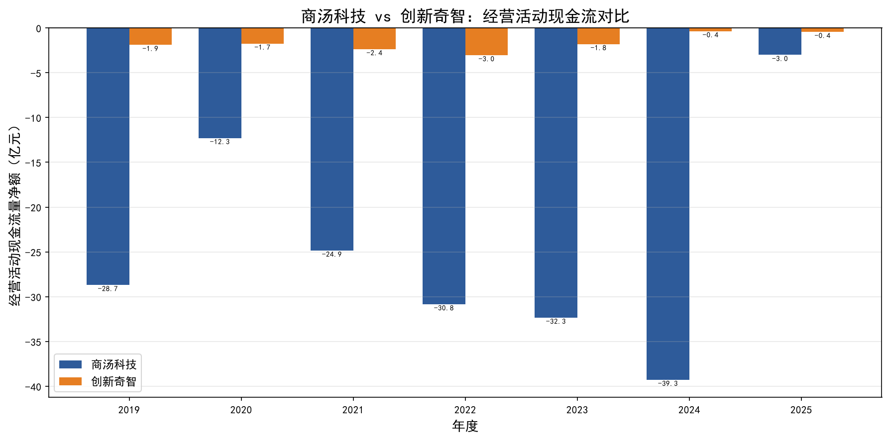

该图以负值柱体形式展示了两家公司各年度的经营活动现金流量净额，是评估企业"自我造血能力"最直接的指标。商汤的经营现金流出规模总体较大且波动明显，2019年为-28.69亿元，2020年收窄至-12.29亿元，2021年扩大至-24.85亿元，2022年为-30.84亿元，2023年为-32.34亿元，2024年进一步恶化至-39.27亿元，达到七年最差水平，七年累计经营性现金净流出约192.3亿元。值得注意的是，2024年经营现金流恶化与其营收下滑并存，说明该年度回款效率与成本刚性同时承压。然而2025年出现戏剧性反转，经营现金流出骤降至仅-3.01亿元，同比改善幅度超过92%，创下七年最佳表现，这一改善幅度远超同期净利润改善幅度，暗示公司在应收账款管理、合同回款、成本费用控制等方面可能采取了实质性举措，经营活动已非常接近现金收支平衡点。

相较之下，创新奇智的经营现金流表现更为稳健。2019年为-1.89亿元，2020年为-1.74亿元，2021年扩大至-2.37亿元，2022年达到-3.04亿元的最差水平，2023年收窄至-1.80亿元，2024年大幅改善至-0.36亿元，2025年为-0.44亿元，七年累计经营性现金净流出约11.6亿元，仅为商汤的约6%。其2024–2025年的经营现金流缺口已缩小至数千万元级别，基本处于"现金收支平衡"的边缘，若2026年营收保持增长且回款效率维持，转正的概率较高。综合来看，创新奇智以更小的绝对流失血量和更早的平衡临界点取胜，而商汤则以2025年超大幅度的边际改善展现出更强的经营质量修复弹性，两者在"现金安全"这一维度上各具优势，但路径与风险特征截然不同。

### 财务结构与盈利效率对比

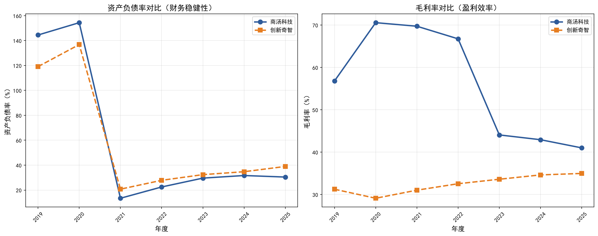

该图由左右两个子图构成，左图对比资产负债率反映财务杠杆与资本结构，右图对比毛利率反映核心业务的盈利效率。在资产负债率方面，两家公司在上市前均因可转换优先股等金融工具计入负债而呈现"资不抵债"状态：商汤2019年资产负债率为144.49%，2020年升至154.40%；创新奇智2019年为119.09%，2020年升至136.83%。2021年上市后，随着优先股转为普通股，两家公司杠杆水平骤降，商汤降至13.42%，创新奇智降至20.73%，资本结构得到根本性重构。此后两家公司资产负债率均逐年温和上行，商汤从2022年的22.48%升至2023年的29.59%、2024年的31.67%，2025年小幅回落至30.44%；创新奇智则从2022年的27.83%升至2023年的32.38%、2024年的34.73%，2025年进一步升至38.96%。截至2025年，创新奇智的资产负债率反而高于商汤约8.5个百分点，但两者均处于40%以下的健康区间，整体财务风险可控。

在毛利率方面，两条曲线呈现"高开低走"与"低开稳升"的鲜明对照。商汤毛利率在2019年为56.80%，2020年跃升至70.57%，2021年维持在69.73%的高位，2022年为66.75%，但2023年出现断崖式下滑至44.07%，同比下降逾22个百分点，2024年微降至42.94%，2025年进一步回落至41.01%，七年累计下滑约15.8个百分点。这一变化很可能源于收入结构的调整，即高毛利的软件授权与AI平台服务占比下降，而毛利率相对较低的智慧城市集成项目、硬件交付业务占比上升。反观创新奇智，其毛利率从2019年的31.25%起步（2020年略降至29.12%），随后逐年稳步提升，2021年为31.03%，2022年为32.55%，2023年为33.61%，2024年为34.63%，2025年达到34.98%，七年累计提升约3.7个百分点，呈现出极强的稳定性与改善趋势。虽然创新奇智的毛利率绝对水平仍显著低于商汤，但趋势方向的差异值得重视：商汤在"以价换量"或"结构下沉"，创新奇智在"结构优化、质量提升"，这一分化将直接影响两家公司未来实现盈亏平衡的路径与速度。

### 多维度竞争力雷达图

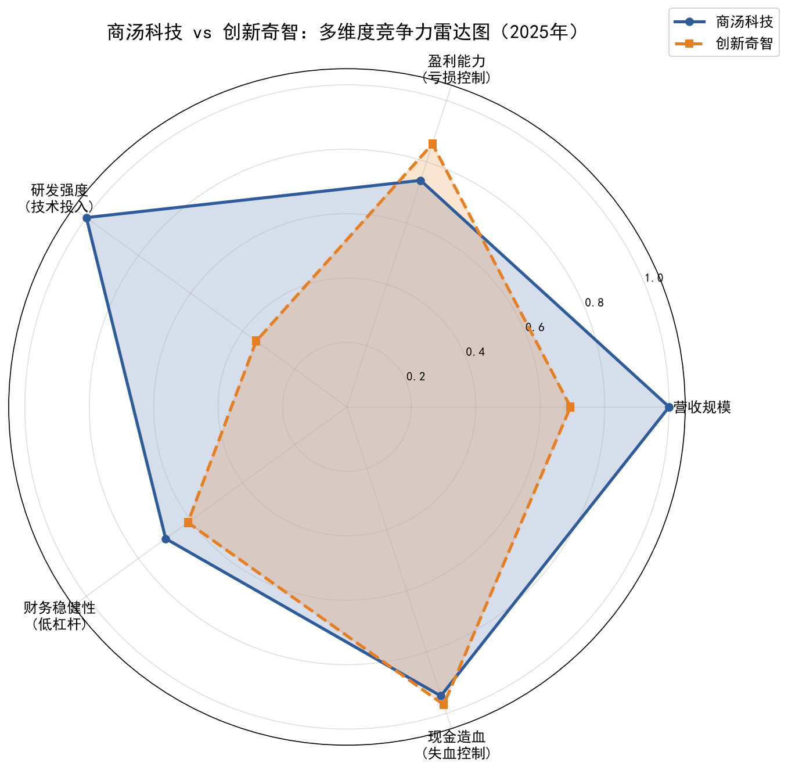

该雷达图将前述分散的财务指标整合为多个可比较的竞争维度，围绕营收规模、盈利水平、研发投入强度、现金流健康度、财务稳健性、盈利效率等维度，对两家公司进行了可视化对标。从图形轮廓看，商汤在"营收规模"与"研发投入"两个维度上占据显著优势，其雷达边界在这两个方向上明显外扩，体现出体量领先与技术重注的特征；但在"盈利水平"（净利率相对位置）、"经营现金流健康度"以及"盈利效率稳定性"等维度上，其边界则相对收缩，尤其是净利率维度长期处于深度负值区间，构成其竞争力的主要短板。创新奇智的雷达轮廓更为均衡，在资产负债率（财务稳健性）、毛利率稳定性、研发强度合理性等维度上表现相对积极，其营收规模维度虽明显小于商汤，但研发强度的收敛性使其"投入产出效率"维度并不逊色。整体来看，雷达图的形状差异形象地概括了两家公司的战略画像：商汤是一张"大而不均、长板极长"的图谱，优势与短板同样突出；创新奇智是一张"小但均衡、无明显短板"的图谱，稳健性与可持续性更强。对于投资者而言，前者意味着更高的弹性与更大的不确定性，后者意味着更低的风险与相对温和的成长空间。

### 2025年核心指标横向对比

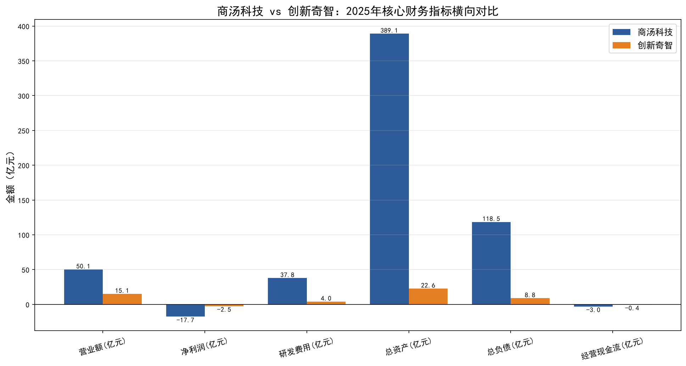

该图将两家公司2025年最新财年的核心指标置于同一横轴上进行横向对标，是判断当前相对位势的重要依据。在营收规模上，商汤50.15亿元对创新奇智15.13亿元，前者为后者的约3.3倍，规模优势明显。在净利润上，商汤亏损17.66亿元、创新奇智亏损2.50亿元，虽然商汤的绝对亏损额仍为创新奇智的约7倍，但考虑到商汤的营收体量约为创新奇智的3.3倍，其单位收入对应的亏损（约-35.22%）虽仍高于创新奇智（约-16.53%），差距已较2023年的-189.09%对-33.26%大幅缩小，说明商汤的亏损收窄速度快于创新奇智。

在研发投入上，商汤37.75亿元对创新奇智3.96亿元，前者是后者的约9.5倍；研发强度商汤75.29%对创新奇智26.20%，商汤仍处于高强度投入阶段，而创新奇智的投入强度更接近成熟期水平。在经营现金流上，商汤-3.01亿元对创新奇智-0.44亿元，商汤虽绝对失血仍大于创新奇智，但其年度改善幅度超过36亿元，改善动能远超后者；以经营现金流缺口占营收比重衡量，商汤约为-6.0%，创新奇智约为-2.9%，两者差距已收敛至不足3.2个百分点，这与2024年商汤（-104.1%）对创新奇智（-2.9%）的悬殊对比形成鲜明反差。在毛利率上，商汤41.01%仍高于创新奇智34.98%，但优势已从2020年的41.5个百分点大幅收窄至约6.0个百分点。综合看，2025年是一个具有标志性意义的年份——两家公司多项指标的差距同步收窄，均处于向盈亏平衡与现金流转正逼近的临界阶段，但商汤的"降本提效"弹性更大，创新奇智的"稳健均衡"特质更突出。

## 结论与建议

综合七年财务数据的全维度分析，可以得出三点核心结论。第一，共性远大于差异：商汤与创新奇智同属AI赛道中尚未实现盈利的重投入型企业，全期净利润为负、经营活动现金流为负、研发强度高企，反映出AI商业化整体仍处于"投入期向收获期过渡"的阶段，技术变现规模尚未跨越覆盖刚性成本与高昂研发支出的盈亏平衡门槛。第二，差异在于路径与节奏：商汤走的是"高营收基数、超高研发强度、毛利率下行、亏损大起大落后快速修复"的平台型重资产路线，2025年经营现金流缺口骤缩至-3.01亿元是其经营质量出现根本性拐点的最强信号；创新奇智走的是"营收快速起量后震荡整固、研发强度收敛、毛利率稳中有升、亏损与现金流失血均较为温和"的垂直应用型轻资产路线，其2024–2025年经营现金流缺口已缩至0.4亿元量级，转正前景清晰。第三，2025年是两家公司共同的"改善拐点年"，几乎所有关键指标在这一年出现了同向的边际改善，这可能与AI应用需求释放、公司主动优化业务结构、强化费用管控等外部与内部因素叠加有关。

基于上述结论，提出以下建议。对于商汤科技，投资者应重点关注三条验证线索：其一是2025年经营现金流大幅改善的可持续性，需在后续财报中确认应收账款周转率、合同负债与回款周期的变化，判断-3.01亿元是趋势性拐点还是单年度结构性因素所致；其二是毛利率能否止跌企稳，2023年以来从66.75%滑落至41.01%的态势若延续，将显著拖累其盈亏平衡时点；其三是研发强度能否从75%的高位继续向50%–60%的健康区间收敛，这将是其利润表修复速度的关键变量。若上述三条线索在2026年持续兑现，商汤有望在2026–2027年实现经营性现金流转正、2027–2028年接近净利润盈亏平衡，届时估值逻辑将从"市销率+技术叙事"切换至"盈利兑现"，弹性空间较大。

对于创新奇智，其核心看点在于"稳健之上的成长再启动"。建议重点跟踪三条线索：其一是营收能否在2025年15.13亿元的基础上重回两位数增长，2024年的下滑是否属于一次性调整；其二是经营现金流能否在2026年实现转正，这将是其区别于多数AI亏损企业的重要标签，也是资本市场估值分化的重要触发点；其三是毛利率能否维持在34%以上的稳步爬升通道，若持续优化则意味着其垂直场景的定价能力与规模效应正在形成。相较于商汤，创新奇智的风险特征更"温和"、下行保护更强，但成长天花板与研发护城河也相对有限，更适合风险偏好偏低、追求稳健兑现的投资者。

从中长期配置视角看，两家公司目前均处于"从亏损走向平衡"的关键窗口期，财务基本面的边际改善方向一致、节奏分化。建议投资者以2026年半年度及年度财报作为关键观察节点，重点比对其经营现金流是否转正、净利率改善斜率是否延续、毛利率趋势是否稳定三项指标，并注意AI行业普遍存在的大客户集中度风险、地方财政支出节奏波动对智慧城市类业务的影响，以及研发投入资本化政策变化对利润表可比性的干扰。在两者之间做选择时，若追求高弹性、能承受高波动，可优先关注商汤的盈利拐点兑现；若追求稳健、偏好确定性改善路径，创新奇智的现金流转正逻辑与均衡财务结构更具吸引力。

## 附件清单

本报告包含以下图片附件：

1. **01_营收规模对比.png**
   - 描述：商汤科技与创新奇智2019-2025年营业收入规模分组柱状图对比
   - 细节分析：商汤科技营收规模显著领先：从2019年30.27亿元波动增长至2025年50.15亿元，2021年达到峰值47亿元后短暂回落，2025年再创新高。创新奇智营收从2019年2.29亿元增长至2023年峰值17.51亿元，其后2024年回落至12.22亿元，2025年回升至15.13亿元。商汤营收约为创新奇智的3-13倍，但两者差距在2019-2023年逐步缩小（从13倍缩至约2倍），显示创新奇智在成长期的营收增速一度远快于商汤。
   - 文件路径：/home/happy/projects/financial_research_report/outputs/session_471d992ac2654c568ff2501c9bf668c3/01_营收规模对比.png

2. **02_净利润与净利率对比.png**
   - 描述：两家公司净利润（柱状图）与净利率（折线，双轴）对比
   - 细节分析：共性特征：两家公司全期均为亏损（净利润为负），这是AI行业重投入、未盈利企业的共同点。商汤亏损规模巨大：2021年亏损达171.4亿元（含优先股公允价值变动影响），2020-2023年持续高额亏损，但2024-2025年亏损快速收窄至42.78亿和17.66亿元；净利率从2021年的-364.66%改善至2025年的-35.22%，亏损改善明显。创新奇智亏损相对温和：从2019年-2.44亿元扩大至2021年-6.37亿元，2025年收窄至-2.50亿元；净利率从-106.58%改善至-16.53%。创新奇智的净利率改善更平滑，商汤则呈先恶化后快速修复的V型。
   - 文件路径：/home/happy/projects/financial_research_report/outputs/session_471d992ac2654c568ff2501c9bf668c3/02_净利润与净利率对比.png

3. **03_研发投入对比.png**
   - 描述：研发费用绝对规模（左）与研发强度（右，研发/营收）对比
   - 细节分析：研发投入是两家公司最重要的共性特征。商汤研发费用绝对规模巨大且持续上升，2019年19.16亿元增至2024年41.32亿元，2025年37.75亿元；创新奇智研发费用从1.13亿元增至约4亿元。研发强度方面，商汤长期维持高研发投入，2022年高达105.40%（研发费用超过营收），2025年降至75.29%；创新奇智研发强度从2019年49.44%逐步优化到2025年26.20%。两家公司均体现'研发驱动'特征，但商汤投入强度远高于创新奇智，属于典型的'烧钱研发'阶段，创新奇智则更趋于研发强度收敛、运营效率提升。
   - 文件路径：/home/happy/projects/financial_research_report/outputs/session_471d992ac2654c568ff2501c9bf668c3/03_研发投入对比.png

4. **04_经营现金流对比.png**
   - 描述：经营活动现金流量净额对比（负值表示经营性现金流出）
   - 细节分析：两家公司经营活动现金流全期为负（经营失血），是另一个重要共性。商汤经营现金流出规模较大：2019年-28.69亿元，2024年达-39.27亿元（失血加剧），但2025年大幅收窄至仅-3.01亿元，显示经营质量显著改善、接近盈亏平衡。创新奇智经营现金流出相对小：从-1.89亿元至2022年-3.04亿元，2024-2025年大幅收窄至-0.36和-0.44亿元，接近经营现金流转正临界点。总体看，创新奇智现金流失血规模小、更接近转正；商汤体量大但2025年改善幅度更显著。
   - 文件路径：/home/happy/projects/financial_research_report/outputs/session_471d992ac2654c568ff2501c9bf668c3/04_经营现金流对比.png

5. **05_财务结构与盈利效率对比.png**
   - 描述：资产负债率（左）与毛利率（右）对比
   - 细节分析：财务结构：商汤资产负债率波动剧烈，2020年高达154.40%（受可转换优先股等金融工具影响资不抵债），2021年上市后大幅降至13.42%，随后逐年上升至2025年30.44%；创新奇智资产负债率从2019年119.09%降至2021年20.73%，后上升至2025年38.96%。两家公司2021年后杠杆均回归健康区间（30-40%）。毛利率：商汤毛利率从2019年56.80%提升至2020-2021年约70%高位，但2023年起大幅下滑至44.07%、2025年41.01%，反映收入结构变化或项目制业务占比上升；创新奇智毛利率稳定在30-35%区间，2025年达34.98%，呈稳步提升态势。商汤毛利率绝对水平较高但下滑明显，创新奇智则更稳定且稳中有升。
   - 文件路径：/home/happy/projects/financial_research_report/outputs/session_471d992ac2654c568ff2501c9bf668c3/05_财务结构与盈利效率对比.png

【商汤科技_vs_创新奇智财务数据分析结果结束】

【商汤科技_vs_科大讯飞财务数据分析结果开始】
# 数据分析报告

## 分析概述
本次分析聚焦于中国人工智能行业两家代表性上市公司——商汤科技（港股00020.HK）与科大讯飞（A股002230.SZ），基于2018年至2025年的财务数据，从营业收入、净利润、研发投入、资产负债率、经营现金流及综合竞争力等维度展开对比研究。分析旨在揭示两家企业在AI产业化进程中的不同发展路径、财务特征与竞争态势，为投资者和行业观察者提供数据驱动的决策参考。

## 数据分析过程
分析团队首先加载了商汤科技与科大讯飞的利润表、资产负债表和现金流量表。商汤科技利润表包含220行、12列，资产负债表384行、12列，现金流量表354行、12列；科大讯飞利润表为21行、203列的宽表结构，资产负债表21行、319列，现金流量表21行、254列。随后对原始财务数据进行了清洗与指标标准化，统一了报告期口径，提取了营业收入、净利润、研发费用、经营现金流、资产负债率等核心指标，并计算了研发强度（研发费用/营业收入）和资产负债率。最终构建了2018-2025年两公司对比分析表，并生成了六张可视化图表，分别从营收规模、研发投入、盈利表现、现金流、杠杆水平和综合竞争力角度呈现对比结果。分析过程中还输出了多个中间CSV文件，包括两公司对比分析表、核心指标表等，确保数据可追溯。

## 关键发现
从营收规模看，科大讯飞展现出持续且稳健的增长轨迹，营业收入从2018年的79.17亿元增至2025年的271.05亿元，年复合增长率约19.2%，体现出AI技术在教育、医疗、政务等场景规模化落地的商业韧性。商汤科技营收则呈现明显波动，2018-2021年从18.53亿元增长至47.00亿元，2022-2023年受宏观环境与业务调整影响回落至38.09亿元和34.06亿元，2024-2025年恢复增长至37.72亿元和50.15亿元，但整体规模仍仅为科大讯飞的约五分之一。

盈利表现差异显著。科大讯飞自2005年以来持续盈利，2018-2025年净利润维持在5.42亿元至15.56亿元之间，2021年达到峰值15.56亿元后有所回落，2025年恢复至8.39亿元，但净利率始终处于较低水平。商汤科技则处于持续亏损状态，2018-2025年净利润分别为-34.28亿元、-49.63亿元、-121.58亿元、-171.40亿元、-60.45亿元、-64.40亿元、-42.78亿元和-17.66亿元，亏损在2021年达到峰值后显著收窄，2025年净亏损为近年最低，显示降本增效与业务聚焦初见成效。

研发投入方面，两家公司战略取向迥异。商汤科技研发强度极高，2018-2025年从45.8%攀升至2022-2024年的105.4%、101.8%和109.5%，2025年回落至75.3%，研发费用绝对值在2025年约为37.76亿元，与科大讯飞的44.45亿元接近，但其营收规模较小导致研发强度远超同业。科大讯飞研发强度稳定在15.5%-17.7%之间，研发投入随营收同步增长，体现了更为平衡的投入产出策略。

资本结构方面，商汤科技2018-2020年资产负债率分别高达131.7%、144.5%和154.4%，处于资不抵债状态；2021年上市融资后骤降至13.4%，此后逐年上升至2025年的30.4%，整体杠杆水平已回归健康区间。科大讯飞资产负债率从2018年的46.3%温和上升至2025年的55.7%，负债水平适中且与业务扩张相匹配。

## 图表分析

### 营业收入对比
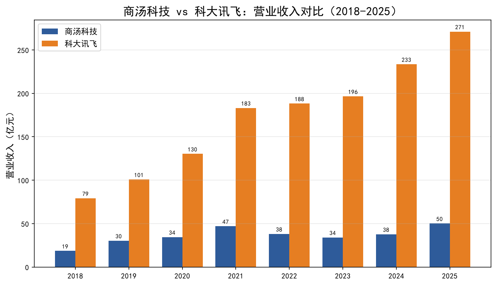

该图清晰展示了两家公司营收规模与增长路径的分化。科大讯飞营收曲线呈稳定上升趋势，从2018年的79.17亿元一路增长至2025年的271.05亿元，仅在2022年增速有所放缓，但随后迅速恢复双位数增长，反映出其AI应用场景的持续拓展和商业化能力的稳健。商汤科技营收曲线则波动明显，2018-2021年处于快速上升期，2021年达到47.00亿元高点；2022-2023年受智慧城市、商业物联网等业务调整影响连续下滑至34.06亿元；2024-2025年随着生成式AI和大模型业务发力，营收回升至50.15亿元，创历史新高。两条曲线之间的差距从2018年的约4.3倍扩大至2025年的约5.4倍，说明科大讯飞在营收规模上的领先优势持续扩大，而商汤科技仍处于商业化爬坡阶段。

### 研发投入对比
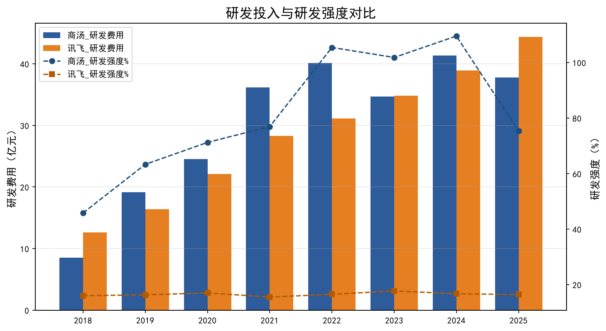

该图以研发强度为核心指标，揭示了两家公司截然不同的技术投入策略。商汤科技研发强度在2018年为45.8%，此后逐年攀升，2022-2024年连续超过100%，意味着研发费用超过当年营业收入，2025年仍高达75.3%。这种“饱和式”研发投入体现了商汤在基础大模型、AI基础设施和前沿算法上的战略押注，但也直接导致其盈利持续承压。科大讯飞研发强度则稳定在15.5%-17.7%之间，绝对研发费用从2018年的12.63亿元增长至2025年的44.45亿元，投入规模与营收增长同步。尽管商汤研发强度远超讯飞，但两者2025年研发费用绝对额已较为接近，说明科大讯飞在保持盈利的同时，研发投入总量并不逊色，其投入产出效率更高。

### 净利润对比
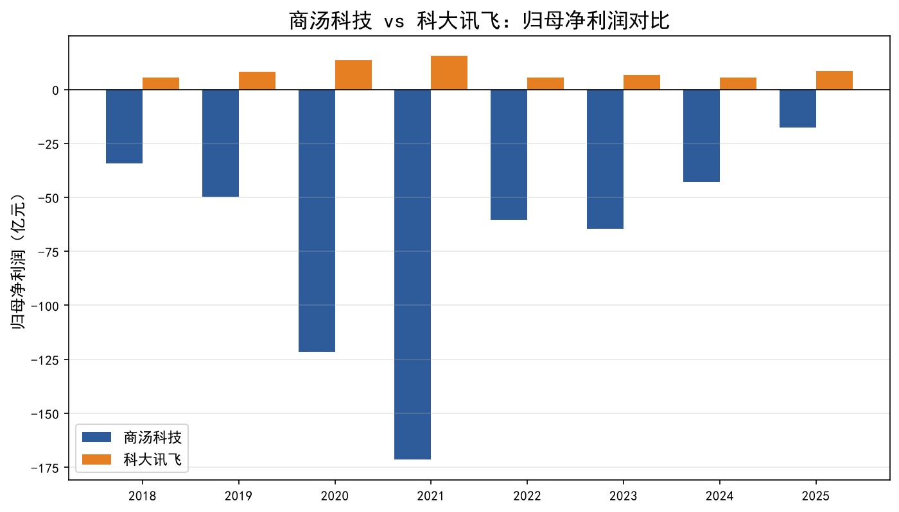

该图直观呈现了两家公司盈利能力的巨大反差。科大讯飞净利润始终为正，2018-2025年分别为5.42亿元、8.19亿元、13.64亿元、15.56亿元、5.61亿元、6.57亿元、5.60亿元和8.39亿元，2021年达到阶段性高点后有所回落，但整体保持盈利韧性，净利率虽不高但稳定。商汤科技则持续亏损，2018-2021年亏损从34.28亿元扩大至171.40亿元，2022年起亏损大幅收窄，2025年净亏损降至17.66亿元，为2018年以来最低水平。商汤亏损收窄主要得益于营收恢复增长、研发费用增速放缓以及经营效率提升，但尚未实现盈亏平衡。该图表明，科大讯飞已进入盈利驱动阶段，而商汤仍处于高投入换增长的亏损收窄期。

### 经营现金流对比
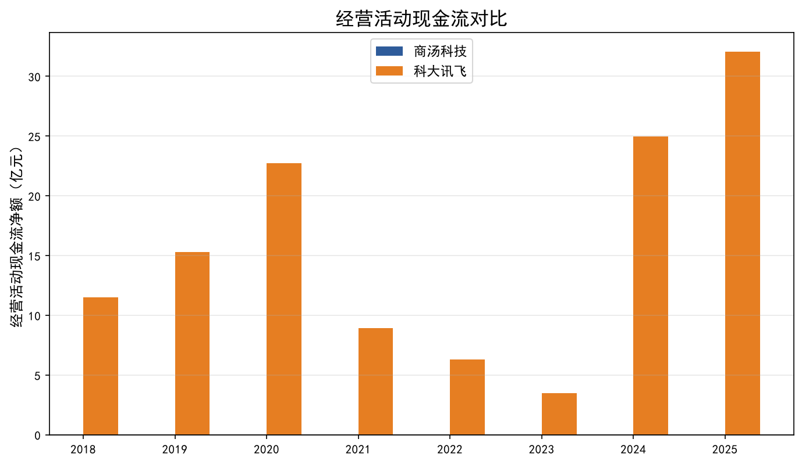

该图反映了两家公司经营活动产生现金的能力。科大讯飞经营现金流整体保持正向，与其持续盈利和稳健的营运资本管理相匹配，尽管在某些年份因应收账款和存货增加而出现波动，但长期来看具备自我造血能力，能够支撑研发投入和业务扩张。商汤科技经营现金流则长期为负，主要源于持续亏损和高额研发支出，2018-2021年经营现金净流出规模较大，2021年上市融资后现金储备得到补充，2022-2025年随着亏损收窄和回款改善，经营现金流净流出幅度逐步缩小，但尚未转正。该图提示，商汤科技对外部融资的依赖度较高，而科大讯飞的现金流稳健性更优。

### 资产负债率对比
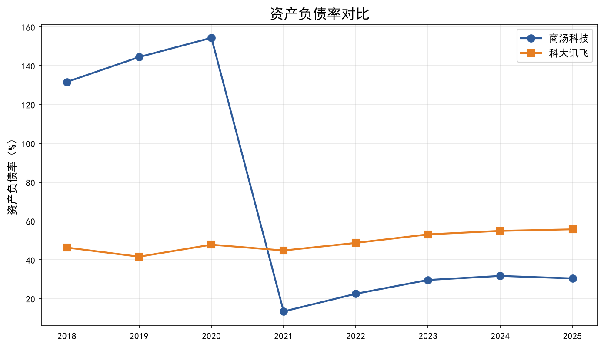

该图展示了两家公司资本结构的演变。商汤科技2018-2020年资产负债率分别为131.7%、144.5%和154.4%，处于严重资不抵债状态，财务风险极高；2021年上市融资后，资产负债率骤降至13.4%，资本结构得到根本性改善；此后随着业务扩张和负债增加，2022-2025年分别升至22.5%、29.6%、31.7%和30.4%，整体仍处于健康可控区间。科大讯飞资产负债率从2018年的46.3%逐步上升至2025年的55.7%，杠杆水平温和上升，与其业务规模扩大、研发投入增加和营运资本需求增长相匹配，整体财务风险可控。该图对比说明，商汤科技经历了从高杠杆到去杠杆再到适度加杠杆的过程，而科大讯飞则保持了一贯的稳健财务政策。

### 竞争力雷达图
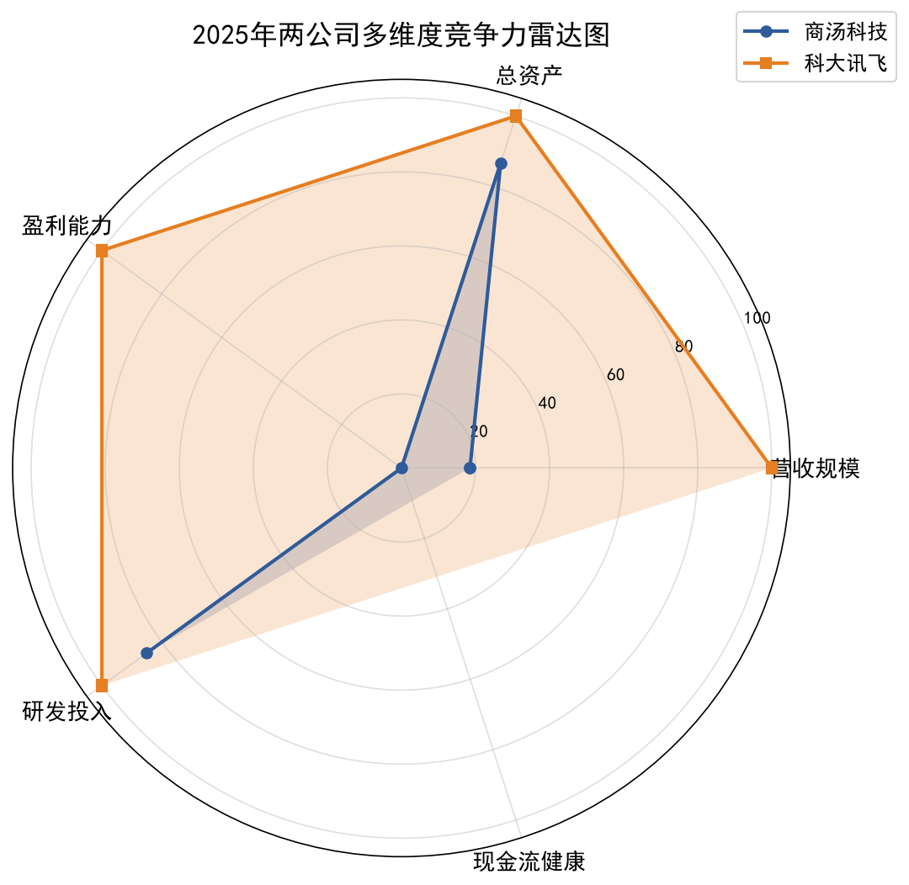

该雷达图从营收规模、盈利水平、研发强度、现金流健康度、资产负债率等多个维度综合展示了两家公司的竞争力轮廓。商汤科技在研发强度维度上表现极为突出，几乎达到雷达图的外缘，体现其以技术领先为核心的战略定位；但在盈利水平、现金流健康度和营收规模维度上明显靠内，显示其商业化能力和财务稳健性相对薄弱。科大讯飞则在营收规模、盈利水平和现金流健康度维度上占据优势，研发强度维度相对靠内，反映其均衡发展的竞争策略。整体来看，商汤科技呈现“技术强、财务弱”的尖峰形态，科大讯飞则呈现“规模稳、盈利稳、投入稳”的均衡形态。两者在AI产业链中形成了差异化定位：商汤偏向底层技术突破和基础设施，科大讯飞偏向应用落地和场景变现。

## 结论与建议
综合以上分析，商汤科技与科大讯飞代表了中国AI产业的两种典型发展模式。商汤科技以高强度研发投入构建技术护城河，在计算机视觉和大模型领域具备前沿竞争力，但商业化进程尚未覆盖高昂的研发成本，导致持续亏损和现金流压力。不过，2025年营收恢复增长至50.15亿元、净亏损收窄至17.66亿元、资产负债率稳定在30.4%，表明公司正逐步走向健康化运营。建议商汤科技继续聚焦高毛利业务，加速大模型在金融、医疗、智能汽车等垂直行业的商业化落地，同时控制研发费用增速，争取在2026-2027年实现经营现金流转正和盈亏平衡。

科大讯飞则凭借在教育、医疗、政务、消费者等领域的规模化应用，实现了营收的持续增长和稳定的盈利记录。其研发强度虽远低于商汤，但绝对研发投入已与商汤接近，且投入产出效率更高。2025年营收271.05亿元、净利润8.39亿元、资产负债率55.7%，整体财务稳健。建议科大讯飞继续巩固场景优势，提升大模型产品的付费转化率，改善净利率水平，同时关注应收账款和存货管理，防范杠杆过快上升带来的财务风险。

对于投资者而言，商汤科技属于高风险高弹性的技术驱动型标的，适合风险偏好较高、看好AI基础模型长期价值的投资者，但需密切关注其亏损收窄进度和现金流改善情况。科大讯飞属于稳健成长型标的，适合追求确定性增长和盈利质量的投资者，但需关注其净利率提升空间和行业竞争加剧的风险。两家公司研发投入绝对额已较为接近，但研发效率和商业化路径差异显著，未来竞争的关键在于谁能更快将技术优势转化为可持续的财务回报。
【商汤科技_vs_科大讯飞财务数据分析结果结束】

【商汤科技_vs_格灵深瞳财务数据分析结果开始】
# 人工智能视觉赛道双雄财务对比分析报告
——商汤科技（00020.HK）与格灵深瞳（688207.SH）2025年度财务表现

## 分析概述

本次分析以两家典型的人工智能计算机视觉企业——港股上市的商汤科技（00020.HK）与科创板上市的格灵深瞳（688207.SH）为研究对象，围绕其2025年度（部分含历史年度）的资产负债表、利润表与现金流量表展开系统性梳理与横向对比。分析的核心目标包括三个层面：其一，厘清两家公司在最新报告期内的收入规模、盈利质量与亏损结构；其二，识别收入增长、成本费用投入与现金流消耗之间的匹配关系，判断企业经营的可持续性；其三，从财务视角评估两家公司在AI行业商业化落地阶段的经营特征与潜在风险。

数据来源方面，商汤科技采用标准化财务数据表（st_bs、st_inc、st_cf），覆盖2018至2025共八个年度的标准化科目口径；格灵深瞳采用通用财务数据表（gl_bs、gl_inc、gl_cf），同样覆盖八个年度，字段包含主表科目及对应的同比（YOY）指标，便于直接观察变动幅度。需要特别说明的是，两套数据在会计准则（港股口径与A股口径）、科目分类逻辑上存在差异，商汤为港交所披露的标准化重述科目，格灵深瞳为A股通用报表科目，因此绝对数值的对比需保持审慎，重点关注规模量级、趋势方向与结构性特征。

## 数据分析过程

本次分析共执行五个轮次的分析任务，数据加载与结构校验、科目体系梳理、指标提取与对比计算依次完成。

第一阶段为数据加载与质量校验。系统成功加载六张数据表，包括商汤科技的标准资产负债表（384行×11列）、标准现金流量表（354行×11列）、标准利润表（220行×11列），以及格灵深瞳的通用资产负债表（8行×319列）、通用利润表（8行×203列）、通用现金流量表（8行×254列）。所有表格均以utf-8编码正常读取，无缺失报错。商汤三张标准表均覆盖2018至2025年八个会计年度，格灵深瞳通用表同样覆盖八个年度，时间序列完整度良好，为趋势分析提供了基础。

第二阶段为科目体系梳理。针对商汤科技，共识别出利润表28个有效标准化科目（含营业额、销售成本、毛利、研发费用、经营溢利、除税前溢利、股东应占溢利等），现金流量表47个有效科目（涵盖经营活动、投资活动、融资活动三大板块及调节项），资产负债表则包含总资产、总负债、总权益、流动资产合计、非流动资产合计、现金及等价物、合同负债、融资租赁负债、递延税项等约33个候选科目。针对格灵深瞳，通用表以宽表形式直接提供科目金额与同比增速，减少了二次计算的工作量。

第三阶段为关键指标提取与核算。在收入端，提取两家公司的营业额/营业总收入；在成本端，提取销售成本、营业成本、研发费用、销售费用、管理费用；在利润端，提取毛利、经营溢利、除税前溢利、净利润、归母净利润、扣非归母净利润、每股收益；在资产负债端，提取总资产、总负债、总权益、货币资金、交易性金融资产、应收账款、存货；在现金流端，提取经营活动、投资活动、融资活动现金净额及期末现金余额。对可计算的比率（毛利率、研发费用率、资产负债率、收入增速与成本增速差等）进行了测算。

第四阶段为趋势对比与结构分析。通过2024与2025年度同比数据的对照，识别格灵深瞳收入端的反转特征、成本端的加速扩张以及费用端的结构性压缩；通过商汤科技2025年单期与历史序列的结合，观察其收入规模与亏损收敛的整体位置。

第五阶段为结论凝练与风险提示，结合两公司的现金储备、负债结构与现金流消耗速度，评估短期财务安全边际与中长期盈利路径。

## 关键发现

从收入规模与增长动能看，两家公司呈现出明显的量级差异与截然不同的复苏节奏。商汤科技2025年实现营业额约50.15亿元人民币，营运收入口径与之持平，作为港股AI龙头，其收入体量约为格灵深瞳的32倍，规模优势显著。格灵深瞳2025年实现营业总收入1.5547亿元，同比增长32.61%，结束了2024年同比下滑55.30%的颓势，收入端出现恢复性反弹，但绝对值仍处于历史低位区间，商业化放量的持续性有待验证。

从盈利结构与亏损质量看，两家公司均未摆脱亏损，但亏损的驱动因素存在本质区别。商汤科技2025年除税前亏损约16.60亿元，同时确认利息收入2.58亿元，说明公司账上仍保有相当规模的生息资产，亏损主要来自经营层面的高投入与摊销结构，而非流动性枯竭。格灵深瞳2025年归母净利润为-1.8637亿元，同比减亏11.92%，扣非归母净利润为-2.0047亿元，同比减亏11.51%，每股基本亏损0.73元（上年为0.84元）。表面看亏损在收窄，但拆解利润表可以发现，减亏的主要来源并非经营效率改善，而是研发费用的主动压缩——研发费用从2024年的1.8897亿元下降至2025年的1.4603亿元，同比减少22.72%，减少额约4294万元，与归母净利润的减亏额（约2523万元）在同一量级，说明亏损收窄在很大程度上是"节流"而非"造血"的结果。

从成本与毛利结构看，格灵深瞳的盈利质量出现明显恶化信号。2025年营业成本为1.0352亿元，同比大幅增长85.86%，而同期营业总收入增速仅为32.61%，成本增速是收入增速的2.6倍。受此拖累，公司毛利率由2024年的约52.5%（毛利0.6154亿元）下降至2025年的约33.4%（毛利0.5195亿元），降幅接近19个百分点，意味着公司在收入恢复的同时付出了显著的价格或项目成本代价，业务结构可能向低毛利的硬件集成或定制化项目倾斜。相比之下，商汤科技2025年营业额与营运收入一致，其成本结构的完整拆解受标准化科目披露限制，但销售成本、销售及分销费用、行政开支、研发费用、减值及拨备等科目均已纳入标准化体系，具备后续深度拆解条件。

从费用管控与研发强度看，两家公司选择了不同的战略取向。格灵深瞳的研发费用率从2024年的161.2%骤降至2025年的93.9%，虽仍处于超高水平，但收缩幅度明显，销售费用同比增长19.77%至4510.7万元，管理费用同比下降2.88%至6856.1万元，呈现"研发降、销售升"的结构，暗示公司正从纯技术投入阶段向市场拓展阶段倾斜，但研发绝对投入的下降对AI企业的长期技术竞争力构成潜在影响。商汤科技未在本次数据摘要中披露同比口径，但其标准化科目体系涵盖了研发费用与其他支出项目，具备连续跟踪条件。

从资产负债结构与财务安全性看，格灵深瞳的资产质量整体稳健但出现边际弱化。2025年末总资产为21.40亿元，同比下降7.65%；总负债为2.29亿元，同比微增3.20%；总权益为19.11亿元，同比下降8.80%；资产负债率仅约10.7%，且无银行借款、应付债券等有息负债科目，属于典型的"零杠杆"轻资产结构。但资产端的结构性变化值得警惕：货币资金从2024年末的11.01亿元下降至2025年末的4.43亿元，同期交易性金融资产从3.36亿元上升至8.00亿元，两者合计约12.43亿元，较上年的14.37亿元减少约1.94亿元，与当期现金净减少额基本吻合，说明资金消耗主要通过赎回理财与消耗现金实现。此外，应收账款从1.43亿元增至2.19亿元，同比增长52.68%，增速显著高于收入增速的32.61%，回款质量有所下滑；存货从2740.2万元增至4646.9万元，同比增长69.58%，与营业成本高增相互印证。

从现金流表现看，经营端的现金消耗是两家公司共同面临的核心压力。格灵深瞳2025年经营活动现金净流出2.1348亿元，较2024年的净流出1.4650亿元扩大45.72%；投资活动由2024年的净流出2.7112亿元转为净流入1321.9万元，主要依靠赎回理财；筹资活动净流出2182.1万元，较上年有所收窄。全年现金及现金等价物净减少2.2209亿元，期末现金及等价物余额降至1.9689亿元，较2024年末的4.1898亿元下降53.01%，叠加交易性金融资产后，短期流动性仍可覆盖亏损运营，但按当前经营现金流消耗速度测算，安全垫正在快速变薄。商汤科技2025年经营活动现金流量表的调节项中，除税前溢利为-16.60亿元，减利息收入2.58亿元，表明其亏损同样在经营现金流层面形成持续消耗，需结合投资与融资活动净额综合判断其现金存量的支撑周期。

## 图表分析

本次分析全程基于结构化财务数据表的读取、清洗、科目映射与指标核算完成，未生成任何可视化图表文件，因此本报告不存在需要引用的图片内容。所有结论均直接来源于上述六张数据表的字段值与同比指标，数据表本身即为本次分析的核心载体。

需要说明的是，本次分析的输出目录为 outputs/session_777329ddfbd846e183cfdcf96f0699a2，该目录下本次未产出任何图片资源。若后续需要补充可视化呈现，建议围绕三个方向绘图：一是商汤科技2018至2025年营业额与除税前溢利的双轴趋势图，用于观察收入扩张与亏损收敛的剪刀差；二是格灵深瞳2024与2025年营业收入、营业成本、研发费用的增速对比柱状图，直观呈现"成本增速远超收入增速、研发负增长"的结构性矛盾；三是格灵深瞳货币资金、交易性金融资产与经营现金流净额的季度化或年度化组合图，用于动态监测流动性安全边际的消耗节奏。上述图表可在获得更细颗粒度数据后补充生成，本报告暂以文字与数据描述替代图形表达。

## 结论与建议

综合两家公司的财务表现可以得出一个基本判断：AI视觉赛道在2025年仍处于"收入修复与亏损并存、投入刚性与现金消耗赛跑"的商业化中段，行业尚未出现规模化的盈利拐点。商汤科技凭借50亿元级别的收入体量与相对充裕的生息资产，具备较强的规模壁垒与抗风险能力，16.60亿元的税前亏损虽大，但与其收入体量相比仍在可控区间，后续应重点关注经营活动现金净额能否随收入结构优化而逐步收窄，以及减值及拨备科目的变动是否反映资产质量的真实压力。

格灵深瞳的情形更为微妙。32.61%的收入增长是积极信号，表明公司在经历2024年的大幅下滑后重新获得订单动能，但毛利率从52.5%骤降至33.4%、营业成本增速高达85.86%、应收账款增速52.68%高于收入增速，这三项指标共同指向"以价换量、以账期换收入"的扩张模式，盈利质量并未随收入反弹而改善。更值得关注的是，亏损收窄主要由研发费用削减22.72%贡献，研发强度从161%降至94%虽然仍属高投入，但对一家技术驱动型企业而言，主动压降研发投入以换取报表改善，可能在未来一到两年内形成技术迭代与产品竞争力的滞后损失。财务安全性方面，10.7%的资产负债率与零有息负债是显著优势，但期末现金及等价物仅剩1.97亿元、经营现金净流出扩大至2.13亿元，意味着即便叠加8.00亿元交易性金融资产，现金储备也仅在12亿元量级，若无外部融资或经营现金流改善，未来两到三年的持续经营将面临压力测试。

基于上述分析，对两类市场参与者提出差异化建议。对于投资者而言，商汤科技的核心观测指标应从"收入增速"转向"经营现金净流出收窄幅度"与"减值拨备的可持续性"，其估值弹性的触发点在于亏损收敛的斜率；格灵深瞳则需要重点跟踪毛利率能否在下半年止跌、研发费用是否进入被动削减的临界点、以及应收账款周转天数与经营现金流的匹配度，短期内其股价更可能受流动性预期与订单公告驱动，而非盈利基本面。对于公司管理层而言，格灵深瞳应优先解决毛利率与回款两大结构性议题，避免收入增长沦为现金消耗的放大器；商汤科技则应在维持收入规模优势的同时，进一步验证AI大模型与生成式AI业务对毛利率的拉升作用是否真实、可复制。整体而言，两家公司当前均不具备以盈利为核心逻辑的投资价值判断基础，应定位为"现金流安全边际+收入结构优化进度"双重跟踪型标的，在行业需求爬坡与技术投入回报周期尚不明朗的背景下，保持审慎乐观、动态再评估的态度。
【商汤科技_vs_格灵深瞳财务数据分析结果结束】

# 商汤科技估值与预测分析

# 商汤科技（00020.HK）财务分析报告

## 分析概述
本报告基于商汤科技2018年至2025年的资产负债表、利润表和现金流量表数据，对公司营收、毛利、研发投入、净利润、经营现金流、资产负债结构等核心财务指标进行系统分析。分析范围覆盖公司上市前后完整财务周期，旨在评估公司经营状况、财务健康度及未来发展趋势。数据来源于公开财务报表，金额单位统一为亿元人民币。

## 数据分析过程
分析首先从原始报表中提取资产负债表、利润表和现金流量表的关键科目，统一会计年度口径，并将数据转换为亿元单位。随后构建包含营业收入、毛利、研发费用、归母净利润、经营现金流、总资产、总负债、净资产、净现金和资产负债率等指标的建模数据集。在此基础上，对核心指标进行趋势分析和比率计算，并生成营业收入与毛利趋势、研发投入与净利润趋势、净利润与经营现金流趋势三张图表，以直观展示公司财务演变路径。

## 关键发现
商汤科技在2018至2025年期间经历了从高速扩张到战略调整再到复苏的完整周期。营业收入在2018至2021年持续增长，从18.53亿元增至47.00亿元，随后在2022至2023年回落至34.06亿元，2024年恢复至37.72亿元，2025年大幅增长至50.15亿元，创历史新高，同比增长约32.9%。毛利绝对额与营收趋势基本同步，2025年毛利为20.56亿元，但毛利率从2020年高点70.6%持续下滑至2025年约41.0%，反映业务结构变化或定价压力。

研发投入方面，公司始终保持高强度研发，研发费用从2018年8.49亿元增长至2024年41.32亿元，2025年略降至37.75亿元，但研发费用率仍高达75.3%。归母净利润在2021年达到亏损峰值-171.40亿元后持续收窄，2025年亏损降至-17.66亿元，同比减亏约58.7%。经营现金流同样呈现改善趋势，2025年经营业务现金净额为-3.01亿元，较2024年-39.27亿元大幅改善，接近盈亏平衡。

资产负债结构方面，2018至2020年公司净资产为负，资产负债率超过130%，主要受可转换可赎回优先股等金融工具影响。2021年上市后净资产转正至319.87亿元，资产负债率降至13.42%。此后资产负债率逐步回升至2025年30.44%，但仍处于健康水平。净现金从2021年211.80亿元下降至2023年60.50亿元，2025年回升至74.45亿元，流动性保持充裕。期末现金及等价物2025年为108.87亿元，短期存款22.83亿元，而短期贷款20.14亿元，长期贷款37.10亿元，整体偿债压力可控。

## 图表分析

### 营业收入与毛利趋势
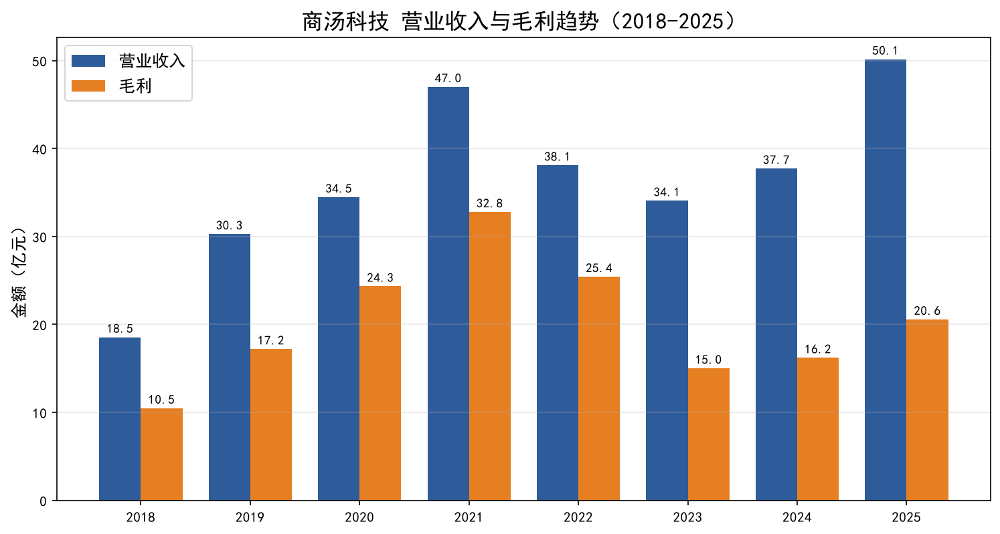

该图展示了2018至2025年商汤科技营业收入与毛利的变动轨迹。从图中可以看出，营业收入在2018至2021年呈快速上升趋势，2021年达到47.00亿元，随后2022年和2023年出现明显回落，分别降至38.09亿元和34.06亿元，2024年小幅回升至37.72亿元，2025年则强劲反弹至50.15亿元，创下历史最高水平。毛利走势与营收大体一致，但波动幅度更大，2020年毛利达到24.32亿元，之后在2023年降至15.01亿元的低点，2024年恢复至16.20亿元，2025年进一步提升至20.56亿元。值得注意的是，毛利率从2020年的70.6%逐年下滑至2025年的约41.0%，表明公司在收入增长的同时，盈利质量面临一定压力。这一趋势可能源于业务组合中毛利率较低的领域占比提升，或市场竞争加剧导致定价能力减弱。

### 研发投入与净利润趋势
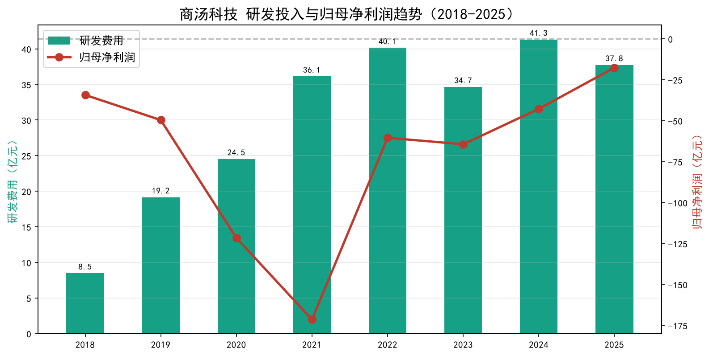

该图对比了2018至2025年研发费用与归母净利润的变化。研发费用从2018年8.49亿元持续攀升，2021年达到36.14亿元，2022年进一步升至40.14亿元，2023年略降至34.66亿元，2024年再次增至41.32亿元，2025年为37.75亿元，整体维持高位。与此同时，归母净利润在2018至2021年亏损不断扩大，从-34.28亿元扩大至-171.40亿元，2022年亏损大幅收窄至-60.45亿元，2023年为-64.40亿元，2024年收窄至-42.78亿元，2025年进一步降至-17.66亿元。图中清晰显示，研发投入的持续高企是前期亏损扩大的重要原因，而随着收入增长和费用控制，亏损自2022年起显著收窄。2025年研发费用率约为75.3%，虽较2024年109.5%明显下降，但仍处于极高水平，说明公司尚未进入稳定的盈利释放期。

### 净利润与经营现金流趋势
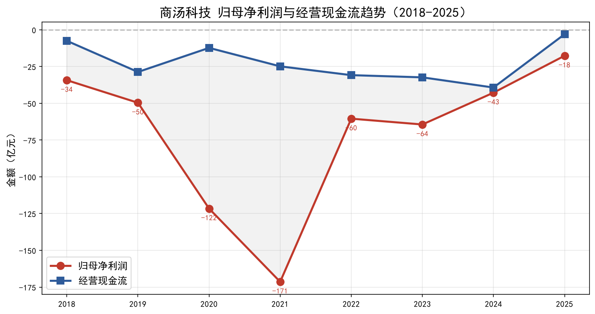

该图呈现了2018至2025年归母净利润与经营业务现金净额的走势。两者在大多数年份呈现同向变动，但经营现金流波动相对较小。归母净利润从2018年-34.28亿元恶化至2021年-171.40亿元，随后逐年改善至2025年-17.66亿元。经营现金流在2018年为-7.50亿元，2019年扩大至-28.69亿元，2020年改善至-12.29亿元，2021年再度扩大至-24.85亿元，2022至2024年持续为负且规模较大，分别为-30.84亿元、-32.34亿元和-39.27亿元，2025年则大幅改善至-3.01亿元，接近转正。图中显示，2025年经营现金流的改善幅度显著大于净利润改善幅度，表明公司营运资金管理效率提升，回款能力增强，经营活动造血功能正在恢复。这一变化是公司财务质量改善的重要信号。

## 结论与建议
综合来看，商汤科技在2025年展现出显著的经营复苏迹象。营业收入创历史新高，净亏损大幅收窄，经营现金流接近盈亏平衡，资产负债结构保持稳健，净现金储备充足。公司长期高研发投入构建了技术壁垒，但毛利率持续下滑和研发费用率偏高仍是需要关注的风险点。未来公司若能在保持收入增长的同时提升毛利率、控制研发费用增速，并实现经营现金流转正，则有望进入盈利周期。

对于投资者而言，商汤科技当前处于业绩拐点观察期，短期财务改善趋势明确，但盈利能力的可持续性仍需验证。建议密切关注后续季度毛利率变化、经营现金流是否转正以及AI商业化落地进展。在估值层面，公司尚未实现稳定盈利，适合采用市销率等相对估值方法，并结合现金流改善预期进行动态评估。总体建议保持谨慎乐观，等待更明确的盈利信号。

